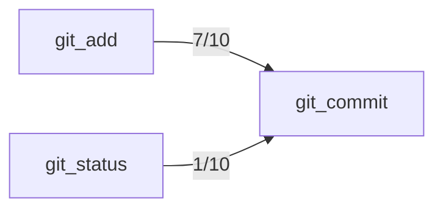

## Confusion Matrix

| Intended \ Called | git_add | git_branch | git_checkout | git_commit | git_create_branch | git_diff | git_diff_staged | git_diff_unstaged | git_log | git_reset | git_show | git_status |
|---|---|---|---|---|---|---|---|---|---|---|---|---|
| git_add | 10 | 0 | 0 | 0 | 0 | 0 | 0 | 0 | 0 | 0 | 0 | 0 |
| git_branch | 0 | 10 | 0 | 0 | 0 | 0 | 0 | 0 | 0 | 0 | 0 | 0 |
| git_checkout | 0 | 0 | 10 | 0 | 0 | 0 | 0 | 0 | 0 | 0 | 0 | 0 |
| git_commit | 6 | 0 | 0 | 3 | 0 | 0 | 0 | 0 | 0 | 0 | 0 | 1 |
| git_create_branch | 0 | 0 | 0 | 0 | 10 | 0 | 0 | 0 | 0 | 0 | 0 | 0 |
| git_diff | 0 | 0 | 0 | 0 | 0 | 10 | 0 | 0 | 0 | 0 | 0 | 0 |
| git_diff_staged | 0 | 0 | 0 | 0 | 0 | 0 | 10 | 0 | 0 | 0 | 0 | 0 |
| git_diff_unstaged | 0 | 0 | 0 | 0 | 0 | 0 | 0 | 10 | 0 | 0 | 0 | 0 |
| git_log | 0 | 0 | 0 | 0 | 0 | 0 | 0 | 0 | 10 | 0 | 0 | 0 |
| git_reset | 0 | 0 | 0 | 0 | 0 | 0 | 0 | 0 | 0 | 10 | 0 | 0 |
| git_show | 0 | 0 | 0 | 0 | 0 | 0 | 0 | 0 | 0 | 0 | 10 | 0 |
| git_status | 0 | 0 | 0 | 0 | 0 | 0 | 0 | 0 | 0 | 0 | 0 | 10 |

## Trial Diversity
- git_add: 10/10 distinct
- git_branch: 10/10 distinct
- git_checkout: 10/10 distinct
- git_commit: 10/10 distinct
- git_create_branch: 10/10 distinct
- git_diff: 10/10 distinct
- git_diff_staged: 10/10 distinct
- git_diff_unstaged: 10/10 distinct
- git_log: 10/10 distinct
- git_reset: 10/10 distinct
- git_show: 10/10 distinct
- git_status: 10/10 distinct

## Pass Rates
- git_add: 10/10 (100%), 95% CI [72%, 100%]
- git_branch: 10/10 (100%), 95% CI [72%, 100%]
- git_checkout: 10/10 (100%), 95% CI [72%, 100%]
- git_commit: 10/10 (100%), 95% CI [72%, 100%]
- git_create_branch: 10/10 (100%), 95% CI [72%, 100%]
- git_diff: 10/10 (100%), 95% CI [72%, 100%]
- git_diff_staged: 10/10 (100%), 95% CI [72%, 100%]
- git_diff_unstaged: 10/10 (100%), 95% CI [72%, 100%]
- git_log: 9/10 (90%), 95% CI [60%, 98%]
- git_reset: 10/10 (100%), 95% CI [72%, 100%]
- git_show: 10/10 (100%), 95% CI [72%, 100%]
- git_status: 10/10 (100%), 95% CI [72%, 100%]

## Preconditions (observed)

Tools the model called *before* correctly calling the intended one, per trial:

- git_add → git_commit: 7/10 trials
- git_status → git_commit: 1/10 trials

## Undeclared Preconditions

The model follows these dependencies, but the catalog is silent about them. Either state
the precondition in the description or make the tool self-sufficient, then re-run:

- git_commit: models call git_add first in 7/10 trials, but git_commit's description never mentions git_add

## Solvability Warnings
- git_commit (seed 2): Committing typically requires staging changes first (git_add) before git_commit, but the request doesn't specify which files to stage, making it unclear whether a single tool call suffices.
- git_commit (seed 6): Committing requires staged changes, but no git_add call was requested first, so it's unclear whether files are already staged or need staging before git_commit can be called.
- git_commit (seed 9): Committing requires changes to be staged first, and it's unclear whether the changes are already staged (git_add) or need staging before git_commit can be used.

## Metadata
- Model under test: claude-sonnet-5
- Generator model: claude-sonnet-5
- Seeds per tool: 10
- Max steps per task: 3

## Proposed Fixes

No tool had a failed trial, so nothing to fix.
