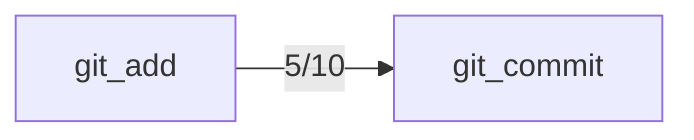

## Confusion Matrix

| Intended \ Called | git_add | git_commit |
|---|---|---|
| git_commit | 5 | 5 |

## Trial Diversity
- git_commit: 10/10 distinct

## Pass Rates
- git_commit: 10/10 (100%), 95% CI [72%, 100%]

## Preconditions (observed)

Tools the model called *before* correctly calling the intended one, per trial:

- git_add → git_commit: 5/10 trials

## Undeclared Preconditions

The model follows these dependencies, but the catalog is silent about them. Either state
the precondition in the description or make the tool self-sufficient, then re-run:

- git_commit: models call git_add first in 5/10 trials, but git_commit's description never mentions git_add

## Solvability Warnings
- git_commit (seed 5, passed anyway): The request only says to "commit" without specifying whether changes need to be staged first, and the tool list separates git_add and git_commit as distinct steps, making it unclear which single tool fulfills the request.
- git_commit (seed 6, passed anyway): The request only specifies committing, but committing typically requires staged changes first via git_add, and it's unclear whether staging has already been done or should be assumed.
- git_commit (seed 7, passed anyway): Committing requires changes to be staged first, and it's unclear whether git_add has already been run, so a single clear tool call cannot be determined.

## Metadata
- Model under test: claude-sonnet-5
- Generator model: claude-sonnet-5
- Seeds per tool: 10
- Max steps per task: 3
- Tools evaluated (--only): git_commit — the model was offered the whole catalog (12 tools) on every call

## Mutation Results

### git_commit
- New description: 'Records staged changes to the repository as a new commit. Only changes already staged with git_add are committed, so call git_add first to stage the files you want in the commit.'
- Before: 10/10 (100%), 95% CI [72%, 100%]
- After:  10/10 (100%), 95% CI [72%, 100%]
- Reached via an earlier call: 5/10 → 9/10 (two-sided p=0.1250; informational, not part of the verdict)
- p-value: 1.0000
- Verdict (Bonferroni-corrected): not significant

### git_commit
- New description: 'Records changes to the repository. Automatically stages all modified and new files before committing, so git_add is not required first.'
- Before: 10/10 (100%), 95% CI [72%, 100%]
- After:  10/10 (100%), 95% CI [72%, 100%]
- Reached via an earlier call: 5/10 → 0/10 (two-sided p=0.0625; informational, not part of the verdict)
- p-value: 1.0000
- Verdict (Bonferroni-corrected): not significant
