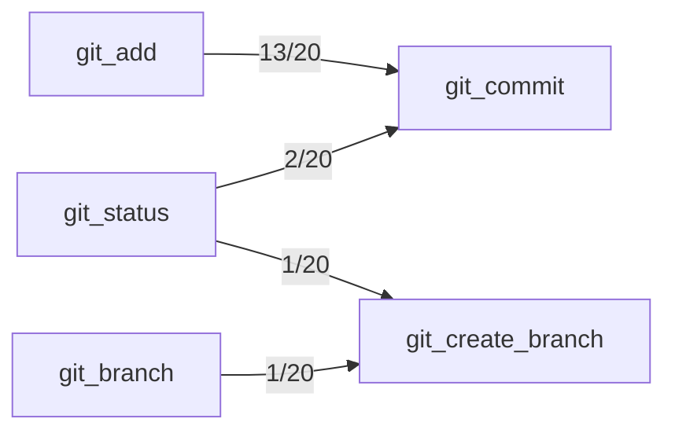

## Confusion Matrix

| Intended \ Called | git_add | git_branch | git_checkout | git_commit | git_create_branch | git_diff | git_diff_staged | git_diff_unstaged | git_log | git_reset | git_show | git_status |
|---|---|---|---|---|---|---|---|---|---|---|---|---|
| git_add | 20 | 0 | 0 | 0 | 0 | 0 | 0 | 0 | 0 | 0 | 0 | 0 |
| git_branch | 0 | 20 | 0 | 0 | 0 | 0 | 0 | 0 | 0 | 0 | 0 | 0 |
| git_checkout | 0 | 0 | 20 | 0 | 0 | 0 | 0 | 0 | 0 | 0 | 0 | 0 |
| git_commit | 11 | 0 | 0 | 7 | 0 | 0 | 0 | 0 | 0 | 0 | 0 | 2 |
| git_create_branch | 0 | 1 | 0 | 0 | 19 | 0 | 0 | 0 | 0 | 0 | 0 | 0 |
| git_diff | 0 | 0 | 0 | 0 | 0 | 20 | 0 | 0 | 0 | 0 | 0 | 0 |
| git_diff_staged | 0 | 0 | 0 | 0 | 0 | 0 | 20 | 0 | 0 | 0 | 0 | 0 |
| git_diff_unstaged | 0 | 0 | 0 | 0 | 0 | 0 | 0 | 20 | 0 | 0 | 0 | 0 |
| git_log | 0 | 0 | 0 | 0 | 0 | 0 | 0 | 0 | 20 | 0 | 0 | 0 |
| git_reset | 0 | 0 | 0 | 0 | 0 | 0 | 0 | 0 | 0 | 20 | 0 | 0 |
| git_show | 0 | 0 | 0 | 0 | 0 | 0 | 0 | 0 | 0 | 0 | 20 | 0 |
| git_status | 0 | 0 | 0 | 0 | 0 | 0 | 0 | 0 | 0 | 0 | 0 | 20 |

## Trial Diversity
- git_add: 20/20 distinct
- git_branch: 20/20 distinct
- git_checkout: 20/20 distinct
- git_commit: 20/20 distinct
- git_create_branch: 20/20 distinct
- git_diff: 20/20 distinct
- git_diff_staged: 20/20 distinct
- git_diff_unstaged: 20/20 distinct
- git_log: 20/20 distinct
- git_reset: 20/20 distinct
- git_show: 20/20 distinct
- git_status: 20/20 distinct

## Pass Rates
- git_add: 20/20 (100%), 95% CI [84%, 100%]
- git_branch: 20/20 (100%), 95% CI [84%, 100%]
- git_checkout: 20/20 (100%), 95% CI [84%, 100%]
- git_commit: 20/20 (100%), 95% CI [84%, 100%]
- git_create_branch: 20/20 (100%), 95% CI [84%, 100%]
- git_diff: 20/20 (100%), 95% CI [84%, 100%]
- git_diff_staged: 20/20 (100%), 95% CI [84%, 100%]
- git_diff_unstaged: 20/20 (100%), 95% CI [84%, 100%]
- git_log: 18/20 (90%), 95% CI [70%, 97%]
- git_reset: 20/20 (100%), 95% CI [84%, 100%]
- git_show: 20/20 (100%), 95% CI [84%, 100%]
- git_status: 20/20 (100%), 95% CI [84%, 100%]

## Preconditions (observed)

Tools the model called *before* correctly calling the intended one, per trial:

- git_add → git_commit: 13/20 trials
- git_status → git_commit: 2/20 trials
- git_branch → git_create_branch: 1/20 trials
- git_status → git_create_branch: 1/20 trials

## Undeclared Preconditions

The model follows these dependencies, but the catalog is silent about them. Either state
the precondition in the description or make the tool self-sufficient, then re-run:

- git_commit: models call git_add first in 13/20 trials, but git_commit's description never mentions git_add

## Solvability Warnings
- git_commit (seed 5): The request only says to "commit" without specifying whether changes need to be staged first, and the tool list separates git_add and git_commit as distinct steps, making it unclear which single tool fulfills the request.
- git_commit (seed 6): The request only specifies committing, but committing typically requires staged changes first via git_add, and it's unclear whether staging has already been done or should be assumed.
- git_commit (seed 7): Committing requires changes to be staged first, and it's unclear whether git_add has already been run, so a single clear tool call cannot be determined.
- git_commit (seed 17): Committing requires changes to be staged first (git_add) before git_commit can be used, so a single clear tool cannot be determined without knowing the staging state.

## Metadata
- Model under test: claude-sonnet-5
- Generator model: claude-sonnet-5
- Seeds per tool: 20
- Max steps per task: 3

## Mutation Results

### git_commit
- New description: 'Records staged changes to the repository as a new commit. Only changes already staged with git_add are committed, so call git_add first to stage the files you want in the commit.'
- Before: 20/20 (100%), 95% CI [84%, 100%]
- After:  20/20 (100%), 95% CI [84%, 100%]
- Reached via an earlier call: 13/20 → 19/20
- p-value: 1.0000
- Verdict (Bonferroni-corrected): not significant

### git_commit
- New description: 'Records changes to the repository. Automatically stages all modified and new files before committing, so git_add is not required first.'
- Before: 20/20 (100%), 95% CI [84%, 100%]
- After:  20/20 (100%), 95% CI [84%, 100%]
- Reached via an earlier call: 13/20 → 0/20
- p-value: 1.0000
- Verdict (Bonferroni-corrected): not significant
