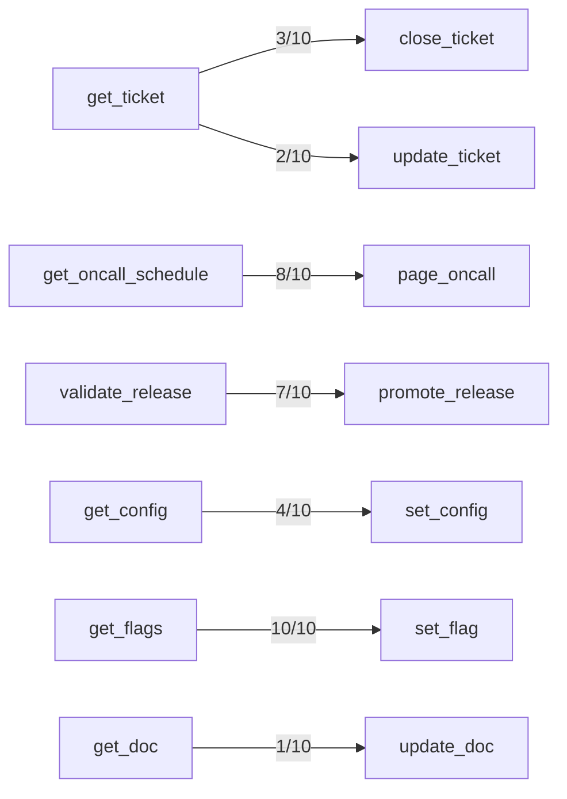

## Confusion Matrix

| Intended \ Called | acknowledge_alert | add_ticket_note | archive_doc | close_ticket | comment_on_ticket | create_doc | create_flag | create_incident_legacy | create_ticket | deactivate_user | delete_flag | deploy_release | get_config | get_deployment | get_doc | get_flags | get_oncall_schedule | get_secret_v1 | get_ticket | get_user | invite_user | list_alerts | list_deployments | list_environments | list_flags | list_shifts | list_teams | list_tickets | list_users | lookup_user | mute_alert | open_incident | override_oncall | page_oncall | promote_release | read_secret | redeploy_service | resolve_incident | restart_service | rollback_deployment | rotate_secret | search_docs | search_tickets | set_config | set_flag | snooze_alert | update_doc | update_ticket | validate_release | (no call) |
|---|---|---|---|---|---|---|---|---|---|---|---|---|---|---|---|---|---|---|---|---|---|---|---|---|---|---|---|---|---|---|---|---|---|---|---|---|---|---|---|---|---|---|---|---|---|---|---|---|---|---|
| acknowledge_alert | 10 | 0 | 0 | 0 | 0 | 0 | 0 | 0 | 0 | 0 | 0 | 0 | 0 | 0 | 0 | 0 | 0 | 0 | 0 | 0 | 0 | 0 | 0 | 0 | 0 | 0 | 0 | 0 | 0 | 0 | 0 | 0 | 0 | 0 | 0 | 0 | 0 | 0 | 0 | 0 | 0 | 0 | 0 | 0 | 0 | 0 | 0 | 0 | 0 | 0 |
| add_ticket_note | 0 | 10 | 0 | 0 | 0 | 0 | 0 | 0 | 0 | 0 | 0 | 0 | 0 | 0 | 0 | 0 | 0 | 0 | 0 | 0 | 0 | 0 | 0 | 0 | 0 | 0 | 0 | 0 | 0 | 0 | 0 | 0 | 0 | 0 | 0 | 0 | 0 | 0 | 0 | 0 | 0 | 0 | 0 | 0 | 0 | 0 | 0 | 0 | 0 | 0 |
| archive_doc | 0 | 0 | 10 | 0 | 0 | 0 | 0 | 0 | 0 | 0 | 0 | 0 | 0 | 0 | 0 | 0 | 0 | 0 | 0 | 0 | 0 | 0 | 0 | 0 | 0 | 0 | 0 | 0 | 0 | 0 | 0 | 0 | 0 | 0 | 0 | 0 | 0 | 0 | 0 | 0 | 0 | 0 | 0 | 0 | 0 | 0 | 0 | 0 | 0 | 0 |
| close_ticket | 0 | 0 | 0 | 5 | 0 | 0 | 0 | 0 | 0 | 0 | 0 | 0 | 0 | 0 | 0 | 0 | 0 | 0 | 5 | 0 | 0 | 0 | 0 | 0 | 0 | 0 | 0 | 0 | 0 | 0 | 0 | 0 | 0 | 0 | 0 | 0 | 0 | 0 | 0 | 0 | 0 | 0 | 0 | 0 | 0 | 0 | 0 | 0 | 0 | 0 |
| comment_on_ticket | 0 | 0 | 0 | 0 | 10 | 0 | 0 | 0 | 0 | 0 | 0 | 0 | 0 | 0 | 0 | 0 | 0 | 0 | 0 | 0 | 0 | 0 | 0 | 0 | 0 | 0 | 0 | 0 | 0 | 0 | 0 | 0 | 0 | 0 | 0 | 0 | 0 | 0 | 0 | 0 | 0 | 0 | 0 | 0 | 0 | 0 | 0 | 0 | 0 | 0 |
| create_doc | 0 | 0 | 0 | 0 | 0 | 10 | 0 | 0 | 0 | 0 | 0 | 0 | 0 | 0 | 0 | 0 | 0 | 0 | 0 | 0 | 0 | 0 | 0 | 0 | 0 | 0 | 0 | 0 | 0 | 0 | 0 | 0 | 0 | 0 | 0 | 0 | 0 | 0 | 0 | 0 | 0 | 0 | 0 | 0 | 0 | 0 | 0 | 0 | 0 | 0 |
| create_flag | 0 | 0 | 0 | 0 | 0 | 0 | 10 | 0 | 0 | 0 | 0 | 0 | 0 | 0 | 0 | 0 | 0 | 0 | 0 | 0 | 0 | 0 | 0 | 0 | 0 | 0 | 0 | 0 | 0 | 0 | 0 | 0 | 0 | 0 | 0 | 0 | 0 | 0 | 0 | 0 | 0 | 0 | 0 | 0 | 0 | 0 | 0 | 0 | 0 | 0 |
| create_incident_legacy | 0 | 0 | 0 | 0 | 0 | 0 | 0 | 9 | 0 | 0 | 0 | 0 | 0 | 0 | 0 | 0 | 0 | 0 | 0 | 0 | 0 | 0 | 0 | 0 | 0 | 0 | 0 | 0 | 0 | 0 | 0 | 1 | 0 | 0 | 0 | 0 | 0 | 0 | 0 | 0 | 0 | 0 | 0 | 0 | 0 | 0 | 0 | 0 | 0 | 0 |
| create_ticket | 0 | 0 | 0 | 0 | 0 | 0 | 0 | 0 | 10 | 0 | 0 | 0 | 0 | 0 | 0 | 0 | 0 | 0 | 0 | 0 | 0 | 0 | 0 | 0 | 0 | 0 | 0 | 0 | 0 | 0 | 0 | 0 | 0 | 0 | 0 | 0 | 0 | 0 | 0 | 0 | 0 | 0 | 0 | 0 | 0 | 0 | 0 | 0 | 0 | 0 |
| deactivate_user | 0 | 0 | 0 | 0 | 0 | 0 | 0 | 0 | 0 | 10 | 0 | 0 | 0 | 0 | 0 | 0 | 0 | 0 | 0 | 0 | 0 | 0 | 0 | 0 | 0 | 0 | 0 | 0 | 0 | 0 | 0 | 0 | 0 | 0 | 0 | 0 | 0 | 0 | 0 | 0 | 0 | 0 | 0 | 0 | 0 | 0 | 0 | 0 | 0 | 0 |
| delete_flag | 0 | 0 | 0 | 0 | 0 | 0 | 0 | 0 | 0 | 0 | 10 | 0 | 0 | 0 | 0 | 0 | 0 | 0 | 0 | 0 | 0 | 0 | 0 | 0 | 0 | 0 | 0 | 0 | 0 | 0 | 0 | 0 | 0 | 0 | 0 | 0 | 0 | 0 | 0 | 0 | 0 | 0 | 0 | 0 | 0 | 0 | 0 | 0 | 0 | 0 |
| deploy_release | 0 | 0 | 0 | 0 | 0 | 0 | 0 | 0 | 0 | 0 | 0 | 9 | 0 | 1 | 0 | 0 | 0 | 0 | 0 | 0 | 0 | 0 | 0 | 0 | 0 | 0 | 0 | 0 | 0 | 0 | 0 | 0 | 0 | 0 | 0 | 0 | 0 | 0 | 0 | 0 | 0 | 0 | 0 | 0 | 0 | 0 | 0 | 0 | 0 | 0 |
| get_config | 0 | 0 | 0 | 0 | 0 | 0 | 0 | 0 | 0 | 0 | 0 | 0 | 10 | 0 | 0 | 0 | 0 | 0 | 0 | 0 | 0 | 0 | 0 | 0 | 0 | 0 | 0 | 0 | 0 | 0 | 0 | 0 | 0 | 0 | 0 | 0 | 0 | 0 | 0 | 0 | 0 | 0 | 0 | 0 | 0 | 0 | 0 | 0 | 0 | 0 |
| get_deployment | 0 | 0 | 0 | 0 | 0 | 0 | 0 | 0 | 0 | 0 | 0 | 0 | 0 | 10 | 0 | 0 | 0 | 0 | 0 | 0 | 0 | 0 | 0 | 0 | 0 | 0 | 0 | 0 | 0 | 0 | 0 | 0 | 0 | 0 | 0 | 0 | 0 | 0 | 0 | 0 | 0 | 0 | 0 | 0 | 0 | 0 | 0 | 0 | 0 | 0 |
| get_doc | 0 | 0 | 0 | 0 | 0 | 0 | 0 | 0 | 0 | 0 | 0 | 0 | 0 | 0 | 10 | 0 | 0 | 0 | 0 | 0 | 0 | 0 | 0 | 0 | 0 | 0 | 0 | 0 | 0 | 0 | 0 | 0 | 0 | 0 | 0 | 0 | 0 | 0 | 0 | 0 | 0 | 0 | 0 | 0 | 0 | 0 | 0 | 0 | 0 | 0 |
| get_flags | 0 | 0 | 0 | 0 | 0 | 0 | 0 | 0 | 0 | 0 | 0 | 0 | 0 | 0 | 0 | 10 | 0 | 0 | 0 | 0 | 0 | 0 | 0 | 0 | 0 | 0 | 0 | 0 | 0 | 0 | 0 | 0 | 0 | 0 | 0 | 0 | 0 | 0 | 0 | 0 | 0 | 0 | 0 | 0 | 0 | 0 | 0 | 0 | 0 | 0 |
| get_oncall_schedule | 0 | 0 | 0 | 0 | 0 | 0 | 0 | 0 | 0 | 0 | 0 | 0 | 0 | 0 | 0 | 0 | 10 | 0 | 0 | 0 | 0 | 0 | 0 | 0 | 0 | 0 | 0 | 0 | 0 | 0 | 0 | 0 | 0 | 0 | 0 | 0 | 0 | 0 | 0 | 0 | 0 | 0 | 0 | 0 | 0 | 0 | 0 | 0 | 0 | 0 |
| get_secret_v1 | 0 | 0 | 0 | 0 | 0 | 0 | 0 | 0 | 0 | 0 | 0 | 0 | 0 | 0 | 0 | 0 | 0 | 0 | 0 | 0 | 0 | 0 | 0 | 0 | 0 | 0 | 0 | 0 | 0 | 0 | 0 | 0 | 0 | 0 | 0 | 8 | 0 | 0 | 0 | 0 | 0 | 0 | 0 | 0 | 0 | 0 | 0 | 0 | 0 | 2 |
| get_ticket | 0 | 0 | 0 | 0 | 0 | 0 | 0 | 0 | 0 | 0 | 0 | 0 | 0 | 0 | 0 | 0 | 0 | 0 | 10 | 0 | 0 | 0 | 0 | 0 | 0 | 0 | 0 | 0 | 0 | 0 | 0 | 0 | 0 | 0 | 0 | 0 | 0 | 0 | 0 | 0 | 0 | 0 | 0 | 0 | 0 | 0 | 0 | 0 | 0 | 0 |
| get_user | 0 | 0 | 0 | 0 | 0 | 0 | 0 | 0 | 0 | 0 | 0 | 0 | 0 | 0 | 0 | 0 | 0 | 0 | 0 | 10 | 0 | 0 | 0 | 0 | 0 | 0 | 0 | 0 | 0 | 0 | 0 | 0 | 0 | 0 | 0 | 0 | 0 | 0 | 0 | 0 | 0 | 0 | 0 | 0 | 0 | 0 | 0 | 0 | 0 | 0 |
| invite_user | 0 | 0 | 0 | 0 | 0 | 0 | 0 | 0 | 0 | 0 | 0 | 0 | 0 | 0 | 0 | 0 | 0 | 0 | 0 | 0 | 9 | 0 | 0 | 0 | 0 | 0 | 0 | 0 | 0 | 1 | 0 | 0 | 0 | 0 | 0 | 0 | 0 | 0 | 0 | 0 | 0 | 0 | 0 | 0 | 0 | 0 | 0 | 0 | 0 | 0 |
| list_alerts | 0 | 0 | 0 | 0 | 0 | 0 | 0 | 0 | 0 | 0 | 0 | 0 | 0 | 0 | 0 | 0 | 0 | 0 | 0 | 0 | 0 | 10 | 0 | 0 | 0 | 0 | 0 | 0 | 0 | 0 | 0 | 0 | 0 | 0 | 0 | 0 | 0 | 0 | 0 | 0 | 0 | 0 | 0 | 0 | 0 | 0 | 0 | 0 | 0 | 0 |
| list_deployments | 0 | 0 | 0 | 0 | 0 | 0 | 0 | 0 | 0 | 0 | 0 | 0 | 0 | 0 | 0 | 0 | 0 | 0 | 0 | 0 | 0 | 0 | 10 | 0 | 0 | 0 | 0 | 0 | 0 | 0 | 0 | 0 | 0 | 0 | 0 | 0 | 0 | 0 | 0 | 0 | 0 | 0 | 0 | 0 | 0 | 0 | 0 | 0 | 0 | 0 |
| list_environments | 0 | 0 | 0 | 0 | 0 | 0 | 0 | 0 | 0 | 0 | 0 | 0 | 0 | 0 | 0 | 0 | 0 | 0 | 0 | 0 | 0 | 0 | 0 | 10 | 0 | 0 | 0 | 0 | 0 | 0 | 0 | 0 | 0 | 0 | 0 | 0 | 0 | 0 | 0 | 0 | 0 | 0 | 0 | 0 | 0 | 0 | 0 | 0 | 0 | 0 |
| list_flags | 0 | 0 | 0 | 0 | 0 | 0 | 0 | 0 | 0 | 0 | 0 | 0 | 0 | 0 | 0 | 0 | 0 | 0 | 0 | 0 | 0 | 0 | 0 | 0 | 10 | 0 | 0 | 0 | 0 | 0 | 0 | 0 | 0 | 0 | 0 | 0 | 0 | 0 | 0 | 0 | 0 | 0 | 0 | 0 | 0 | 0 | 0 | 0 | 0 | 0 |
| list_shifts | 0 | 0 | 0 | 0 | 0 | 0 | 0 | 0 | 0 | 0 | 0 | 0 | 0 | 0 | 0 | 0 | 0 | 0 | 0 | 0 | 0 | 0 | 0 | 0 | 0 | 10 | 0 | 0 | 0 | 0 | 0 | 0 | 0 | 0 | 0 | 0 | 0 | 0 | 0 | 0 | 0 | 0 | 0 | 0 | 0 | 0 | 0 | 0 | 0 | 0 |
| list_teams | 0 | 0 | 0 | 0 | 0 | 0 | 0 | 0 | 0 | 0 | 0 | 0 | 0 | 0 | 0 | 0 | 0 | 0 | 0 | 0 | 0 | 0 | 0 | 0 | 0 | 0 | 10 | 0 | 0 | 0 | 0 | 0 | 0 | 0 | 0 | 0 | 0 | 0 | 0 | 0 | 0 | 0 | 0 | 0 | 0 | 0 | 0 | 0 | 0 | 0 |
| list_tickets | 0 | 0 | 0 | 0 | 0 | 0 | 0 | 0 | 0 | 0 | 0 | 0 | 0 | 0 | 0 | 0 | 0 | 0 | 0 | 0 | 0 | 0 | 0 | 0 | 0 | 0 | 0 | 9 | 0 | 0 | 0 | 0 | 0 | 0 | 0 | 0 | 0 | 0 | 0 | 0 | 0 | 0 | 0 | 0 | 0 | 0 | 0 | 0 | 0 | 1 |
| list_users | 0 | 0 | 0 | 0 | 0 | 0 | 0 | 0 | 0 | 0 | 0 | 0 | 0 | 0 | 0 | 0 | 0 | 0 | 0 | 0 | 0 | 0 | 0 | 0 | 0 | 0 | 0 | 0 | 10 | 0 | 0 | 0 | 0 | 0 | 0 | 0 | 0 | 0 | 0 | 0 | 0 | 0 | 0 | 0 | 0 | 0 | 0 | 0 | 0 | 0 |
| lookup_user | 0 | 0 | 0 | 0 | 0 | 0 | 0 | 0 | 0 | 0 | 0 | 0 | 0 | 0 | 0 | 0 | 0 | 0 | 0 | 0 | 0 | 0 | 0 | 0 | 0 | 0 | 0 | 0 | 0 | 10 | 0 | 0 | 0 | 0 | 0 | 0 | 0 | 0 | 0 | 0 | 0 | 0 | 0 | 0 | 0 | 0 | 0 | 0 | 0 | 0 |
| mute_alert | 0 | 0 | 0 | 0 | 0 | 0 | 0 | 0 | 0 | 0 | 0 | 0 | 0 | 0 | 0 | 0 | 0 | 0 | 0 | 0 | 0 | 0 | 0 | 0 | 0 | 0 | 0 | 0 | 0 | 0 | 10 | 0 | 0 | 0 | 0 | 0 | 0 | 0 | 0 | 0 | 0 | 0 | 0 | 0 | 0 | 0 | 0 | 0 | 0 | 0 |
| open_incident | 0 | 0 | 0 | 0 | 0 | 0 | 0 | 2 | 0 | 0 | 0 | 0 | 0 | 0 | 0 | 0 | 0 | 0 | 0 | 0 | 0 | 0 | 0 | 0 | 0 | 0 | 0 | 0 | 0 | 0 | 0 | 8 | 0 | 0 | 0 | 0 | 0 | 0 | 0 | 0 | 0 | 0 | 0 | 0 | 0 | 0 | 0 | 0 | 0 | 0 |
| override_oncall | 0 | 0 | 0 | 0 | 0 | 0 | 0 | 0 | 0 | 0 | 0 | 0 | 0 | 0 | 0 | 0 | 0 | 0 | 0 | 0 | 0 | 0 | 0 | 0 | 0 | 0 | 0 | 0 | 0 | 0 | 0 | 0 | 7 | 0 | 0 | 0 | 0 | 0 | 0 | 0 | 0 | 0 | 0 | 0 | 0 | 0 | 0 | 0 | 0 | 3 |
| page_oncall | 0 | 0 | 0 | 0 | 0 | 0 | 0 | 0 | 0 | 0 | 0 | 0 | 0 | 0 | 0 | 0 | 10 | 0 | 0 | 0 | 0 | 0 | 0 | 0 | 0 | 0 | 0 | 0 | 0 | 0 | 0 | 0 | 0 | 0 | 0 | 0 | 0 | 0 | 0 | 0 | 0 | 0 | 0 | 0 | 0 | 0 | 0 | 0 | 0 | 0 |
| promote_release | 0 | 0 | 0 | 0 | 0 | 0 | 0 | 0 | 0 | 0 | 0 | 0 | 0 | 0 | 0 | 0 | 0 | 0 | 0 | 0 | 0 | 0 | 0 | 0 | 0 | 0 | 0 | 0 | 0 | 0 | 0 | 0 | 0 | 0 | 3 | 0 | 0 | 0 | 0 | 0 | 0 | 0 | 0 | 0 | 0 | 0 | 0 | 0 | 7 | 0 |
| read_secret | 0 | 0 | 0 | 0 | 0 | 0 | 0 | 0 | 0 | 0 | 0 | 0 | 0 | 0 | 0 | 0 | 0 | 0 | 0 | 0 | 0 | 0 | 0 | 0 | 0 | 0 | 0 | 0 | 0 | 0 | 0 | 0 | 0 | 0 | 0 | 10 | 0 | 0 | 0 | 0 | 0 | 0 | 0 | 0 | 0 | 0 | 0 | 0 | 0 | 0 |
| redeploy_service | 0 | 0 | 0 | 0 | 0 | 0 | 0 | 0 | 0 | 0 | 0 | 0 | 0 | 0 | 0 | 0 | 0 | 0 | 0 | 0 | 0 | 0 | 0 | 0 | 0 | 0 | 0 | 0 | 0 | 0 | 0 | 0 | 0 | 0 | 0 | 0 | 10 | 0 | 0 | 0 | 0 | 0 | 0 | 0 | 0 | 0 | 0 | 0 | 0 | 0 |
| resolve_incident | 0 | 0 | 0 | 0 | 0 | 0 | 0 | 0 | 0 | 0 | 0 | 0 | 0 | 0 | 0 | 0 | 0 | 0 | 0 | 0 | 0 | 0 | 0 | 0 | 0 | 0 | 0 | 0 | 0 | 0 | 0 | 0 | 0 | 0 | 0 | 0 | 0 | 10 | 0 | 0 | 0 | 0 | 0 | 0 | 0 | 0 | 0 | 0 | 0 | 0 |
| restart_service | 0 | 0 | 0 | 0 | 0 | 0 | 0 | 0 | 0 | 0 | 0 | 0 | 0 | 0 | 0 | 0 | 0 | 0 | 0 | 0 | 0 | 0 | 0 | 0 | 0 | 0 | 0 | 0 | 0 | 0 | 0 | 0 | 0 | 0 | 0 | 0 | 0 | 0 | 10 | 0 | 0 | 0 | 0 | 0 | 0 | 0 | 0 | 0 | 0 | 0 |
| rollback_deployment | 0 | 0 | 0 | 0 | 0 | 0 | 0 | 0 | 0 | 0 | 0 | 0 | 0 | 0 | 0 | 0 | 0 | 0 | 0 | 0 | 0 | 0 | 0 | 0 | 0 | 0 | 0 | 0 | 0 | 0 | 0 | 0 | 0 | 0 | 0 | 0 | 0 | 0 | 0 | 10 | 0 | 0 | 0 | 0 | 0 | 0 | 0 | 0 | 0 | 0 |
| rotate_secret | 0 | 0 | 0 | 0 | 0 | 0 | 0 | 0 | 0 | 0 | 0 | 0 | 0 | 0 | 0 | 0 | 0 | 0 | 0 | 0 | 0 | 0 | 0 | 0 | 0 | 0 | 0 | 0 | 0 | 0 | 0 | 0 | 0 | 0 | 0 | 0 | 0 | 0 | 0 | 0 | 10 | 0 | 0 | 0 | 0 | 0 | 0 | 0 | 0 | 0 |
| search_docs | 0 | 0 | 0 | 0 | 0 | 0 | 0 | 0 | 0 | 0 | 0 | 0 | 0 | 0 | 0 | 0 | 0 | 0 | 0 | 0 | 0 | 0 | 0 | 0 | 0 | 0 | 0 | 0 | 0 | 0 | 0 | 0 | 0 | 0 | 0 | 0 | 0 | 0 | 0 | 0 | 0 | 10 | 0 | 0 | 0 | 0 | 0 | 0 | 0 | 0 |
| search_tickets | 0 | 0 | 0 | 0 | 0 | 0 | 0 | 0 | 0 | 0 | 0 | 0 | 0 | 0 | 0 | 0 | 0 | 0 | 0 | 0 | 0 | 0 | 0 | 0 | 0 | 0 | 0 | 0 | 0 | 0 | 0 | 0 | 0 | 0 | 0 | 0 | 0 | 0 | 0 | 0 | 0 | 0 | 10 | 0 | 0 | 0 | 0 | 0 | 0 | 0 |
| set_config | 0 | 0 | 0 | 0 | 0 | 0 | 0 | 0 | 0 | 0 | 0 | 0 | 5 | 0 | 0 | 0 | 0 | 0 | 0 | 0 | 0 | 0 | 0 | 0 | 0 | 0 | 0 | 0 | 0 | 0 | 0 | 0 | 0 | 0 | 0 | 0 | 0 | 0 | 0 | 0 | 0 | 0 | 0 | 5 | 0 | 0 | 0 | 0 | 0 | 0 |
| set_flag | 0 | 0 | 0 | 0 | 0 | 0 | 0 | 0 | 0 | 0 | 0 | 0 | 0 | 0 | 0 | 10 | 0 | 0 | 0 | 0 | 0 | 0 | 0 | 0 | 0 | 0 | 0 | 0 | 0 | 0 | 0 | 0 | 0 | 0 | 0 | 0 | 0 | 0 | 0 | 0 | 0 | 0 | 0 | 0 | 0 | 0 | 0 | 0 | 0 | 0 |
| snooze_alert | 0 | 0 | 0 | 0 | 0 | 0 | 0 | 0 | 0 | 0 | 0 | 0 | 0 | 0 | 0 | 0 | 0 | 0 | 0 | 0 | 0 | 0 | 0 | 0 | 0 | 0 | 0 | 0 | 0 | 0 | 0 | 0 | 0 | 0 | 0 | 0 | 0 | 0 | 0 | 0 | 0 | 0 | 0 | 0 | 0 | 6 | 0 | 0 | 0 | 4 |
| update_doc | 0 | 0 | 0 | 0 | 0 | 0 | 0 | 0 | 0 | 0 | 0 | 0 | 0 | 0 | 1 | 0 | 0 | 0 | 0 | 0 | 0 | 0 | 0 | 0 | 0 | 0 | 0 | 0 | 0 | 0 | 0 | 0 | 0 | 0 | 0 | 0 | 0 | 0 | 0 | 0 | 0 | 0 | 0 | 0 | 0 | 0 | 9 | 0 | 0 | 0 |
| update_ticket | 0 | 0 | 0 | 0 | 0 | 0 | 0 | 0 | 0 | 0 | 0 | 0 | 0 | 0 | 0 | 0 | 0 | 0 | 2 | 0 | 0 | 0 | 0 | 0 | 0 | 0 | 0 | 0 | 0 | 0 | 0 | 0 | 0 | 0 | 0 | 0 | 0 | 0 | 0 | 0 | 0 | 0 | 0 | 0 | 0 | 0 | 0 | 8 | 0 | 0 |
| validate_release | 0 | 0 | 0 | 0 | 0 | 0 | 0 | 0 | 0 | 0 | 0 | 0 | 0 | 0 | 0 | 0 | 0 | 0 | 0 | 0 | 0 | 0 | 0 | 0 | 0 | 0 | 0 | 0 | 0 | 0 | 0 | 0 | 0 | 0 | 0 | 0 | 0 | 0 | 0 | 0 | 0 | 0 | 0 | 0 | 0 | 0 | 0 | 0 | 10 | 0 |

## Trial Diversity
- acknowledge_alert: 10/10 distinct
- add_ticket_note: 10/10 distinct
- archive_doc: 10/10 distinct
- close_ticket: 10/10 distinct
- comment_on_ticket: 10/10 distinct
- create_doc: 10/10 distinct
- create_flag: 10/10 distinct
- create_incident_legacy: 8/10 distinct (some seeds sampled identical arguments)
- create_ticket: 10/10 distinct
- deactivate_user: 10/10 distinct
- delete_flag: 10/10 distinct
- deploy_release: 10/10 distinct
- get_config: 10/10 distinct
- get_deployment: 10/10 distinct
- get_doc: 10/10 distinct
- get_flags: 10/10 distinct
- get_oncall_schedule: 10/10 distinct
- get_secret_v1: 10/10 distinct
- get_ticket: 10/10 distinct
- get_user: 10/10 distinct
- invite_user: 10/10 distinct
- list_alerts: 10/10 distinct
- list_deployments: 10/10 distinct
- list_environments: 10/10 distinct
- list_flags: 10/10 distinct
- list_shifts: 10/10 distinct
- list_teams: 3/10 distinct (some seeds sampled identical arguments)
- list_tickets: 10/10 distinct
- list_users: 10/10 distinct
- lookup_user: 10/10 distinct
- mute_alert: 10/10 distinct
- open_incident: 10/10 distinct
- override_oncall: 10/10 distinct
- page_oncall: 10/10 distinct
- promote_release: 10/10 distinct
- read_secret: 10/10 distinct
- redeploy_service: 10/10 distinct
- resolve_incident: 10/10 distinct
- restart_service: 10/10 distinct
- rollback_deployment: 10/10 distinct
- rotate_secret: 10/10 distinct
- search_docs: 10/10 distinct
- search_tickets: 10/10 distinct
- set_config: 10/10 distinct
- set_flag: 10/10 distinct
- snooze_alert: 10/10 distinct
- update_doc: 10/10 distinct
- update_ticket: 10/10 distinct
- validate_release: 10/10 distinct

## Pass Rates
- acknowledge_alert: 9/10 (90%), 95% CI [60%, 98%]
- add_ticket_note: 10/10 (100%), 95% CI [72%, 100%]
- archive_doc: 10/10 (100%), 95% CI [72%, 100%]
- close_ticket: 7/10 (70%), 95% CI [40%, 89%]
- comment_on_ticket: 9/10 (90%), 95% CI [60%, 98%]
- create_doc: 10/10 (100%), 95% CI [72%, 100%]
- create_flag: 8/10 (80%), 95% CI [49%, 94%]
- create_incident_legacy: 9/10 (90%), 95% CI [60%, 98%]
- create_ticket: 10/10 (100%), 95% CI [72%, 100%]
- deactivate_user: 10/10 (100%), 95% CI [72%, 100%]
- delete_flag: 10/10 (100%), 95% CI [72%, 100%]
- deploy_release: 4/10 (40%), 95% CI [17%, 69%]
- get_config: 10/10 (100%), 95% CI [72%, 100%]
- get_deployment: 10/10 (100%), 95% CI [72%, 100%]
- get_doc: 10/10 (100%), 95% CI [72%, 100%]
- get_flags: 10/10 (100%), 95% CI [72%, 100%]
- get_oncall_schedule: 10/10 (100%), 95% CI [72%, 100%]
- get_secret_v1: 0/10 (0%), 95% CI [0%, 28%]
- get_ticket: 10/10 (100%), 95% CI [72%, 100%]
- get_user: 10/10 (100%), 95% CI [72%, 100%]
- invite_user: 4/10 (40%), 95% CI [17%, 69%]
- list_alerts: 6/10 (60%), 95% CI [31%, 83%]
- list_deployments: 10/10 (100%), 95% CI [72%, 100%]
- list_environments: 10/10 (100%), 95% CI [72%, 100%]
- list_flags: 10/10 (100%), 95% CI [72%, 100%]
- list_shifts: 8/10 (80%), 95% CI [49%, 94%]
- list_teams: 6/10 (60%), 95% CI [31%, 83%]
- list_tickets: 6/10 (60%), 95% CI [31%, 83%]
- list_users: 6/10 (60%), 95% CI [31%, 83%]
- lookup_user: 10/10 (100%), 95% CI [72%, 100%]
- mute_alert: 3/10 (30%), 95% CI [11%, 60%]
- open_incident: 6/10 (60%), 95% CI [31%, 83%]
- override_oncall: 2/10 (20%), 95% CI [6%, 51%]
- page_oncall: 8/10 (80%), 95% CI [49%, 94%]
- promote_release: 10/10 (100%), 95% CI [72%, 100%]
- read_secret: 10/10 (100%), 95% CI [72%, 100%]
- redeploy_service: 10/10 (100%), 95% CI [72%, 100%]
- resolve_incident: 10/10 (100%), 95% CI [72%, 100%]
- restart_service: 10/10 (100%), 95% CI [72%, 100%]
- rollback_deployment: 10/10 (100%), 95% CI [72%, 100%]
- rotate_secret: 7/10 (70%), 95% CI [40%, 89%]
- search_docs: 7/10 (70%), 95% CI [40%, 89%]
- search_tickets: 9/10 (90%), 95% CI [60%, 98%]
- set_config: 9/10 (90%), 95% CI [60%, 98%]
- set_flag: 10/10 (100%), 95% CI [72%, 100%]
- snooze_alert: 4/10 (40%), 95% CI [17%, 69%]
- update_doc: 10/10 (100%), 95% CI [72%, 100%]
- update_ticket: 10/10 (100%), 95% CI [72%, 100%]
- validate_release: 10/10 (100%), 95% CI [72%, 100%]

## Preconditions (observed)

Tools the model called *before* correctly calling the intended one, per trial:

- get_ticket → close_ticket: 3/10 trials
- get_oncall_schedule → page_oncall: 8/10 trials
- validate_release → promote_release: 7/10 trials
- get_config → set_config: 4/10 trials
- get_flags → set_flag: 10/10 trials
- get_doc → update_doc: 1/10 trials
- get_ticket → update_ticket: 2/10 trials

## Undeclared Preconditions

The model follows these dependencies, but the catalog is silent about them. Either state
the precondition in the description or make the tool self-sufficient, then re-run:

- close_ticket: models call get_ticket first in 3/10 trials, but close_ticket's description never mentions get_ticket
- page_oncall: models call get_oncall_schedule first in 8/10 trials, but page_oncall's description never mentions get_oncall_schedule
- set_config: models call get_config first in 4/10 trials, but set_config's description never mentions get_config
- set_flag: models call get_flags first in 10/10 trials, but set_flag's description never mentions get_flags

## Argument Failures

Trials that reached the right tool with the wrong arguments, per parameter: `missing` = expected but not sent, `extra` = sent but not expected, `wrong` = value differs, `* malformed/duplicated argument JSON` = the argument text could not be parsed.

- acknowledge_alert: note extra 1/10
- close_ticket: duplicate_of extra 2/10; resolution wrong 1/10
- comment_on_ticket: notify_assignee extra 1/10
- create_flag: default_on missing 2/10
- deploy_release: window extra 5/10; window wrong 1/10
- invite_user: role extra 6/10
- list_alerts: page extra 2/10; page missing 2/10
- list_shifts: days_ahead extra 2/10
- list_teams: include_members extra 4/10
- list_tickets: page extra 2/10; page wrong 1/10
- list_users: page missing 2/10; limit extra 2/10; page wrong 1/10; page extra 1/10
- mute_alert: until wrong 7/10
- open_incident: title wrong 2/10
- override_oncall: window wrong 5/10
- page_oncall: urgency extra 1/10; schedule_id wrong 1/10
- rotate_secret: notify_owner extra 3/10
- search_docs: page missing 2/10; limit extra 1/10; cursor extra 1/10; page wrong 1/10
- search_tickets: page extra 1/10
- snooze_alert: minutes extra 2/10

## No-Call Replies

- get_secret_v1 (seed 8, asked): Sure, I can help with that. Could you please provide the environment ID and a justification for accessing the secret?
- get_secret_v1 (seed 9, asked): Absolutely, I can help with that. Could you please provide the environment ID where the secret is stored?
- list_tickets (seed 2, asked): Sure, I can help with that. Could you please provide me with the specific filters you want to apply to the tickets?
- snooze_alert (seed 1, asked): Sure, how many minutes would you like to snooze the alert for?
- snooze_alert (seed 3, other): Sure, please specify the number of minutes you want to snooze the alert for.
- snooze_alert (seed 6, asked): Sure thing! How many minutes would you like to snooze the alert for?
- snooze_alert (seed 7, asked): Sure, how many minutes would you like to snooze the alert for?

## Solvability Warnings
- get_user (seed 1, passed anyway, after 2 regeneration(s)): 
- get_user (seed 2, passed anyway, after 2 regeneration(s)): unparseable response, treated as ambiguous: **AMBIGUOUS** — two overlapping tools (`get_user` and `lookup_user`) both fetch a user record with no criteria given to choose between them.
- get_user (seed 3, passed anyway, after 2 regeneration(s)): unparseable response, treated as ambiguous: **AMBIGUOUS** — both `get_user` and `lookup_user` are listed with the identical description "Return user record," so the tool list gives no way to determine which one is intended for fetching this user ID.
- get_user (seed 4, passed anyway, after 2 regeneration(s)): unparseable response, treated as ambiguous: **AMBIGUOUS** — two equivalent tools (`get_user` and `lookup_user`) both return a user record, so it's unclear which one should be used to fetch the details.
- get_user (seed 5, passed anyway, after 2 regeneration(s)): 
- get_user (seed 6, passed anyway, after 2 regeneration(s)): 
- get_user (seed 7, passed anyway, after 2 regeneration(s)): unparseable response, treated as ambiguous: **AMBIGUOUS** — both `get_user` and `lookup_user` claim to "return user record," so it's unclear which tool should be used to fetch the details for sample-user_id-332.
- get_user (seed 8, passed anyway, after 2 regeneration(s)): 
- get_user (seed 9, passed anyway, after 2 regeneration(s)): unparseable response, treated as ambiguous: **AMBIGUOUS**

The request is a simple, clearly-specified lookup ("pull up user record for user ID sample-user_id-475"), but the tool list contains two functions with identical descriptions and purpose:

- `get_user`: Return user record.
- `lookup_user`: Return user record.

There is no distinguishing information (e.g., differing parameters, scope, or use-case notes) to indicate which of these two tools is the correct one to call for this task. Since both appear functionally identical from their descriptions, selecting one over the other would be a guess rather than a determination based on the tool definitions provided.
- get_user (seed 10, passed anyway, after 2 regeneration(s)): unparseable response, treated as ambiguous: **AMBIGUOUS** — the request could be fulfilled by either `get_user` or `lookup_user`, since both are described identically as returning a user record with no distinguishing criteria for which to use.
- lookup_user (seed 1, passed anyway, after 2 regeneration(s)): 
- lookup_user (seed 2, passed anyway, after 2 regeneration(s)): 
- lookup_user (seed 3, passed anyway, after 2 regeneration(s)): 
- lookup_user (seed 4, passed anyway, after 2 regeneration(s)): 
- lookup_user (seed 5, passed anyway, after 2 regeneration(s)): 
- lookup_user (seed 6, passed anyway, after 2 regeneration(s)): unparseable response, treated as ambiguous: **AMBIGUOUS** — there are two functionally identical tools (`get_user` and `lookup_user`) for retrieving a user record, and the request doesn't specify which one to use.
- lookup_user (seed 9, passed anyway, after 2 regeneration(s)): unparseable response, treated as ambiguous: **SOLVABLE** — There are two equivalent tools (`get_user` / `lookup_user`) that can directly retrieve a user record by email, so the request can be fulfilled, albeit with minor ambiguity about which one to use (functionally interchangeable).
- lookup_user (seed 10, passed anyway, after 2 regeneration(s)): Both get_user and lookup_user are described identically as returning a user record, so the tool list gives no basis for choosing one over the other.
- list_tickets (seed 2, failed, after 2 regeneration(s)): 
- list_tickets (seed 4, passed anyway, after 2 regeneration(s)): unparseable response, treated as ambiguous: **AMBIGUOUS**: `list_tickets` is paginated, and no parameter guarantees a fixed page size of 206 results in a single call, so it's unclear if the tool can return exactly that many results on one page.
- list_tickets (seed 5, passed anyway, after 2 regeneration(s)): unparseable response, treated as ambiguous: **AMBIGUOUS** — "all tickets" doesn't specify which tool to use (`list_tickets` needs filter criteria while `search_tickets` needs a query) or what scope/status/team to include, so it's unclear how to call either correctly.
- search_tickets (seed 8, failed, after 2 regeneration(s)): The only relevant tool, search_tickets, doesn't specify any parameter to disable pagination or guarantee all matches are returned on a single page, so it's unclear whether the request can be fulfilled as stated.
- close_ticket (seed 4, passed anyway, after 2 regeneration(s)): The close_ticket tool requires an original ticket id when resolution is "duplicate," but the request explicitly states no original ticket number is available to link, making it impossible to fulfill the request with the given tool constraints.
- close_ticket (seed 5, failed, after 2 regeneration(s)): unparseable response, treated as ambiguous: **AMBIGUOUS** — closing as a duplicate requires the original ticket ID to reference, which was not provided in the request.
- close_ticket (seed 8, failed, after 2 regeneration(s)): 
- get_deployment (seed 1, passed anyway, after 2 regeneration(s)): 
- get_deployment (seed 2, passed anyway, after 2 regeneration(s)): 
- get_deployment (seed 3, passed anyway, after 2 regeneration(s)): unparseable response, treated as ambiguous: This request is AMBIGUOUS — "sample-deployment_id-244" appears to be a placeholder rather than a real deployment ID, and no environment/project context is given, which `get_deployment` would require to locate the correct deployment.
- get_deployment (seed 5, passed anyway, after 2 regeneration(s)): unparseable response, treated as ambiguous: **AMBIGUOUS** — the request omits the required environment name (and project context), which `get_deployment` needs to look up the specific deployment ID.
- get_deployment (seed 6, passed anyway, after 2 regeneration(s)): unparseable response, treated as ambiguous: **SOLVABLE** – Call `get_deployment` with `deployment_id="sample-deployment_id-813"` to retrieve its status, commit, and timing information.
- get_deployment (seed 7, passed anyway, after 2 regeneration(s)): 
- get_deployment (seed 8, passed anyway, after 2 regeneration(s)): 
- get_deployment (seed 9, passed anyway, after 2 regeneration(s)): unparseable response, treated as ambiguous: **SOLVABLE** — The `get_deployment` tool directly fetches status and commit timing for a specific deployment, and the user supplied the deployment ID (`sample-deployment_id-475`) needed to call it.
- get_deployment (seed 10, passed anyway, after 2 regeneration(s)): unparseable response, treated as ambiguous: **SOLVABLE**

The request maps directly onto a single available tool:

- **`get_deployment`** — described as "Fetch status, commit timing one deployment." This is an exact match for "check the status commit timing deployment sample-deployment_id-586."

**Action:** Call `get_deployment` with `deployment_id = "sample-deployment_id-586"`.

No ambiguity exists here — the user specified a concrete deployment ID and asked for exactly the two data points (status and commit timing) that this tool is documented to return. No additional lookups (e.g., `list_environments`, `list_deployments`) are needed since the deployment ID was given explicitly rather than requiring discovery.
- deploy_release (seed 3, failed, after 2 regeneration(s)): 
- rollback_deployment (seed 3, passed anyway, after 2 regeneration(s)): 
- list_alerts (seed 5, failed, after 2 regeneration(s)): unparseable response, treated as ambiguous: UNSOLVABLE — there is no tool available for listing or querying currently firing alerts (only alert-related actions like snoozing/paging exist).
- list_alerts (seed 6, passed anyway, after 2 regeneration(s)): 
- list_alerts (seed 9, passed anyway, after 2 regeneration(s)): 
- acknowledge_alert (seed 6, passed anyway, after 2 regeneration(s)): 
- acknowledge_alert (seed 7, passed anyway, after 2 regeneration(s)): 
- acknowledge_alert (seed 10, passed anyway, after 2 regeneration(s)): unparseable response, treated as ambiguous: **AMBIGUOUS** — there is no `acknowledge_alert` tool, and the closest match, `snooze_alert`, requires a "number of minutes" parameter that the user never specified.
- snooze_alert (seed 1, failed, after 2 regeneration(s)): 
- snooze_alert (seed 3, failed, after 2 regeneration(s)): 
- open_incident (seed 2, passed anyway, after 2 regeneration(s)): 
- open_incident (seed 3, passed anyway, after 2 regeneration(s)): 
- open_incident (seed 7, failed, after 2 regeneration(s)): 
- open_incident (seed 9, passed anyway, after 2 regeneration(s)): 
- create_incident_legacy (seed 1, passed anyway, after 2 regeneration(s)): 
- create_incident_legacy (seed 4, passed anyway, after 2 regeneration(s)): Both "open_incident" (which can simply omit the optional commander/alert-linking parameters) and "create_incident_legacy" (which inherently creates incidents without commander or alert links) could satisfy the request, and the tool list doesn't make clear which one the assistant should prefer despite the deprecation note.
- create_incident_legacy (seed 7, failed, after 2 regeneration(s)): 
- create_incident_legacy (seed 8, passed anyway, after 2 regeneration(s)): Both "open_incident" (which can simply omit the optional commander/alert-linking parameters) and "create_incident_legacy" (which inherently creates incidents without commander or alert links) could satisfy the request, and the tool list doesn't make clear which one the assistant should prefer despite the deprecation note.
- create_incident_legacy (seed 9, passed anyway, after 2 regeneration(s)): 
- search_docs (seed 8, passed anyway, after 2 regeneration(s)): 
- set_flag (seed 8, passed anyway, after 2 regeneration(s)): unparseable response, treated as ambiguous: This request is contradictory: turning a flag **off** means it's disabled, while setting a **rollout percentage of 90%** implies the flag is **on** and being served to 90% of users. These two states can't both be true in the same update — a flag that's off doesn't serve to any percentage of users.

I'd classify this as **AMBIGUOUS**: Turning off flag "sample-key-380" while also setting a 90% rollout percentage is contradictory — off means the flag shows no variation to users, making the percentage moot. Please clarify: do you want the flag turned **off** (ignoring the percentage), or turned **on with a 90% rollout**?

Once you confirm, I can use `set_flag` to apply the correct configuration for project `sample-project_id-233`, environment `sample-environment_id-986`.
- delete_flag (seed 1, passed anyway, after 2 regeneration(s)): The request doesn't specify the feature flag's key (only the environment key and project ID are given), so it's unclear which flag should be permanently deleted.
- delete_flag (seed 2, passed anyway, after 2 regeneration(s)): unparseable response, treated as ambiguous: I'm not able to complete this request. Looking through the available tools, there is no function for deleting an environment key from a project. The closest related tools are:

- **`list_environments`** – lists deployable environments for a project
- **`delete_flag`** – permanently deletes a *feature flag* (not an environment key) across all environments
- **`set_flag`** – turns a flag on/off *within* an environment

None of these perform "permanently delete an environment key" as described. Since I can only act through the listed tools, I can't carry out this specific action.

If you'd like, I can:
1. Run **`list_environments`** on project `sample-project_id-979` to confirm what "sample-key-884" refers to (e.g., is it actually an environment, or possibly a flag key?), or
2. Open a support ticket (**`create_ticket`**) requesting an engineer manually remove the environment key, since that capability isn't exposed here.

Let me know how you'd like to proceed.
- delete_flag (seed 7, passed anyway, after 2 regeneration(s)): unparseable response, treated as ambiguous: UNSOLVABLE: No available tool can delete an environment key/config value — only set_config, read_secret, and rotate_secret exist, with no delete/remove capability for config or secret keys.
- delete_flag (seed 8, passed anyway, after 2 regeneration(s)): No available tool can permanently delete an environment/config key (only delete_flag exists for feature flags, not environment variables/config values), so this request cannot be fulfilled with the provided toolset.
- get_secret_v1 (seed 6, failed, after 2 regeneration(s)): 
- rotate_secret (seed 8, passed anyway, after 2 regeneration(s)): No available tool can "regenerate" a secret (only read/get secret exist), so the request cannot be mapped to a concrete tool action.

## Metadata
- Model under test: mistralai/mistral-nemo
- Generator model: claude-sonnet-5
- Seeds per tool: 10
- Max steps per task: 3
