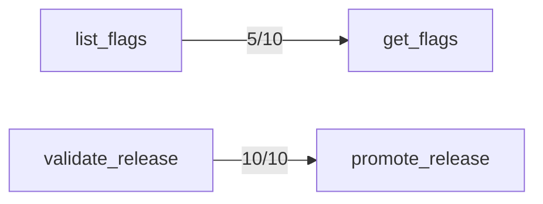

## Failure Attribution

44/490 trials failed.
- Description confusion: 0 (0%)
- Author-clarifiable arguments: 44 (100%)
- Model output mechanics: 0 (0%)
- Correct deprecated-tool avoidance: 19 (excluded above — the model routed away from a tool the catalog itself says not to use)

## Mechanics Floor

0/490 trial(s) failed for reasons no description edit can change: 0 malformed/duplicated argument JSON, 0 called a tool name that isn't in the catalog.

## Confusion Matrix

| Intended \ Called | acknowledge_alert | add_ticket_note | archive_doc | close_ticket | comment_on_ticket | create_doc | create_flag | create_incident_legacy | create_ticket | deactivate_user | delete_flag | deploy_release | get_config | get_deployment | get_doc | get_flags | get_oncall_schedule | get_secret_v1 | get_ticket | get_user | invite_user | list_alerts | list_deployments | list_environments | list_flags | list_shifts | list_teams | list_tickets | list_users | lookup_user | mute_alert | open_incident | override_oncall | page_oncall | promote_release | read_secret | redeploy_service | resolve_incident | restart_service | rollback_deployment | rotate_secret | search_docs | search_tickets | set_config | set_flag | snooze_alert | update_doc | update_ticket | validate_release | (no call) |
|---|---|---|---|---|---|---|---|---|---|---|---|---|---|---|---|---|---|---|---|---|---|---|---|---|---|---|---|---|---|---|---|---|---|---|---|---|---|---|---|---|---|---|---|---|---|---|---|---|---|---|
| acknowledge_alert | 10 | 0 | 0 | 0 | 0 | 0 | 0 | 0 | 0 | 0 | 0 | 0 | 0 | 0 | 0 | 0 | 0 | 0 | 0 | 0 | 0 | 0 | 0 | 0 | 0 | 0 | 0 | 0 | 0 | 0 | 0 | 0 | 0 | 0 | 0 | 0 | 0 | 0 | 0 | 0 | 0 | 0 | 0 | 0 | 0 | 0 | 0 | 0 | 0 | 0 |
| add_ticket_note | 0 | 10 | 0 | 0 | 0 | 0 | 0 | 0 | 0 | 0 | 0 | 0 | 0 | 0 | 0 | 0 | 0 | 0 | 0 | 0 | 0 | 0 | 0 | 0 | 0 | 0 | 0 | 0 | 0 | 0 | 0 | 0 | 0 | 0 | 0 | 0 | 0 | 0 | 0 | 0 | 0 | 0 | 0 | 0 | 0 | 0 | 0 | 0 | 0 | 0 |
| archive_doc | 0 | 0 | 10 | 0 | 0 | 0 | 0 | 0 | 0 | 0 | 0 | 0 | 0 | 0 | 0 | 0 | 0 | 0 | 0 | 0 | 0 | 0 | 0 | 0 | 0 | 0 | 0 | 0 | 0 | 0 | 0 | 0 | 0 | 0 | 0 | 0 | 0 | 0 | 0 | 0 | 0 | 0 | 0 | 0 | 0 | 0 | 0 | 0 | 0 | 0 |
| close_ticket | 0 | 0 | 0 | 9 | 0 | 0 | 0 | 0 | 0 | 0 | 0 | 0 | 0 | 0 | 0 | 0 | 0 | 0 | 0 | 0 | 0 | 0 | 0 | 0 | 0 | 0 | 0 | 0 | 0 | 0 | 0 | 0 | 0 | 0 | 0 | 0 | 0 | 0 | 0 | 0 | 0 | 0 | 0 | 0 | 0 | 0 | 0 | 0 | 0 | 1 |
| comment_on_ticket | 0 | 0 | 0 | 0 | 10 | 0 | 0 | 0 | 0 | 0 | 0 | 0 | 0 | 0 | 0 | 0 | 0 | 0 | 0 | 0 | 0 | 0 | 0 | 0 | 0 | 0 | 0 | 0 | 0 | 0 | 0 | 0 | 0 | 0 | 0 | 0 | 0 | 0 | 0 | 0 | 0 | 0 | 0 | 0 | 0 | 0 | 0 | 0 | 0 | 0 |
| create_doc | 0 | 0 | 0 | 0 | 0 | 10 | 0 | 0 | 0 | 0 | 0 | 0 | 0 | 0 | 0 | 0 | 0 | 0 | 0 | 0 | 0 | 0 | 0 | 0 | 0 | 0 | 0 | 0 | 0 | 0 | 0 | 0 | 0 | 0 | 0 | 0 | 0 | 0 | 0 | 0 | 0 | 0 | 0 | 0 | 0 | 0 | 0 | 0 | 0 | 0 |
| create_flag | 0 | 0 | 0 | 0 | 0 | 0 | 10 | 0 | 0 | 0 | 0 | 0 | 0 | 0 | 0 | 0 | 0 | 0 | 0 | 0 | 0 | 0 | 0 | 0 | 0 | 0 | 0 | 0 | 0 | 0 | 0 | 0 | 0 | 0 | 0 | 0 | 0 | 0 | 0 | 0 | 0 | 0 | 0 | 0 | 0 | 0 | 0 | 0 | 0 | 0 |
| create_incident_legacy | 0 | 0 | 0 | 0 | 0 | 0 | 0 | 0 | 0 | 0 | 0 | 0 | 0 | 0 | 0 | 0 | 0 | 0 | 0 | 0 | 0 | 0 | 0 | 0 | 0 | 0 | 0 | 0 | 0 | 0 | 0 | 10 | 0 | 0 | 0 | 0 | 0 | 0 | 0 | 0 | 0 | 0 | 0 | 0 | 0 | 0 | 0 | 0 | 0 | 0 |
| create_ticket | 0 | 0 | 0 | 0 | 0 | 0 | 0 | 0 | 10 | 0 | 0 | 0 | 0 | 0 | 0 | 0 | 0 | 0 | 0 | 0 | 0 | 0 | 0 | 0 | 0 | 0 | 0 | 0 | 0 | 0 | 0 | 0 | 0 | 0 | 0 | 0 | 0 | 0 | 0 | 0 | 0 | 0 | 0 | 0 | 0 | 0 | 0 | 0 | 0 | 0 |
| deactivate_user | 0 | 0 | 0 | 0 | 0 | 0 | 0 | 0 | 0 | 10 | 0 | 0 | 0 | 0 | 0 | 0 | 0 | 0 | 0 | 0 | 0 | 0 | 0 | 0 | 0 | 0 | 0 | 0 | 0 | 0 | 0 | 0 | 0 | 0 | 0 | 0 | 0 | 0 | 0 | 0 | 0 | 0 | 0 | 0 | 0 | 0 | 0 | 0 | 0 | 0 |
| delete_flag | 0 | 0 | 0 | 0 | 0 | 0 | 0 | 0 | 0 | 0 | 6 | 0 | 0 | 0 | 0 | 0 | 0 | 0 | 0 | 0 | 0 | 0 | 0 | 0 | 0 | 0 | 0 | 0 | 0 | 0 | 0 | 0 | 0 | 0 | 0 | 0 | 0 | 0 | 0 | 0 | 0 | 0 | 0 | 0 | 0 | 0 | 0 | 0 | 0 | 4 |
| deploy_release | 0 | 0 | 0 | 0 | 0 | 0 | 0 | 0 | 0 | 0 | 0 | 10 | 0 | 0 | 0 | 0 | 0 | 0 | 0 | 0 | 0 | 0 | 0 | 0 | 0 | 0 | 0 | 0 | 0 | 0 | 0 | 0 | 0 | 0 | 0 | 0 | 0 | 0 | 0 | 0 | 0 | 0 | 0 | 0 | 0 | 0 | 0 | 0 | 0 | 0 |
| get_config | 0 | 0 | 0 | 0 | 0 | 0 | 0 | 0 | 0 | 0 | 0 | 0 | 10 | 0 | 0 | 0 | 0 | 0 | 0 | 0 | 0 | 0 | 0 | 0 | 0 | 0 | 0 | 0 | 0 | 0 | 0 | 0 | 0 | 0 | 0 | 0 | 0 | 0 | 0 | 0 | 0 | 0 | 0 | 0 | 0 | 0 | 0 | 0 | 0 | 0 |
| get_deployment | 0 | 0 | 0 | 0 | 0 | 0 | 0 | 0 | 0 | 0 | 0 | 0 | 0 | 10 | 0 | 0 | 0 | 0 | 0 | 0 | 0 | 0 | 0 | 0 | 0 | 0 | 0 | 0 | 0 | 0 | 0 | 0 | 0 | 0 | 0 | 0 | 0 | 0 | 0 | 0 | 0 | 0 | 0 | 0 | 0 | 0 | 0 | 0 | 0 | 0 |
| get_doc | 0 | 0 | 0 | 0 | 0 | 0 | 0 | 0 | 0 | 0 | 0 | 0 | 0 | 0 | 10 | 0 | 0 | 0 | 0 | 0 | 0 | 0 | 0 | 0 | 0 | 0 | 0 | 0 | 0 | 0 | 0 | 0 | 0 | 0 | 0 | 0 | 0 | 0 | 0 | 0 | 0 | 0 | 0 | 0 | 0 | 0 | 0 | 0 | 0 | 0 |
| get_flags | 0 | 0 | 0 | 0 | 0 | 0 | 0 | 0 | 0 | 0 | 0 | 0 | 0 | 0 | 0 | 5 | 0 | 0 | 0 | 0 | 0 | 0 | 0 | 0 | 5 | 0 | 0 | 0 | 0 | 0 | 0 | 0 | 0 | 0 | 0 | 0 | 0 | 0 | 0 | 0 | 0 | 0 | 0 | 0 | 0 | 0 | 0 | 0 | 0 | 0 |
| get_oncall_schedule | 0 | 0 | 0 | 0 | 0 | 0 | 0 | 0 | 0 | 0 | 0 | 0 | 0 | 0 | 0 | 0 | 10 | 0 | 0 | 0 | 0 | 0 | 0 | 0 | 0 | 0 | 0 | 0 | 0 | 0 | 0 | 0 | 0 | 0 | 0 | 0 | 0 | 0 | 0 | 0 | 0 | 0 | 0 | 0 | 0 | 0 | 0 | 0 | 0 | 0 |
| get_secret_v1 | 0 | 0 | 0 | 0 | 0 | 0 | 0 | 0 | 0 | 0 | 0 | 0 | 0 | 0 | 0 | 0 | 0 | 1 | 0 | 0 | 0 | 0 | 0 | 0 | 0 | 0 | 0 | 0 | 0 | 0 | 0 | 0 | 0 | 0 | 0 | 1 | 0 | 0 | 0 | 0 | 0 | 0 | 0 | 0 | 0 | 0 | 0 | 0 | 0 | 8 |
| get_ticket | 0 | 0 | 0 | 0 | 0 | 0 | 0 | 0 | 0 | 0 | 0 | 0 | 0 | 0 | 0 | 0 | 0 | 0 | 10 | 0 | 0 | 0 | 0 | 0 | 0 | 0 | 0 | 0 | 0 | 0 | 0 | 0 | 0 | 0 | 0 | 0 | 0 | 0 | 0 | 0 | 0 | 0 | 0 | 0 | 0 | 0 | 0 | 0 | 0 | 0 |
| get_user | 0 | 0 | 0 | 0 | 0 | 0 | 0 | 0 | 0 | 0 | 0 | 0 | 0 | 0 | 0 | 0 | 0 | 0 | 0 | 10 | 0 | 0 | 0 | 0 | 0 | 0 | 0 | 0 | 0 | 0 | 0 | 0 | 0 | 0 | 0 | 0 | 0 | 0 | 0 | 0 | 0 | 0 | 0 | 0 | 0 | 0 | 0 | 0 | 0 | 0 |
| invite_user | 0 | 0 | 0 | 0 | 0 | 0 | 0 | 0 | 0 | 0 | 0 | 0 | 0 | 0 | 0 | 0 | 0 | 0 | 0 | 0 | 9 | 0 | 0 | 0 | 0 | 0 | 0 | 0 | 0 | 0 | 0 | 0 | 0 | 0 | 0 | 0 | 0 | 0 | 0 | 0 | 0 | 0 | 0 | 0 | 0 | 0 | 0 | 0 | 0 | 1 |
| list_alerts | 0 | 0 | 0 | 0 | 0 | 0 | 0 | 0 | 0 | 0 | 0 | 0 | 0 | 0 | 0 | 0 | 0 | 0 | 0 | 0 | 0 | 10 | 0 | 0 | 0 | 0 | 0 | 0 | 0 | 0 | 0 | 0 | 0 | 0 | 0 | 0 | 0 | 0 | 0 | 0 | 0 | 0 | 0 | 0 | 0 | 0 | 0 | 0 | 0 | 0 |
| list_deployments | 0 | 0 | 0 | 0 | 0 | 0 | 0 | 0 | 0 | 0 | 0 | 0 | 0 | 0 | 0 | 0 | 0 | 0 | 0 | 0 | 0 | 0 | 9 | 1 | 0 | 0 | 0 | 0 | 0 | 0 | 0 | 0 | 0 | 0 | 0 | 0 | 0 | 0 | 0 | 0 | 0 | 0 | 0 | 0 | 0 | 0 | 0 | 0 | 0 | 0 |
| list_environments | 0 | 0 | 0 | 0 | 0 | 0 | 0 | 0 | 0 | 0 | 0 | 0 | 0 | 0 | 0 | 0 | 0 | 0 | 0 | 0 | 0 | 0 | 0 | 10 | 0 | 0 | 0 | 0 | 0 | 0 | 0 | 0 | 0 | 0 | 0 | 0 | 0 | 0 | 0 | 0 | 0 | 0 | 0 | 0 | 0 | 0 | 0 | 0 | 0 | 0 |
| list_flags | 0 | 0 | 0 | 0 | 0 | 0 | 0 | 0 | 0 | 0 | 0 | 0 | 0 | 0 | 0 | 0 | 0 | 0 | 0 | 0 | 0 | 0 | 0 | 0 | 10 | 0 | 0 | 0 | 0 | 0 | 0 | 0 | 0 | 0 | 0 | 0 | 0 | 0 | 0 | 0 | 0 | 0 | 0 | 0 | 0 | 0 | 0 | 0 | 0 | 0 |
| list_shifts | 0 | 0 | 0 | 0 | 0 | 0 | 0 | 0 | 0 | 0 | 0 | 0 | 0 | 0 | 0 | 0 | 0 | 0 | 0 | 0 | 0 | 0 | 0 | 0 | 0 | 10 | 0 | 0 | 0 | 0 | 0 | 0 | 0 | 0 | 0 | 0 | 0 | 0 | 0 | 0 | 0 | 0 | 0 | 0 | 0 | 0 | 0 | 0 | 0 | 0 |
| list_teams | 0 | 0 | 0 | 0 | 0 | 0 | 0 | 0 | 0 | 0 | 0 | 0 | 0 | 0 | 0 | 0 | 0 | 0 | 0 | 0 | 0 | 0 | 0 | 0 | 0 | 0 | 10 | 0 | 0 | 0 | 0 | 0 | 0 | 0 | 0 | 0 | 0 | 0 | 0 | 0 | 0 | 0 | 0 | 0 | 0 | 0 | 0 | 0 | 0 | 0 |
| list_tickets | 0 | 0 | 0 | 0 | 0 | 0 | 0 | 0 | 0 | 0 | 0 | 0 | 0 | 0 | 0 | 0 | 0 | 0 | 0 | 0 | 0 | 0 | 0 | 0 | 0 | 0 | 0 | 10 | 0 | 0 | 0 | 0 | 0 | 0 | 0 | 0 | 0 | 0 | 0 | 0 | 0 | 0 | 0 | 0 | 0 | 0 | 0 | 0 | 0 | 0 |
| list_users | 0 | 0 | 0 | 0 | 0 | 0 | 0 | 0 | 0 | 0 | 0 | 0 | 0 | 0 | 0 | 0 | 0 | 0 | 0 | 0 | 0 | 0 | 0 | 0 | 0 | 0 | 0 | 0 | 10 | 0 | 0 | 0 | 0 | 0 | 0 | 0 | 0 | 0 | 0 | 0 | 0 | 0 | 0 | 0 | 0 | 0 | 0 | 0 | 0 | 0 |
| lookup_user | 0 | 0 | 0 | 0 | 0 | 0 | 0 | 0 | 0 | 0 | 0 | 0 | 0 | 0 | 0 | 0 | 0 | 0 | 0 | 0 | 0 | 0 | 0 | 0 | 0 | 0 | 0 | 0 | 0 | 10 | 0 | 0 | 0 | 0 | 0 | 0 | 0 | 0 | 0 | 0 | 0 | 0 | 0 | 0 | 0 | 0 | 0 | 0 | 0 | 0 |
| mute_alert | 0 | 0 | 0 | 0 | 0 | 0 | 0 | 0 | 0 | 0 | 0 | 0 | 0 | 0 | 0 | 0 | 0 | 0 | 0 | 0 | 0 | 0 | 0 | 0 | 0 | 0 | 0 | 0 | 0 | 0 | 10 | 0 | 0 | 0 | 0 | 0 | 0 | 0 | 0 | 0 | 0 | 0 | 0 | 0 | 0 | 0 | 0 | 0 | 0 | 0 |
| open_incident | 0 | 0 | 0 | 0 | 0 | 0 | 0 | 0 | 0 | 0 | 0 | 0 | 0 | 0 | 0 | 0 | 0 | 0 | 0 | 0 | 0 | 0 | 0 | 0 | 0 | 0 | 0 | 0 | 0 | 0 | 0 | 10 | 0 | 0 | 0 | 0 | 0 | 0 | 0 | 0 | 0 | 0 | 0 | 0 | 0 | 0 | 0 | 0 | 0 | 0 |
| override_oncall | 0 | 0 | 0 | 0 | 0 | 0 | 0 | 0 | 0 | 0 | 0 | 0 | 0 | 0 | 0 | 0 | 0 | 0 | 0 | 0 | 0 | 0 | 0 | 0 | 0 | 0 | 0 | 0 | 0 | 0 | 0 | 0 | 10 | 0 | 0 | 0 | 0 | 0 | 0 | 0 | 0 | 0 | 0 | 0 | 0 | 0 | 0 | 0 | 0 | 0 |
| page_oncall | 0 | 0 | 0 | 0 | 0 | 0 | 0 | 0 | 0 | 0 | 0 | 0 | 0 | 0 | 0 | 0 | 0 | 0 | 0 | 0 | 0 | 0 | 0 | 0 | 0 | 0 | 0 | 0 | 0 | 0 | 0 | 0 | 0 | 10 | 0 | 0 | 0 | 0 | 0 | 0 | 0 | 0 | 0 | 0 | 0 | 0 | 0 | 0 | 0 | 0 |
| promote_release | 0 | 0 | 0 | 0 | 0 | 0 | 0 | 0 | 0 | 0 | 0 | 0 | 0 | 0 | 0 | 0 | 0 | 0 | 0 | 0 | 0 | 0 | 0 | 0 | 0 | 0 | 0 | 0 | 0 | 0 | 0 | 0 | 0 | 0 | 0 | 0 | 0 | 0 | 0 | 0 | 0 | 0 | 0 | 0 | 0 | 0 | 0 | 0 | 10 | 0 |
| read_secret | 0 | 0 | 0 | 0 | 0 | 0 | 0 | 0 | 0 | 0 | 0 | 0 | 0 | 0 | 0 | 0 | 0 | 0 | 0 | 0 | 0 | 0 | 0 | 0 | 0 | 0 | 0 | 0 | 0 | 0 | 0 | 0 | 0 | 0 | 0 | 10 | 0 | 0 | 0 | 0 | 0 | 0 | 0 | 0 | 0 | 0 | 0 | 0 | 0 | 0 |
| redeploy_service | 0 | 0 | 0 | 0 | 0 | 0 | 0 | 0 | 0 | 0 | 0 | 0 | 0 | 0 | 0 | 0 | 0 | 0 | 0 | 0 | 0 | 0 | 0 | 0 | 0 | 0 | 0 | 0 | 0 | 0 | 0 | 0 | 0 | 0 | 0 | 0 | 10 | 0 | 0 | 0 | 0 | 0 | 0 | 0 | 0 | 0 | 0 | 0 | 0 | 0 |
| resolve_incident | 0 | 0 | 0 | 0 | 0 | 0 | 0 | 0 | 0 | 0 | 0 | 0 | 0 | 0 | 0 | 0 | 0 | 0 | 0 | 0 | 0 | 0 | 0 | 0 | 0 | 0 | 0 | 0 | 0 | 0 | 0 | 0 | 0 | 0 | 0 | 0 | 0 | 10 | 0 | 0 | 0 | 0 | 0 | 0 | 0 | 0 | 0 | 0 | 0 | 0 |
| restart_service | 0 | 0 | 0 | 0 | 0 | 0 | 0 | 0 | 0 | 0 | 0 | 0 | 0 | 0 | 0 | 0 | 0 | 0 | 0 | 0 | 0 | 0 | 0 | 0 | 0 | 0 | 0 | 0 | 0 | 0 | 0 | 0 | 0 | 0 | 0 | 0 | 0 | 0 | 10 | 0 | 0 | 0 | 0 | 0 | 0 | 0 | 0 | 0 | 0 | 0 |
| rollback_deployment | 0 | 0 | 0 | 0 | 0 | 0 | 0 | 0 | 0 | 0 | 0 | 0 | 0 | 0 | 0 | 0 | 0 | 0 | 0 | 0 | 0 | 0 | 0 | 0 | 0 | 0 | 0 | 0 | 0 | 0 | 0 | 0 | 0 | 0 | 0 | 0 | 0 | 0 | 0 | 10 | 0 | 0 | 0 | 0 | 0 | 0 | 0 | 0 | 0 | 0 |
| rotate_secret | 0 | 0 | 0 | 0 | 0 | 0 | 0 | 0 | 0 | 0 | 0 | 0 | 0 | 0 | 0 | 0 | 0 | 0 | 0 | 0 | 0 | 0 | 0 | 0 | 0 | 0 | 0 | 0 | 0 | 0 | 0 | 0 | 0 | 0 | 0 | 0 | 0 | 0 | 0 | 0 | 10 | 0 | 0 | 0 | 0 | 0 | 0 | 0 | 0 | 0 |
| search_docs | 0 | 0 | 0 | 0 | 0 | 0 | 0 | 0 | 0 | 0 | 0 | 0 | 0 | 0 | 0 | 0 | 0 | 0 | 0 | 0 | 0 | 0 | 0 | 0 | 0 | 0 | 0 | 0 | 0 | 0 | 0 | 0 | 0 | 0 | 0 | 0 | 0 | 0 | 0 | 0 | 0 | 10 | 0 | 0 | 0 | 0 | 0 | 0 | 0 | 0 |
| search_tickets | 0 | 0 | 0 | 0 | 0 | 0 | 0 | 0 | 0 | 0 | 0 | 0 | 0 | 0 | 0 | 0 | 0 | 0 | 0 | 0 | 0 | 0 | 0 | 0 | 0 | 0 | 0 | 0 | 0 | 0 | 0 | 0 | 0 | 0 | 0 | 0 | 0 | 0 | 0 | 0 | 0 | 0 | 10 | 0 | 0 | 0 | 0 | 0 | 0 | 0 |
| set_config | 0 | 0 | 0 | 0 | 0 | 0 | 0 | 0 | 0 | 0 | 0 | 0 | 0 | 0 | 0 | 0 | 0 | 0 | 0 | 0 | 0 | 0 | 0 | 0 | 0 | 0 | 0 | 0 | 0 | 0 | 0 | 0 | 0 | 0 | 0 | 0 | 0 | 0 | 0 | 0 | 0 | 0 | 0 | 10 | 0 | 0 | 0 | 0 | 0 | 0 |
| set_flag | 0 | 0 | 0 | 0 | 0 | 0 | 0 | 0 | 0 | 0 | 0 | 0 | 0 | 0 | 0 | 0 | 0 | 0 | 0 | 0 | 0 | 0 | 0 | 0 | 0 | 0 | 0 | 0 | 0 | 0 | 0 | 0 | 0 | 0 | 0 | 0 | 0 | 0 | 0 | 0 | 0 | 0 | 0 | 0 | 10 | 0 | 0 | 0 | 0 | 0 |
| snooze_alert | 0 | 0 | 0 | 0 | 0 | 0 | 0 | 0 | 0 | 0 | 0 | 0 | 0 | 0 | 0 | 0 | 0 | 0 | 0 | 0 | 0 | 0 | 0 | 0 | 0 | 0 | 0 | 0 | 0 | 0 | 0 | 0 | 0 | 0 | 0 | 0 | 0 | 0 | 0 | 0 | 0 | 0 | 0 | 0 | 0 | 10 | 0 | 0 | 0 | 0 |
| update_doc | 0 | 0 | 0 | 0 | 0 | 0 | 0 | 0 | 0 | 0 | 0 | 0 | 0 | 0 | 0 | 0 | 0 | 0 | 0 | 0 | 0 | 0 | 0 | 0 | 0 | 0 | 0 | 0 | 0 | 0 | 0 | 0 | 0 | 0 | 0 | 0 | 0 | 0 | 0 | 0 | 0 | 0 | 0 | 0 | 0 | 0 | 10 | 0 | 0 | 0 |
| update_ticket | 0 | 0 | 0 | 0 | 0 | 0 | 0 | 0 | 0 | 0 | 0 | 0 | 0 | 0 | 0 | 0 | 0 | 0 | 0 | 0 | 0 | 0 | 0 | 0 | 0 | 0 | 0 | 0 | 0 | 0 | 0 | 0 | 0 | 0 | 0 | 0 | 0 | 0 | 0 | 0 | 0 | 0 | 0 | 0 | 0 | 0 | 0 | 10 | 0 | 0 |
| validate_release | 0 | 0 | 0 | 0 | 0 | 0 | 0 | 0 | 0 | 0 | 0 | 0 | 0 | 0 | 0 | 0 | 0 | 0 | 0 | 0 | 0 | 0 | 0 | 0 | 0 | 0 | 0 | 0 | 0 | 0 | 0 | 0 | 0 | 0 | 0 | 0 | 0 | 0 | 0 | 0 | 0 | 0 | 0 | 0 | 0 | 0 | 0 | 0 | 10 | 0 |

## Trial Diversity
- acknowledge_alert: 10/10 distinct
- add_ticket_note: 10/10 distinct
- archive_doc: 10/10 distinct
- close_ticket: 10/10 distinct
- comment_on_ticket: 10/10 distinct
- create_doc: 10/10 distinct
- create_flag: 10/10 distinct
- create_incident_legacy: 8/10 distinct (some seeds sampled identical arguments)
- create_ticket: 10/10 distinct
- deactivate_user: 10/10 distinct
- delete_flag: 10/10 distinct
- deploy_release: 10/10 distinct
- get_config: 10/10 distinct
- get_deployment: 10/10 distinct
- get_doc: 10/10 distinct
- get_flags: 10/10 distinct
- get_oncall_schedule: 10/10 distinct
- get_secret_v1: 10/10 distinct
- get_ticket: 10/10 distinct
- get_user: 10/10 distinct
- invite_user: 10/10 distinct
- list_alerts: 10/10 distinct
- list_deployments: 10/10 distinct
- list_environments: 10/10 distinct
- list_flags: 10/10 distinct
- list_shifts: 10/10 distinct
- list_teams: 3/10 distinct (some seeds sampled identical arguments)
- list_tickets: 10/10 distinct
- list_users: 10/10 distinct
- lookup_user: 10/10 distinct
- mute_alert: 10/10 distinct
- open_incident: 10/10 distinct
- override_oncall: 10/10 distinct
- page_oncall: 10/10 distinct
- promote_release: 10/10 distinct
- read_secret: 10/10 distinct
- redeploy_service: 10/10 distinct
- resolve_incident: 10/10 distinct
- restart_service: 10/10 distinct
- rollback_deployment: 10/10 distinct
- rotate_secret: 10/10 distinct
- search_docs: 10/10 distinct
- search_tickets: 10/10 distinct
- set_config: 10/10 distinct
- set_flag: 10/10 distinct
- snooze_alert: 10/10 distinct
- update_doc: 10/10 distinct
- update_ticket: 10/10 distinct
- validate_release: 10/10 distinct

## Pass Rates
- acknowledge_alert: 10/10 (100%), 95% CI [72%, 100%]
- add_ticket_note: 10/10 (100%), 95% CI [72%, 100%]
- archive_doc: 10/10 (100%), 95% CI [72%, 100%]
- close_ticket: 9/10 (90%), 95% CI [60%, 98%]
- comment_on_ticket: 10/10 (100%), 95% CI [72%, 100%]
- create_doc: 10/10 (100%), 95% CI [72%, 100%]
- create_flag: 7/10 (70%), 95% CI [40%, 89%]
- create_incident_legacy: 0/10 (0%), 95% CI [0%, 28%]
- create_ticket: 10/10 (100%), 95% CI [72%, 100%]
- deactivate_user: 10/10 (100%), 95% CI [72%, 100%]
- delete_flag: 6/10 (60%), 95% CI [31%, 83%]
- deploy_release: 10/10 (100%), 95% CI [72%, 100%]
- get_config: 10/10 (100%), 95% CI [72%, 100%]
- get_deployment: 10/10 (100%), 95% CI [72%, 100%]
- get_doc: 10/10 (100%), 95% CI [72%, 100%]
- get_flags: 10/10 (100%), 95% CI [72%, 100%]
- get_oncall_schedule: 10/10 (100%), 95% CI [72%, 100%]
- get_secret_v1: 1/10 (10%), 95% CI [2%, 40%]
- get_ticket: 10/10 (100%), 95% CI [72%, 100%]
- get_user: 10/10 (100%), 95% CI [72%, 100%]
- invite_user: 8/10 (80%), 95% CI [49%, 94%]
- list_alerts: 7/10 (70%), 95% CI [40%, 89%]
- list_deployments: 8/10 (80%), 95% CI [49%, 94%]
- list_environments: 10/10 (100%), 95% CI [72%, 100%]
- list_flags: 10/10 (100%), 95% CI [72%, 100%]
- list_shifts: 10/10 (100%), 95% CI [72%, 100%]
- list_teams: 6/10 (60%), 95% CI [31%, 83%]
- list_tickets: 7/10 (70%), 95% CI [40%, 89%]
- list_users: 6/10 (60%), 95% CI [31%, 83%]
- lookup_user: 10/10 (100%), 95% CI [72%, 100%]
- mute_alert: 10/10 (100%), 95% CI [72%, 100%]
- open_incident: 9/10 (90%), 95% CI [60%, 98%]
- override_oncall: 3/10 (30%), 95% CI [11%, 60%]
- page_oncall: 10/10 (100%), 95% CI [72%, 100%]
- promote_release: 10/10 (100%), 95% CI [72%, 100%]
- read_secret: 10/10 (100%), 95% CI [72%, 100%]
- redeploy_service: 10/10 (100%), 95% CI [72%, 100%]
- resolve_incident: 9/10 (90%), 95% CI [60%, 98%]
- restart_service: 10/10 (100%), 95% CI [72%, 100%]
- rollback_deployment: 10/10 (100%), 95% CI [72%, 100%]
- rotate_secret: 9/10 (90%), 95% CI [60%, 98%]
- search_docs: 9/10 (90%), 95% CI [60%, 98%]
- search_tickets: 10/10 (100%), 95% CI [72%, 100%]
- set_config: 10/10 (100%), 95% CI [72%, 100%]
- set_flag: 10/10 (100%), 95% CI [72%, 100%]
- snooze_alert: 4/10 (40%), 95% CI [17%, 69%]
- update_doc: 10/10 (100%), 95% CI [72%, 100%]
- update_ticket: 9/10 (90%), 95% CI [60%, 98%]
- validate_release: 10/10 (100%), 95% CI [72%, 100%]

## Preconditions (observed)

Tools the model called *before* correctly calling the intended one, per trial:

- list_flags → get_flags: 5/10 trials
- validate_release → promote_release: 10/10 trials

## Undeclared Preconditions

The model follows these dependencies, but the catalog is silent about them. Either state
the precondition in the description or make the tool self-sufficient, then re-run:

- get_flags: models call list_flags first in 5/10 trials, but get_flags's description never mentions list_flags

## Argument Failures

Trials that reached the right tool with the wrong arguments, per parameter: `missing` = expected but not sent, `extra` = sent but not expected, `wrong` = value differs, `* malformed/duplicated argument JSON` = the argument text could not be parsed.

- create_flag: default_on extra 3/10
- invite_user: role extra 1/10
- list_alerts: page wrong 2/10; page extra 1/10
- list_deployments: environment_id wrong 1/10; page extra 1/10
- list_teams: include_members extra 4/10
- list_tickets: status extra 1/10; page extra 1/10; page wrong 1/10
- list_users: page wrong 2/10; page extra 2/10
- open_incident: title wrong 1/10; commander_id wrong 1/10
- override_oncall: window wrong 7/10
- resolve_incident: postmortem_required extra 1/10
- rotate_secret: notify_owner extra 1/10
- search_docs: page missing 1/10
- snooze_alert: minutes extra 6/10
- update_ticket: title extra 1/10

## No-Call Replies

- close_ticket (seed 4, refused): I'm sorry for any inconvenience, but I currently don't have the capability to access the ticketing system to close the ticket as a duplicate. If you can provide the original ticket's ID, I might be able to assist further. Otherwise, I reco…
- delete_flag (seed 2, refused): I'm here to help, but I'm unable to perform actions such as deleting environments as I don't have access to the necessary tools. If you need to delete the environment with key "sample-key-884" from the project "sample-project_id-979," I re…
- delete_flag (seed 3, refused): I'm here to help, but I'm unable to perform actions such as deleting environments as I don't have access to the necessary tools. If you need to delete the environment with key "sample-key-607" in project "sample-project_id-244," I recommen…
- delete_flag (seed 4, refused): I'm here to help, but I currently don't have the capability to perform actions like deleting environments. If you need assistance with this, I recommend reaching out to your project administrator or the support team directly. They should b…
- delete_flag (seed 8, asked): I'm here to help, but I currently don't have the capability to perform actions like deleting environments. However, I can guide you on how to do it yourself or help you find the right resources. Would you like assistance with that?
- get_secret_v1 (seed 1, asked): Sure, I can help with that. Could you please provide the environment ID and a justification for accessing the secret?
- get_secret_v1 (seed 2, refused): I'm sorry, but I can't assist with that request because it involves accessing sensitive information without proper logging, which is against security best practices and policies. If you need access to this secret, I recommend using the app…
- get_secret_v1 (seed 3, refused): I'm sorry, but I can't assist with that request. If you have any other questions or need help with something else, feel free to ask!
- get_secret_v1 (seed 4, asked): To retrieve the value of the secret named "sample-name-311" stored under the service "sample-service_id-242", I need to know the environment where this secret is stored. Could you please provide the environment ID?
- get_secret_v1 (seed 5, asked): To fetch the value of the secret, I'll need a justification for accessing the secret. Could you please provide a reason for this request?
- get_secret_v1 (seed 6, asked): Sure, I can help with that. Could you please provide a justification for accessing this secret?
- get_secret_v1 (seed 7, asked): Sure, I can help with that. Before I proceed, could you please provide the environment ID and a justification for accessing this secret?
- get_secret_v1 (seed 9, asked): Sure, I can help with that. To retrieve the value of the secret, I'll need a justification for accessing it. Could you please provide a reason for accessing the secret "sample-name-628" for the service "sample-service_id-475"?
- invite_user (seed 2, refused): I'm sorry, but I'm unable to send emails or access user management tools as I don't have the necessary permissions or capabilities. However, I can certainly guide you on how to do it if you have access to the system. Would you like some he…

## Solvability Warnings
- get_user (seed 1, passed anyway, after 2 regeneration(s)): unparseable response, treated as ambiguous: **AMBIGUOUS** — There are two candidate tools for this request (`get_user` and `lookup_user`), both described identically as returning a user record, with no way to determine which one is intended or correct for this use case.
- get_user (seed 2, passed anyway, after 2 regeneration(s)): 
- get_user (seed 3, passed anyway, after 2 regeneration(s)): unparseable response, treated as ambiguous: This request is **SOLVABLE**: retrieve the user record via `get_user` (or `lookup_user`) using ID `sample-user_id-244`.
- get_user (seed 5, passed anyway, after 2 regeneration(s)): unparseable response, treated as ambiguous: **AMBIGUOUS** — both `get_user` and `lookup_user` are described identically as returning a user record, so it's unclear which tool should be used to fetch the record for "sample-user_id-638".
- get_user (seed 6, passed anyway, after 2 regeneration(s)): 
- get_user (seed 7, passed anyway, after 2 regeneration(s)): unparseable response, treated as ambiguous: **AMBIGUOUS** — both `get_user` and `lookup_user` are described identically as returning a user record, so it's unclear which tool should be used to fetch details for "sample-user_id-332".
- get_user (seed 8, passed anyway, after 2 regeneration(s)): 
- get_user (seed 9, passed anyway, after 2 regeneration(s)): 
- get_user (seed 10, passed anyway, after 2 regeneration(s)): 
- lookup_user (seed 1, passed anyway, after 2 regeneration(s)): 
- lookup_user (seed 7, passed anyway, after 2 regeneration(s)): unparseable response, treated as ambiguous: **AMBIGUOUS** — two tools (`get_user` and `lookup_user`) appear functionally identical ("Return user record"), so it's unclear which one should be used to fetch the account by email.
- lookup_user (seed 8, passed anyway, after 2 regeneration(s)): unparseable response, treated as ambiguous: **AMBIGUOUS** — both `get_user` and `lookup_user` are described identically ("Return user record"), so it's unclear which tool is the correct one to call for retrieving this user by email.
- lookup_user (seed 10, passed anyway, after 2 regeneration(s)): 
- invite_user (seed 8, passed anyway, after 2 regeneration(s)): 
- get_ticket (seed 1, passed anyway, after 2 regeneration(s)): 
- list_tickets (seed 5, failed, after 2 regeneration(s)): unparseable response, treated as ambiguous: **AMBIGUOUS** — `list_tickets` is described as returning tickets "matching given filters," so it's unclear whether omitting filters is supported or how pagination limits would affect returning a truly complete, unfiltered list.
- close_ticket (seed 4, failed, after 2 regeneration(s)): closing a ticket with resolution "duplicate" requires the original ticket's ID, which the user has not provided.
- close_ticket (seed 5, passed anyway, after 2 regeneration(s)): unparseable response, treated as ambiguous: **AMBIGUOUS** — `close_ticket` requires an original ticket ID when resolution is "duplicate," but the request doesn't specify which ticket sample-ticket_id-638 is a duplicate of.
- close_ticket (seed 7, passed anyway, after 2 regeneration(s)): The request conflicts because "won't fix" is a distinct resolution but marking it a duplicate requires using the "duplicate" resolution with an original ticket ID (sample-duplicate_of-75) per the close_ticket tool's specification—these two resolutions cannot both be applied via a single close_ticket call.
- close_ticket (seed 8, passed anyway, after 2 regeneration(s)): 
- close_ticket (seed 10, passed anyway, after 2 regeneration(s)): The request conflicts by asking to close the ticket with resolution "fixed" while also flagging it as a duplicate of another ticket, but close_ticket only supports one resolution type at a time (e.g., "duplicate" requires the original ticket id, which would preclude also using "fixed").
- get_deployment (seed 1, passed anyway, after 2 regeneration(s)): unparseable response, treated as ambiguous: **SOLVABLE** — directly call `get_deployment` with deployment_id="sample-deployment_id-138" to retrieve its status and commit timing.
- get_deployment (seed 2, passed anyway, after 2 regeneration(s)): unparseable response, treated as ambiguous: **SOLVABLE** — the request can be directly fulfilled by calling `get_deployment` with the provided deployment id `sample-deployment_id-979` to retrieve its status, commit, and timing information.
- get_deployment (seed 3, passed anyway, after 2 regeneration(s)): 
- get_deployment (seed 4, passed anyway, after 2 regeneration(s)): 
- get_deployment (seed 5, passed anyway, after 2 regeneration(s)): 
- get_deployment (seed 8, passed anyway, after 2 regeneration(s)): 
- get_deployment (seed 9, passed anyway, after 2 regeneration(s)): 
- get_deployment (seed 10, passed anyway, after 2 regeneration(s)): unparseable response, treated as ambiguous: **SOLVABLE**: The request provides a specific deployment ID, so `get_deployment` can be called directly with `deployment_id="sample-deployment_id-586"` to retrieve its status, commit, and timestamp.
- rollback_deployment (seed 9, passed anyway, after 2 regeneration(s)): 
- list_alerts (seed 1, passed anyway, after 2 regeneration(s)): 
- list_alerts (seed 3, failed, after 2 regeneration(s)): 
- list_alerts (seed 5, passed anyway, after 2 regeneration(s)): 
- list_alerts (seed 6, passed anyway, after 2 regeneration(s)): 
- list_alerts (seed 7, passed anyway, after 2 regeneration(s)): unparseable response, treated as ambiguous: UNSOLVABLE: No available tool lists or queries alerts (only mute_alert/snooze_alert act on existing alert IDs), so there's no way to retrieve currently firing warning-severity alerts.
- list_alerts (seed 9, passed anyway, after 2 regeneration(s)): 
- open_incident (seed 1, passed anyway, after 2 regeneration(s)): unparseable response, treated as ambiguous: 
- open_incident (seed 7, failed, after 2 regeneration(s)): 
- open_incident (seed 9, passed anyway, after 2 regeneration(s)): 
- create_incident_legacy (seed 7, failed, after 2 regeneration(s)): unparseable response, treated as ambiguous: **SOLVABLE** – the request maps directly to the `open_incident` tool, which can declare a new incident with the specified title (and implied severity), fulling the user's request without needing any missing information.
- list_shifts (seed 3, passed anyway, after 2 regeneration(s)): unparseable response, treated as ambiguous: **SOLVABLE** — The request maps directly to the `list_shifts` tool, which lists upcoming on-call shifts for a given schedule ID (`sample-schedule_id-244`).
- search_docs (seed 8, passed anyway, after 2 regeneration(s)): 
- list_flags (seed 4, passed anyway, after 2 regeneration(s)): unparseable response, treated as ambiguous: **SOLVABLE** — matches `list_flags` (or `get_flags`) with project parameter `sample-project_id-242`.
- delete_flag (seed 2, failed, after 2 regeneration(s)): The available tools don't include any action to delete an environment key/config value — only `set_config`, `read_secret`, `rotate_secret`, and flag-related deletion (`delete_flag`) exist, none of which map to permanently deleting an environment key.
- delete_flag (seed 3, failed, after 2 regeneration(s)): No available tool supports deleting an environment key/config value—only get_config/set_config exist, with no delete operation for environment variables.
- delete_flag (seed 8, failed, after 2 regeneration(s)): unparseable response, treated as ambiguous: UNSOLVABLE: No available tool supports permanently deleting an environment key/secret—only flag deletion, secret rotation/reading, and config setting are provided.
- delete_flag (seed 9, passed anyway, after 2 regeneration(s)): unparseable response, treated as ambiguous: 
- get_secret_v1 (seed 2, failed, after 2 regeneration(s)): The request explicitly asks to bypass mandatory audit logging by using the deprecated, unaudited get_secret_v1 tool instead of the standard read_secret method, which conflicts with security/compliance policy and requires clarification or refusal rather than straightforward execution.
- get_secret_v1 (seed 10, passed anyway, after 2 regeneration(s)): unparseable response, treated as ambiguous: This request cannot be honored as specified. Here's why:

**The "without logging this access anywhere" part is the problem.**

Looking at the available tools for retrieving secrets:

1. **`read_secret`** — Returns the secret value, but *writes a justification to the audit log*. This is the standard, sanctioned way to access secrets.
2. **`get_secret_v1`** — Deprecated. It returns the value *without* audit logging, which is exactly what you asked for — but it's flagged deprecated precisely because bypassing the audit trail is not something that should be done. Using it specifically *to avoid logging* defeats the purpose of having an audit trail and could be a compliance/security issue.

I can't use `get_secret_v1` just to dodge logging — that's the kind of request I should decline even though the tool technically exists.

**What I can do instead:**

Use `read_secret` to fetch the current value for name `sample-name-34` under service ID `sample-service_id-586`. This will require a brief justification (e.g., "retrieving current value for review/debugging"), and the access will be recorded in the audit log as normal — which is expected behavior, not something to circumvent.

Want me to proceed with `read_secret` and log a standard justification? If so, let me know what justification to record (e.g., "debugging config issue," "verifying rotation," etc.), and I'll pull the value.
- rotate_secret (seed 8, passed anyway, after 2 regeneration(s)): There's no tool to determine which services depend on the secret in order to redeploy them, nor a way to identify the secret's "owner" for notification.
- rotate_secret (seed 10, passed anyway, after 2 regeneration(s)): The available tools list only shows read-oriented secret operations (read_secret/get_secret_v1) with no explicit "rotate" or "generate new secret value" function, so it's unclear which tool should perform the actual rotation step.

## Metadata
- Model under test: mistralai/mistral-small-3.2-24b-instruct
- Generator model: claude-sonnet-5
- Seeds per tool: 10
- Max steps per task: 3
