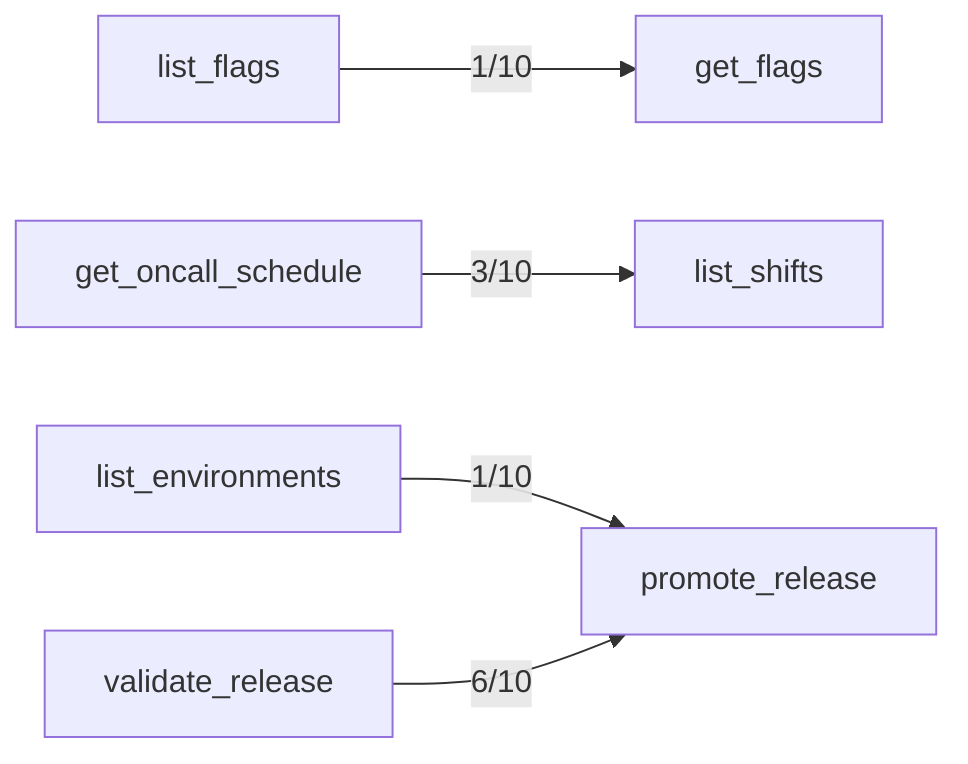

## Failure Attribution

138/490 trials failed.
- Description confusion: 11 (8%)
- Author-clarifiable arguments: 126 (91%)
- Model output mechanics: 1 (1%)
- Correct deprecated-tool avoidance: 18 (excluded above — the model routed away from a tool the catalog itself says not to use)

## Mechanics Floor

0/490 trial(s) failed for reasons no description edit can change: 0 malformed/duplicated argument JSON, 0 called a tool name that isn't in the catalog.

## Confusion Matrix

| Intended \ Called | acknowledge_alert | add_ticket_note | archive_doc | close_ticket | comment_on_ticket | create_doc | create_flag | create_incident_legacy | create_ticket | deactivate_user | delete_flag | deploy_release | get_config | get_deployment | get_doc | get_flags | get_oncall_schedule | get_secret_v1 | get_ticket | get_user | invite_user | list_alerts | list_deployments | list_environments | list_flags | list_shifts | list_teams | list_tickets | list_users | lookup_user | mute_alert | open_incident | override_oncall | page_oncall | promote_release | read_secret | redeploy_service | resolve_incident | restart_service | rollback_deployment | rotate_secret | search_docs | search_tickets | set_config | set_flag | snooze_alert | update_doc | update_ticket | validate_release | (no call) |
|---|---|---|---|---|---|---|---|---|---|---|---|---|---|---|---|---|---|---|---|---|---|---|---|---|---|---|---|---|---|---|---|---|---|---|---|---|---|---|---|---|---|---|---|---|---|---|---|---|---|---|
| acknowledge_alert | 9 | 0 | 0 | 0 | 0 | 0 | 0 | 0 | 0 | 0 | 0 | 0 | 0 | 0 | 0 | 0 | 0 | 0 | 0 | 0 | 0 | 1 | 0 | 0 | 0 | 0 | 0 | 0 | 0 | 0 | 0 | 0 | 0 | 0 | 0 | 0 | 0 | 0 | 0 | 0 | 0 | 0 | 0 | 0 | 0 | 0 | 0 | 0 | 0 | 0 |
| add_ticket_note | 0 | 10 | 0 | 0 | 0 | 0 | 0 | 0 | 0 | 0 | 0 | 0 | 0 | 0 | 0 | 0 | 0 | 0 | 0 | 0 | 0 | 0 | 0 | 0 | 0 | 0 | 0 | 0 | 0 | 0 | 0 | 0 | 0 | 0 | 0 | 0 | 0 | 0 | 0 | 0 | 0 | 0 | 0 | 0 | 0 | 0 | 0 | 0 | 0 | 0 |
| archive_doc | 0 | 0 | 10 | 0 | 0 | 0 | 0 | 0 | 0 | 0 | 0 | 0 | 0 | 0 | 0 | 0 | 0 | 0 | 0 | 0 | 0 | 0 | 0 | 0 | 0 | 0 | 0 | 0 | 0 | 0 | 0 | 0 | 0 | 0 | 0 | 0 | 0 | 0 | 0 | 0 | 0 | 0 | 0 | 0 | 0 | 0 | 0 | 0 | 0 | 0 |
| close_ticket | 0 | 0 | 0 | 8 | 0 | 0 | 0 | 0 | 0 | 0 | 0 | 0 | 0 | 0 | 0 | 0 | 0 | 0 | 0 | 0 | 0 | 0 | 0 | 0 | 0 | 0 | 0 | 0 | 0 | 0 | 0 | 0 | 0 | 0 | 0 | 0 | 0 | 0 | 0 | 0 | 0 | 0 | 0 | 0 | 0 | 0 | 0 | 0 | 0 | 2 |
| comment_on_ticket | 0 | 0 | 0 | 0 | 10 | 0 | 0 | 0 | 0 | 0 | 0 | 0 | 0 | 0 | 0 | 0 | 0 | 0 | 0 | 0 | 0 | 0 | 0 | 0 | 0 | 0 | 0 | 0 | 0 | 0 | 0 | 0 | 0 | 0 | 0 | 0 | 0 | 0 | 0 | 0 | 0 | 0 | 0 | 0 | 0 | 0 | 0 | 0 | 0 | 0 |
| create_doc | 0 | 0 | 0 | 0 | 0 | 10 | 0 | 0 | 0 | 0 | 0 | 0 | 0 | 0 | 0 | 0 | 0 | 0 | 0 | 0 | 0 | 0 | 0 | 0 | 0 | 0 | 0 | 0 | 0 | 0 | 0 | 0 | 0 | 0 | 0 | 0 | 0 | 0 | 0 | 0 | 0 | 0 | 0 | 0 | 0 | 0 | 0 | 0 | 0 | 0 |
| create_flag | 0 | 0 | 0 | 0 | 0 | 0 | 10 | 0 | 0 | 0 | 0 | 0 | 0 | 0 | 0 | 0 | 0 | 0 | 0 | 0 | 0 | 0 | 0 | 0 | 0 | 0 | 0 | 0 | 0 | 0 | 0 | 0 | 0 | 0 | 0 | 0 | 0 | 0 | 0 | 0 | 0 | 0 | 0 | 0 | 0 | 0 | 0 | 0 | 0 | 0 |
| create_incident_legacy | 0 | 0 | 0 | 0 | 0 | 0 | 0 | 0 | 0 | 0 | 0 | 0 | 0 | 0 | 0 | 0 | 0 | 0 | 0 | 0 | 0 | 0 | 0 | 0 | 0 | 0 | 0 | 0 | 0 | 0 | 0 | 10 | 0 | 0 | 0 | 0 | 0 | 0 | 0 | 0 | 0 | 0 | 0 | 0 | 0 | 0 | 0 | 0 | 0 | 0 |
| create_ticket | 0 | 0 | 0 | 0 | 0 | 0 | 0 | 0 | 10 | 0 | 0 | 0 | 0 | 0 | 0 | 0 | 0 | 0 | 0 | 0 | 0 | 0 | 0 | 0 | 0 | 0 | 0 | 0 | 0 | 0 | 0 | 0 | 0 | 0 | 0 | 0 | 0 | 0 | 0 | 0 | 0 | 0 | 0 | 0 | 0 | 0 | 0 | 0 | 0 | 0 |
| deactivate_user | 0 | 0 | 0 | 0 | 0 | 0 | 0 | 0 | 0 | 10 | 0 | 0 | 0 | 0 | 0 | 0 | 0 | 0 | 0 | 0 | 0 | 0 | 0 | 0 | 0 | 0 | 0 | 0 | 0 | 0 | 0 | 0 | 0 | 0 | 0 | 0 | 0 | 0 | 0 | 0 | 0 | 0 | 0 | 0 | 0 | 0 | 0 | 0 | 0 | 0 |
| delete_flag | 0 | 0 | 0 | 0 | 0 | 0 | 0 | 0 | 0 | 0 | 7 | 0 | 0 | 0 | 0 | 0 | 0 | 0 | 0 | 0 | 0 | 0 | 0 | 0 | 0 | 0 | 0 | 0 | 0 | 0 | 0 | 0 | 0 | 0 | 0 | 0 | 0 | 0 | 0 | 0 | 0 | 0 | 0 | 0 | 0 | 0 | 0 | 0 | 0 | 3 |
| deploy_release | 0 | 0 | 0 | 0 | 0 | 0 | 0 | 0 | 0 | 0 | 0 | 10 | 0 | 0 | 0 | 0 | 0 | 0 | 0 | 0 | 0 | 0 | 0 | 0 | 0 | 0 | 0 | 0 | 0 | 0 | 0 | 0 | 0 | 0 | 0 | 0 | 0 | 0 | 0 | 0 | 0 | 0 | 0 | 0 | 0 | 0 | 0 | 0 | 0 | 0 |
| get_config | 0 | 0 | 0 | 0 | 0 | 0 | 0 | 0 | 0 | 0 | 0 | 0 | 10 | 0 | 0 | 0 | 0 | 0 | 0 | 0 | 0 | 0 | 0 | 0 | 0 | 0 | 0 | 0 | 0 | 0 | 0 | 0 | 0 | 0 | 0 | 0 | 0 | 0 | 0 | 0 | 0 | 0 | 0 | 0 | 0 | 0 | 0 | 0 | 0 | 0 |
| get_deployment | 0 | 0 | 0 | 0 | 0 | 0 | 0 | 0 | 0 | 0 | 0 | 0 | 0 | 10 | 0 | 0 | 0 | 0 | 0 | 0 | 0 | 0 | 0 | 0 | 0 | 0 | 0 | 0 | 0 | 0 | 0 | 0 | 0 | 0 | 0 | 0 | 0 | 0 | 0 | 0 | 0 | 0 | 0 | 0 | 0 | 0 | 0 | 0 | 0 | 0 |
| get_doc | 0 | 0 | 0 | 0 | 0 | 0 | 0 | 0 | 0 | 0 | 0 | 0 | 0 | 0 | 10 | 0 | 0 | 0 | 0 | 0 | 0 | 0 | 0 | 0 | 0 | 0 | 0 | 0 | 0 | 0 | 0 | 0 | 0 | 0 | 0 | 0 | 0 | 0 | 0 | 0 | 0 | 0 | 0 | 0 | 0 | 0 | 0 | 0 | 0 | 0 |
| get_flags | 0 | 0 | 0 | 0 | 0 | 0 | 0 | 0 | 0 | 0 | 0 | 0 | 0 | 0 | 0 | 9 | 0 | 0 | 0 | 0 | 0 | 0 | 0 | 0 | 1 | 0 | 0 | 0 | 0 | 0 | 0 | 0 | 0 | 0 | 0 | 0 | 0 | 0 | 0 | 0 | 0 | 0 | 0 | 0 | 0 | 0 | 0 | 0 | 0 | 0 |
| get_oncall_schedule | 0 | 0 | 0 | 0 | 0 | 0 | 0 | 0 | 0 | 0 | 0 | 0 | 0 | 0 | 0 | 0 | 10 | 0 | 0 | 0 | 0 | 0 | 0 | 0 | 0 | 0 | 0 | 0 | 0 | 0 | 0 | 0 | 0 | 0 | 0 | 0 | 0 | 0 | 0 | 0 | 0 | 0 | 0 | 0 | 0 | 0 | 0 | 0 | 0 | 0 |
| get_secret_v1 | 0 | 0 | 0 | 0 | 0 | 0 | 0 | 0 | 0 | 0 | 0 | 0 | 0 | 0 | 0 | 0 | 0 | 2 | 0 | 0 | 0 | 0 | 0 | 0 | 0 | 0 | 0 | 0 | 0 | 0 | 0 | 0 | 0 | 0 | 0 | 1 | 0 | 0 | 0 | 0 | 0 | 0 | 0 | 0 | 0 | 0 | 0 | 0 | 0 | 7 |
| get_ticket | 0 | 0 | 0 | 0 | 0 | 0 | 0 | 0 | 0 | 0 | 0 | 0 | 0 | 0 | 0 | 0 | 0 | 0 | 10 | 0 | 0 | 0 | 0 | 0 | 0 | 0 | 0 | 0 | 0 | 0 | 0 | 0 | 0 | 0 | 0 | 0 | 0 | 0 | 0 | 0 | 0 | 0 | 0 | 0 | 0 | 0 | 0 | 0 | 0 | 0 |
| get_user | 0 | 0 | 0 | 0 | 0 | 0 | 0 | 0 | 0 | 0 | 0 | 0 | 0 | 0 | 0 | 0 | 0 | 0 | 0 | 10 | 0 | 0 | 0 | 0 | 0 | 0 | 0 | 0 | 0 | 0 | 0 | 0 | 0 | 0 | 0 | 0 | 0 | 0 | 0 | 0 | 0 | 0 | 0 | 0 | 0 | 0 | 0 | 0 | 0 | 0 |
| invite_user | 0 | 0 | 0 | 0 | 0 | 0 | 0 | 0 | 0 | 0 | 0 | 0 | 0 | 0 | 0 | 0 | 0 | 0 | 0 | 0 | 10 | 0 | 0 | 0 | 0 | 0 | 0 | 0 | 0 | 0 | 0 | 0 | 0 | 0 | 0 | 0 | 0 | 0 | 0 | 0 | 0 | 0 | 0 | 0 | 0 | 0 | 0 | 0 | 0 | 0 |
| list_alerts | 0 | 0 | 0 | 0 | 0 | 0 | 0 | 0 | 0 | 0 | 0 | 0 | 0 | 0 | 0 | 0 | 0 | 0 | 0 | 0 | 0 | 10 | 0 | 0 | 0 | 0 | 0 | 0 | 0 | 0 | 0 | 0 | 0 | 0 | 0 | 0 | 0 | 0 | 0 | 0 | 0 | 0 | 0 | 0 | 0 | 0 | 0 | 0 | 0 | 0 |
| list_deployments | 0 | 0 | 0 | 0 | 0 | 0 | 0 | 0 | 0 | 0 | 0 | 0 | 0 | 0 | 0 | 0 | 0 | 0 | 0 | 0 | 0 | 0 | 10 | 0 | 0 | 0 | 0 | 0 | 0 | 0 | 0 | 0 | 0 | 0 | 0 | 0 | 0 | 0 | 0 | 0 | 0 | 0 | 0 | 0 | 0 | 0 | 0 | 0 | 0 | 0 |
| list_environments | 0 | 0 | 0 | 0 | 0 | 0 | 0 | 0 | 0 | 0 | 0 | 0 | 0 | 0 | 0 | 0 | 0 | 0 | 0 | 0 | 0 | 0 | 0 | 10 | 0 | 0 | 0 | 0 | 0 | 0 | 0 | 0 | 0 | 0 | 0 | 0 | 0 | 0 | 0 | 0 | 0 | 0 | 0 | 0 | 0 | 0 | 0 | 0 | 0 | 0 |
| list_flags | 0 | 0 | 0 | 0 | 0 | 0 | 0 | 0 | 0 | 0 | 0 | 0 | 0 | 0 | 0 | 0 | 0 | 0 | 0 | 0 | 0 | 0 | 0 | 0 | 10 | 0 | 0 | 0 | 0 | 0 | 0 | 0 | 0 | 0 | 0 | 0 | 0 | 0 | 0 | 0 | 0 | 0 | 0 | 0 | 0 | 0 | 0 | 0 | 0 | 0 |
| list_shifts | 0 | 0 | 0 | 0 | 0 | 0 | 0 | 0 | 0 | 0 | 0 | 0 | 0 | 0 | 0 | 0 | 8 | 0 | 0 | 0 | 0 | 0 | 0 | 0 | 0 | 2 | 0 | 0 | 0 | 0 | 0 | 0 | 0 | 0 | 0 | 0 | 0 | 0 | 0 | 0 | 0 | 0 | 0 | 0 | 0 | 0 | 0 | 0 | 0 | 0 |
| list_teams | 0 | 0 | 0 | 0 | 0 | 0 | 0 | 0 | 0 | 0 | 0 | 0 | 0 | 0 | 0 | 0 | 0 | 0 | 0 | 0 | 0 | 0 | 0 | 0 | 0 | 0 | 10 | 0 | 0 | 0 | 0 | 0 | 0 | 0 | 0 | 0 | 0 | 0 | 0 | 0 | 0 | 0 | 0 | 0 | 0 | 0 | 0 | 0 | 0 | 0 |
| list_tickets | 0 | 0 | 0 | 0 | 0 | 0 | 0 | 0 | 0 | 0 | 0 | 0 | 0 | 0 | 0 | 0 | 0 | 0 | 0 | 0 | 0 | 0 | 0 | 0 | 0 | 0 | 0 | 10 | 0 | 0 | 0 | 0 | 0 | 0 | 0 | 0 | 0 | 0 | 0 | 0 | 0 | 0 | 0 | 0 | 0 | 0 | 0 | 0 | 0 | 0 |
| list_users | 0 | 0 | 0 | 0 | 0 | 0 | 0 | 0 | 0 | 0 | 0 | 0 | 0 | 0 | 0 | 0 | 0 | 0 | 0 | 0 | 0 | 0 | 0 | 0 | 0 | 0 | 0 | 0 | 10 | 0 | 0 | 0 | 0 | 0 | 0 | 0 | 0 | 0 | 0 | 0 | 0 | 0 | 0 | 0 | 0 | 0 | 0 | 0 | 0 | 0 |
| lookup_user | 0 | 0 | 0 | 0 | 0 | 0 | 0 | 0 | 0 | 0 | 0 | 0 | 0 | 0 | 0 | 0 | 0 | 0 | 0 | 0 | 0 | 0 | 0 | 0 | 0 | 0 | 0 | 0 | 0 | 10 | 0 | 0 | 0 | 0 | 0 | 0 | 0 | 0 | 0 | 0 | 0 | 0 | 0 | 0 | 0 | 0 | 0 | 0 | 0 | 0 |
| mute_alert | 0 | 0 | 0 | 0 | 0 | 0 | 0 | 0 | 0 | 0 | 0 | 0 | 0 | 0 | 0 | 0 | 0 | 0 | 0 | 0 | 0 | 0 | 0 | 0 | 0 | 0 | 0 | 0 | 0 | 0 | 9 | 0 | 0 | 0 | 0 | 0 | 0 | 0 | 0 | 0 | 0 | 0 | 0 | 0 | 0 | 1 | 0 | 0 | 0 | 0 |
| open_incident | 0 | 0 | 0 | 0 | 0 | 0 | 0 | 0 | 0 | 0 | 0 | 0 | 0 | 0 | 0 | 0 | 0 | 0 | 0 | 0 | 0 | 0 | 0 | 0 | 0 | 0 | 0 | 0 | 0 | 0 | 0 | 10 | 0 | 0 | 0 | 0 | 0 | 0 | 0 | 0 | 0 | 0 | 0 | 0 | 0 | 0 | 0 | 0 | 0 | 0 |
| override_oncall | 0 | 0 | 0 | 0 | 0 | 0 | 0 | 0 | 0 | 0 | 0 | 0 | 0 | 0 | 0 | 0 | 0 | 0 | 0 | 0 | 0 | 0 | 0 | 0 | 0 | 0 | 0 | 0 | 0 | 0 | 0 | 0 | 10 | 0 | 0 | 0 | 0 | 0 | 0 | 0 | 0 | 0 | 0 | 0 | 0 | 0 | 0 | 0 | 0 | 0 |
| page_oncall | 0 | 0 | 0 | 0 | 0 | 0 | 0 | 0 | 0 | 0 | 0 | 0 | 0 | 0 | 0 | 0 | 4 | 0 | 0 | 0 | 0 | 0 | 0 | 0 | 0 | 0 | 0 | 0 | 0 | 0 | 0 | 0 | 0 | 6 | 0 | 0 | 0 | 0 | 0 | 0 | 0 | 0 | 0 | 0 | 0 | 0 | 0 | 0 | 0 | 0 |
| promote_release | 0 | 0 | 0 | 0 | 0 | 0 | 0 | 0 | 0 | 0 | 0 | 0 | 0 | 0 | 0 | 0 | 0 | 0 | 0 | 0 | 0 | 0 | 0 | 0 | 0 | 0 | 0 | 0 | 0 | 0 | 0 | 0 | 0 | 0 | 0 | 0 | 0 | 0 | 0 | 0 | 0 | 0 | 0 | 0 | 0 | 0 | 0 | 0 | 10 | 0 |
| read_secret | 0 | 0 | 0 | 0 | 0 | 0 | 0 | 0 | 0 | 0 | 0 | 0 | 0 | 0 | 0 | 0 | 0 | 0 | 0 | 0 | 0 | 0 | 0 | 0 | 0 | 0 | 0 | 0 | 0 | 0 | 0 | 0 | 0 | 0 | 0 | 10 | 0 | 0 | 0 | 0 | 0 | 0 | 0 | 0 | 0 | 0 | 0 | 0 | 0 | 0 |
| redeploy_service | 0 | 0 | 0 | 0 | 0 | 0 | 0 | 0 | 0 | 0 | 0 | 0 | 0 | 0 | 0 | 0 | 0 | 0 | 0 | 0 | 0 | 0 | 0 | 0 | 0 | 0 | 0 | 0 | 0 | 0 | 0 | 0 | 0 | 0 | 0 | 0 | 10 | 0 | 0 | 0 | 0 | 0 | 0 | 0 | 0 | 0 | 0 | 0 | 0 | 0 |
| resolve_incident | 0 | 0 | 0 | 0 | 0 | 0 | 0 | 0 | 0 | 0 | 0 | 0 | 0 | 0 | 0 | 0 | 0 | 0 | 0 | 0 | 0 | 0 | 0 | 0 | 0 | 0 | 0 | 0 | 0 | 0 | 0 | 0 | 0 | 0 | 0 | 0 | 0 | 10 | 0 | 0 | 0 | 0 | 0 | 0 | 0 | 0 | 0 | 0 | 0 | 0 |
| restart_service | 0 | 0 | 0 | 0 | 0 | 0 | 0 | 0 | 0 | 0 | 0 | 0 | 0 | 0 | 0 | 0 | 0 | 0 | 0 | 0 | 0 | 0 | 0 | 0 | 0 | 0 | 0 | 0 | 0 | 0 | 0 | 0 | 0 | 0 | 0 | 0 | 0 | 0 | 10 | 0 | 0 | 0 | 0 | 0 | 0 | 0 | 0 | 0 | 0 | 0 |
| rollback_deployment | 0 | 0 | 0 | 0 | 0 | 0 | 0 | 0 | 0 | 0 | 0 | 0 | 0 | 0 | 0 | 0 | 0 | 0 | 0 | 0 | 0 | 0 | 0 | 0 | 0 | 0 | 0 | 0 | 0 | 0 | 0 | 0 | 0 | 0 | 0 | 0 | 0 | 0 | 0 | 10 | 0 | 0 | 0 | 0 | 0 | 0 | 0 | 0 | 0 | 0 |
| rotate_secret | 0 | 0 | 0 | 0 | 0 | 0 | 0 | 0 | 0 | 0 | 0 | 0 | 0 | 0 | 0 | 0 | 0 | 0 | 0 | 0 | 0 | 0 | 0 | 0 | 0 | 0 | 0 | 0 | 0 | 0 | 0 | 0 | 0 | 0 | 0 | 0 | 0 | 0 | 0 | 0 | 10 | 0 | 0 | 0 | 0 | 0 | 0 | 0 | 0 | 0 |
| search_docs | 0 | 0 | 0 | 0 | 0 | 0 | 0 | 0 | 0 | 0 | 0 | 0 | 0 | 0 | 0 | 0 | 0 | 0 | 0 | 0 | 0 | 0 | 0 | 0 | 0 | 0 | 0 | 0 | 0 | 0 | 0 | 0 | 0 | 0 | 0 | 0 | 0 | 0 | 0 | 0 | 0 | 10 | 0 | 0 | 0 | 0 | 0 | 0 | 0 | 0 |
| search_tickets | 0 | 0 | 0 | 0 | 0 | 0 | 0 | 0 | 0 | 0 | 0 | 0 | 0 | 0 | 0 | 0 | 0 | 0 | 0 | 0 | 0 | 0 | 0 | 0 | 0 | 0 | 0 | 0 | 0 | 0 | 0 | 0 | 0 | 0 | 0 | 0 | 0 | 0 | 0 | 0 | 0 | 0 | 10 | 0 | 0 | 0 | 0 | 0 | 0 | 0 |
| set_config | 0 | 0 | 0 | 0 | 0 | 0 | 0 | 0 | 0 | 0 | 0 | 0 | 0 | 0 | 0 | 0 | 0 | 0 | 0 | 0 | 0 | 0 | 0 | 0 | 0 | 0 | 0 | 0 | 0 | 0 | 0 | 0 | 0 | 0 | 0 | 0 | 0 | 0 | 0 | 0 | 0 | 0 | 0 | 10 | 0 | 0 | 0 | 0 | 0 | 0 |
| set_flag | 0 | 0 | 0 | 0 | 0 | 0 | 0 | 0 | 0 | 0 | 0 | 0 | 0 | 0 | 0 | 0 | 0 | 0 | 0 | 0 | 0 | 0 | 0 | 0 | 0 | 0 | 0 | 0 | 0 | 0 | 0 | 0 | 0 | 0 | 0 | 0 | 0 | 0 | 0 | 0 | 0 | 0 | 0 | 0 | 10 | 0 | 0 | 0 | 0 | 0 |
| snooze_alert | 0 | 0 | 0 | 0 | 0 | 0 | 0 | 0 | 0 | 0 | 0 | 0 | 0 | 0 | 0 | 0 | 0 | 0 | 0 | 0 | 0 | 0 | 0 | 0 | 0 | 0 | 0 | 0 | 0 | 0 | 0 | 0 | 0 | 0 | 0 | 0 | 0 | 0 | 0 | 0 | 0 | 0 | 0 | 0 | 0 | 10 | 0 | 0 | 0 | 0 |
| update_doc | 0 | 0 | 0 | 0 | 0 | 0 | 0 | 0 | 0 | 0 | 0 | 0 | 0 | 0 | 0 | 0 | 0 | 0 | 0 | 0 | 0 | 0 | 0 | 0 | 0 | 0 | 0 | 0 | 0 | 0 | 0 | 0 | 0 | 0 | 0 | 0 | 0 | 0 | 0 | 0 | 0 | 0 | 0 | 0 | 0 | 0 | 10 | 0 | 0 | 0 |
| update_ticket | 0 | 0 | 0 | 0 | 0 | 0 | 0 | 0 | 0 | 0 | 0 | 0 | 0 | 0 | 0 | 0 | 0 | 0 | 0 | 0 | 0 | 0 | 0 | 0 | 0 | 0 | 0 | 0 | 0 | 0 | 0 | 0 | 0 | 0 | 0 | 0 | 0 | 0 | 0 | 0 | 0 | 0 | 0 | 0 | 0 | 0 | 0 | 10 | 0 | 0 |
| validate_release | 0 | 0 | 0 | 0 | 0 | 0 | 0 | 0 | 0 | 0 | 0 | 0 | 0 | 0 | 0 | 0 | 0 | 0 | 0 | 0 | 0 | 0 | 0 | 0 | 0 | 0 | 0 | 0 | 0 | 0 | 0 | 0 | 0 | 0 | 0 | 0 | 0 | 0 | 0 | 0 | 0 | 0 | 0 | 0 | 0 | 0 | 0 | 0 | 10 | 0 |

## Trial Diversity
- acknowledge_alert: 10/10 distinct
- add_ticket_note: 10/10 distinct
- archive_doc: 10/10 distinct
- close_ticket: 10/10 distinct
- comment_on_ticket: 10/10 distinct
- create_doc: 10/10 distinct
- create_flag: 10/10 distinct
- create_incident_legacy: 8/10 distinct (some seeds sampled identical arguments)
- create_ticket: 10/10 distinct
- deactivate_user: 10/10 distinct
- delete_flag: 10/10 distinct
- deploy_release: 10/10 distinct
- get_config: 10/10 distinct
- get_deployment: 10/10 distinct
- get_doc: 10/10 distinct
- get_flags: 10/10 distinct
- get_oncall_schedule: 10/10 distinct
- get_secret_v1: 10/10 distinct
- get_ticket: 10/10 distinct
- get_user: 10/10 distinct
- invite_user: 10/10 distinct
- list_alerts: 10/10 distinct
- list_deployments: 10/10 distinct
- list_environments: 10/10 distinct
- list_flags: 10/10 distinct
- list_shifts: 10/10 distinct
- list_teams: 3/10 distinct (some seeds sampled identical arguments)
- list_tickets: 10/10 distinct
- list_users: 10/10 distinct
- lookup_user: 10/10 distinct
- mute_alert: 10/10 distinct
- open_incident: 10/10 distinct
- override_oncall: 10/10 distinct
- page_oncall: 10/10 distinct
- promote_release: 10/10 distinct
- read_secret: 10/10 distinct
- redeploy_service: 10/10 distinct
- resolve_incident: 10/10 distinct
- restart_service: 10/10 distinct
- rollback_deployment: 10/10 distinct
- rotate_secret: 10/10 distinct
- search_docs: 10/10 distinct
- search_tickets: 10/10 distinct
- set_config: 10/10 distinct
- set_flag: 10/10 distinct
- snooze_alert: 10/10 distinct
- update_doc: 10/10 distinct
- update_ticket: 10/10 distinct
- validate_release: 10/10 distinct

## Pass Rates
- acknowledge_alert: 9/10 (90%), 95% CI [60%, 98%]
- add_ticket_note: 10/10 (100%), 95% CI [72%, 100%]
- archive_doc: 10/10 (100%), 95% CI [72%, 100%]
- close_ticket: 8/10 (80%), 95% CI [49%, 94%]
- comment_on_ticket: 4/10 (40%), 95% CI [17%, 69%]
- create_doc: 10/10 (100%), 95% CI [72%, 100%]
- create_flag: 7/10 (70%), 95% CI [40%, 89%]
- create_incident_legacy: 0/10 (0%), 95% CI [0%, 28%]
- create_ticket: 5/10 (50%), 95% CI [24%, 76%]
- deactivate_user: 10/10 (100%), 95% CI [72%, 100%]
- delete_flag: 7/10 (70%), 95% CI [40%, 89%]
- deploy_release: 6/10 (60%), 95% CI [31%, 83%]
- get_config: 10/10 (100%), 95% CI [72%, 100%]
- get_deployment: 10/10 (100%), 95% CI [72%, 100%]
- get_doc: 10/10 (100%), 95% CI [72%, 100%]
- get_flags: 10/10 (100%), 95% CI [72%, 100%]
- get_oncall_schedule: 10/10 (100%), 95% CI [72%, 100%]
- get_secret_v1: 2/10 (20%), 95% CI [6%, 51%]
- get_ticket: 10/10 (100%), 95% CI [72%, 100%]
- get_user: 10/10 (100%), 95% CI [72%, 100%]
- invite_user: 4/10 (40%), 95% CI [17%, 69%]
- list_alerts: 2/10 (20%), 95% CI [6%, 51%]
- list_deployments: 0/10 (0%), 95% CI [0%, 28%]
- list_environments: 10/10 (100%), 95% CI [72%, 100%]
- list_flags: 10/10 (100%), 95% CI [72%, 100%]
- list_shifts: 4/10 (40%), 95% CI [17%, 69%]
- list_teams: 6/10 (60%), 95% CI [31%, 83%]
- list_tickets: 1/10 (10%), 95% CI [2%, 40%]
- list_users: 2/10 (20%), 95% CI [6%, 51%]
- lookup_user: 10/10 (100%), 95% CI [72%, 100%]
- mute_alert: 9/10 (90%), 95% CI [60%, 98%]
- open_incident: 8/10 (80%), 95% CI [49%, 94%]
- override_oncall: 0/10 (0%), 95% CI [0%, 28%]
- page_oncall: 3/10 (30%), 95% CI [11%, 60%]
- promote_release: 6/10 (60%), 95% CI [31%, 83%]
- read_secret: 10/10 (100%), 95% CI [72%, 100%]
- redeploy_service: 10/10 (100%), 95% CI [72%, 100%]
- resolve_incident: 4/10 (40%), 95% CI [17%, 69%]
- restart_service: 10/10 (100%), 95% CI [72%, 100%]
- rollback_deployment: 10/10 (100%), 95% CI [72%, 100%]
- rotate_secret: 7/10 (70%), 95% CI [40%, 89%]
- search_docs: 1/10 (10%), 95% CI [2%, 40%]
- search_tickets: 1/10 (10%), 95% CI [2%, 40%]
- set_config: 10/10 (100%), 95% CI [72%, 100%]
- set_flag: 7/10 (70%), 95% CI [40%, 89%]
- snooze_alert: 4/10 (40%), 95% CI [17%, 69%]
- update_doc: 9/10 (90%), 95% CI [60%, 98%]
- update_ticket: 8/10 (80%), 95% CI [49%, 94%]
- validate_release: 10/10 (100%), 95% CI [72%, 100%]

## Preconditions (observed)

Tools the model called *before* correctly calling the intended one, per trial:

- list_flags → get_flags: 1/10 trials
- get_oncall_schedule → list_shifts: 3/10 trials
- validate_release → promote_release: 6/10 trials
- list_environments → promote_release: 1/10 trials

## Undeclared Preconditions

The model follows these dependencies, but the catalog is silent about them. Either state
the precondition in the description or make the tool self-sufficient, then re-run:

- list_shifts: models call get_oncall_schedule first in 3/10 trials, but list_shifts's description never mentions get_oncall_schedule

## Argument Failures

Trials that reached the right tool with the wrong arguments, per parameter: `missing` = expected but not sent, `extra` = sent but not expected, `wrong` = value differs, `* malformed/duplicated argument JSON` = the argument text could not be parsed.

- acknowledge_alert: note extra 1/10
- comment_on_ticket: notify_assignee extra 6/10
- create_flag: default_on extra 3/10
- create_ticket: priority extra 4/10; labels extra 1/10
- deploy_release: window wrong 3/10; window extra 1/10
- invite_user: role extra 6/10
- list_alerts: page extra 5/10; page wrong 3/10
- list_deployments: page extra 10/10
- list_shifts: days_ahead extra 3/10
- list_teams: include_members extra 4/10
- list_tickets: page extra 7/10; status extra 4/10; page wrong 2/10
- list_users: page extra 5/10; page wrong 3/10
- open_incident: title wrong 2/10
- override_oncall: window wrong 10/10
- page_oncall: urgency extra 4/10
- resolve_incident: postmortem_required extra 6/10
- rotate_secret: notify_owner extra 3/10
- search_docs: page extra 6/10; page wrong 3/10
- search_tickets: page extra 9/10
- set_flag: rollout_percent extra 3/10
- snooze_alert: minutes extra 6/10
- update_doc: change_note extra 1/10
- update_ticket: title extra 2/10

## No-Call Replies

- close_ticket (seed 8, other): Please provide me with the original ticket ID that the ticket sample-ticket_id-233 duplicates, so I can close it accordingly.
- close_ticket (seed 10, refused): You asked to close ticket sample-ticket_id-586 as a duplicate of sample-duplicate_of-212 and mark its resolution as fixed. The instructions conflict because a ticket closed as a duplicate cannot have the resolution marked as fixed. Could y…
- delete_flag (seed 1, refused): I cannot delete an environment directly. However, I can help you list environments and manage them in other ways if needed. Would you like me to list the environments for the project "sample-project_id-138" so you can confirm the one to de…
- delete_flag (seed 4, asked): Just to clarify, you want to delete the whole environment with the key 'sample-key-311' in project 'sample-project_id-242', or do you want to delete a feature flag from that environment? Currently, I can delete feature flags or manage conf…
- delete_flag (seed 6, asked): I want to confirm before proceeding: You requested to permanently delete the environment with key "sample-key-588" from the feature flag project "sample-project_id-813". This action is irreversible. Is that correct?
- get_secret_v1 (seed 1, asked): Can you please specify the environment for the secret "sample-name-583" associated with the service "sample-service_id-138"? The secret value retrieval requires the environment context.
- get_secret_v1 (seed 3, other): Please provide the environment ID for the service "sample-service_id-244" where the secret "sample-name-607" is stored. This is necessary to retrieve the secret value.
- get_secret_v1 (seed 5, asked): To get the value of the secret "sample-name-262" for the service "sample-service_id-638," I also need to know the environment ID in which this service is running. Could you please provide the environment ID?
- get_secret_v1 (seed 6, asked): Can you please specify the environment ID where the secret is stored? This is required to retrieve the secret value.
- get_secret_v1 (seed 7, asked): Could you please specify the environment ID for which you want to retrieve the secret value?
- get_secret_v1 (seed 9, asked): Could you please specify the environment ID in which you want me to look for the secret "sample-name-628" for service "sample-service_id-475"?
- get_secret_v1 (seed 10, asked): To retrieve the value of the secret, I need to know the environment ID in which the secret is stored. Could you please provide the environment ID or the environment name where the service "sample-service_id-586" is deployed?

## Solvability Warnings
- get_user (seed 1, passed anyway, after 2 regeneration(s)): unparseable response, treated as ambiguous: **AMBIGUOUS** — there are two equally plausible tools (`get_user` and `lookup_user`) with identical descriptions for returning a user record, and nothing in the request indicates which one should be used.
- get_user (seed 2, passed anyway, after 2 regeneration(s)): unparseable response, treated as ambiguous: **AMBIGUOUS** — both `get_user` and `lookup_user` are described identically as returning a user record, so it's unclear which tool should be used to fulfill this request.
- get_user (seed 3, passed anyway, after 2 regeneration(s)): 
- get_user (seed 4, passed anyway, after 2 regeneration(s)): unparseable response, treated as ambiguous: **AMBIGUOUS** — both `get_user` and `lookup_user` are described identically as returning a user record, so it's unclear which tool should be called to fulfill the request.
- get_user (seed 5, passed anyway, after 2 regeneration(s)): 
- get_user (seed 6, passed anyway, after 2 regeneration(s)): 
- get_user (seed 7, passed anyway, after 2 regeneration(s)): 
- get_user (seed 8, passed anyway, after 2 regeneration(s)): unparseable response, treated as ambiguous: **AMBIGUOUS** — Both `get_user` and `lookup_user` are described identically ("Return user record") and accept what appears to be a user identifier, so there's no way to determine from the tool list which one is the correct/intended call for fetching this account's record.
- get_user (seed 9, passed anyway, after 2 regeneration(s)): 
- get_user (seed 10, passed anyway, after 2 regeneration(s)): 
- lookup_user (seed 1, passed anyway, after 2 regeneration(s)): 
- lookup_user (seed 2, passed anyway, after 2 regeneration(s)): 
- lookup_user (seed 4, passed anyway, after 2 regeneration(s)): unparseable response, treated as ambiguous: **AMBIGUOUS** — there are two equally plausible tools ("get_user" and "lookup_user") that both claim to "Return user record," with no distinguishing criteria given to determine which one should be used to look up the email.
- lookup_user (seed 6, passed anyway, after 2 regeneration(s)): 
- lookup_user (seed 7, passed anyway, after 2 regeneration(s)): 
- lookup_user (seed 8, passed anyway, after 2 regeneration(s)): 
- lookup_user (seed 9, passed anyway, after 2 regeneration(s)): 
- lookup_user (seed 10, passed anyway, after 2 regeneration(s)): 
- list_users (seed 4, failed, after 2 regeneration(s)): unparseable response, treated as ambiguous: **AMBIGUOUS** — `list_users` is inherently paginated, so it's unclear whether "without pagination" means to return only the first page as-is, or to have the assistant loop through all pages internally to compile a complete unpaginated list of admins.
- list_users (seed 8, passed anyway, after 2 regeneration(s)): 
- invite_user (seed 7, failed, after 2 regeneration(s)): 
- update_ticket (seed 5, failed, after 2 regeneration(s)): unparseable response, treated as ambiguous: **SOLVABLE** — Use `update_ticket` on ticket ID "sample-ticket_id-638" to set the title field to an empty string.
- list_tickets (seed 4, failed, after 2 regeneration(s)): unparseable response, treated as ambiguous: **AMBIGUOUS** — `list_tickets` is paginated, and the tool description doesn't specify a max page size, so it's unclear whether 206 results can actually be returned in a single page/call.
- close_ticket (seed 5, passed anyway, after 2 regeneration(s)): unparseable response, treated as ambiguous: **AMBIGUOUS** — The `close_ticket` tool requires a resolution type and, for a "duplicate" resolution, the **original ticket id** it's a duplicate of. The request only supplies the ticket to close (`sample-ticket_id-638`) and the resolution type ("duplicate") but does not specify which original ticket it is a duplicate of, so the call cannot be completed as specified.
- close_ticket (seed 8, failed, after 2 regeneration(s)): 
- close_ticket (seed 9, passed anyway, after 2 regeneration(s)): unparseable response, treated as ambiguous: **SOLVABLE** — the `close_ticket` tool directly supports closing a ticket with resolution "duplicate" and specifying the original ticket id, which matches this request exactly.
- get_deployment (seed 1, passed anyway, after 2 regeneration(s)): unparseable response, treated as ambiguous: **SOLVABLE** — the request maps directly to the `get_deployment` tool, which is described as fetching "status, commit, timing" for a given deployment ID (here, `sample-deployment_id-138`).
- get_deployment (seed 2, passed anyway, after 2 regeneration(s)): unparseable response, treated as ambiguous: **SOLVABLE** — Call `get_deployment` with `deployment_id="sample-deployment_id-979"` to retrieve its status and commit timing directly.
- get_deployment (seed 3, passed anyway, after 2 regeneration(s)): 
- get_deployment (seed 4, passed anyway, after 2 regeneration(s)): unparseable response, treated as ambiguous: **SOLVABLE** — `get_deployment` directly returns status, commit, and timing information for a specified deployment id.
- get_deployment (seed 5, passed anyway, after 2 regeneration(s)): 
- get_deployment (seed 6, passed anyway, after 2 regeneration(s)): 
- get_deployment (seed 7, passed anyway, after 2 regeneration(s)): unparseable response, treated as ambiguous: **SOLVABLE** — call `get_deployment` with deployment_id "sample-deployment_id-332" to retrieve its status, commit, and timing information.
- get_deployment (seed 8, passed anyway, after 2 regeneration(s)): 
- get_deployment (seed 9, passed anyway, after 2 regeneration(s)): unparseable response, treated as ambiguous: **SOLVABLE** — the request directly matches the `get_deployment` tool, which fetches status, commit, and timing information for a single deployment given its ID ("sample-deployment_id-475").
- get_deployment (seed 10, passed anyway, after 2 regeneration(s)): unparseable response, treated as ambiguous: **SOLVABLE** — `get_deployment` directly returns status and commit timing for a given deployment ID, which is exactly what's being requested for `sample-deployment_id-586`.
- deploy_release (seed 6, passed anyway, after 2 regeneration(s)): 
- rollback_deployment (seed 7, passed anyway, after 2 regeneration(s)): 
- list_alerts (seed 1, failed, after 2 regeneration(s)): 
- list_alerts (seed 3, failed, after 2 regeneration(s)): There is no tool for listing or filtering alerts by status/severity (only mute_alert, snooze_alert, etc. operate on alerts by ID), so this request cannot be fulfilled with the available tools.
- list_alerts (seed 5, failed, after 2 regeneration(s)): No tool for listing/filtering alerts by ID (e.g., a "list_alerts" function) exists among the available tools, so this request cannot be fulfilled.
- acknowledge_alert (seed 1, passed anyway, after 2 regeneration(s)): unparseable response, treated as ambiguous: **AMBIGUOUS** — there is no `acknowledge_alert` tool; only `silence_alert`/`snooze_alert` exist, which stop paging differently (via silence duration or delay) rather than true acknowledgment, so it's unclear which action correctly maps to "acknowledge... but leave unresolved."
- acknowledge_alert (seed 6, passed anyway, after 2 regeneration(s)): 
- acknowledge_alert (seed 7, passed anyway, after 2 regeneration(s)): unparseable response, treated as ambiguous: **SOLVABLE** — the request maps directly to an "acknowledge alert" style action, but the available tool list only shows "Silence alert until given time" (silence_alert) and "snooze_alert" (delay next notification), not a distinct "acknowledge" action — however, since the intent is clearly to stop paging without resolving, this can be accomplished with `silence_alert` (or `snooze_alert`) on `sample-alert_id-332`, making it solvable with the given tools despite no exact "acknowledge" function existing.
- acknowledge_alert (seed 10, passed anyway, after 2 regeneration(s)): 
- open_incident (seed 1, passed anyway, after 2 regeneration(s)): 
- open_incident (seed 5, failed, after 2 regeneration(s)): unparseable response, treated as ambiguous: **SOLVABLE** — The request directly maps to the `open_incident` tool, which can declare an incident with a given title and severity (sev2), with all required parameters (title, severity) explicitly provided in the request.
- create_incident_legacy (seed 4, failed, after 2 regeneration(s)): 
- create_incident_legacy (seed 7, failed, after 2 regeneration(s)): 
- create_incident_legacy (seed 8, failed, after 2 regeneration(s)): 
- list_shifts (seed 2, failed, after 2 regeneration(s)): unparseable response, treated as ambiguous: **SOLVABLE** — The request maps directly to the `list_shifts` tool, which lists upcoming on-call shifts for a given schedule ID (`sample-schedule_id-979`).
- list_shifts (seed 3, failed, after 2 regeneration(s)): unparseable response, treated as ambiguous: **SOLVABLE** — The request can be fulfilled directly using the `list_shifts` tool, which lists upcoming on-call shifts for a given schedule ID (here, "sample-schedule_id-244").
- list_shifts (seed 9, failed, after 2 regeneration(s)): unparseable response, treated as ambiguous: **SOLVABLE** — This can be fulfilled directly with the `list_shifts` tool, using `sample-schedule_id-475` as the schedule ID to retrieve the upcoming on-call shifts.
- search_docs (seed 4, failed, after 2 regeneration(s)): unparseable response, treated as ambiguous: **SOLVABLE** – the request maps directly to `search_docs` with the query "sample-query-242" and no space filter (searching all spaces); the "206 results" is just an expected outcome, not an actionable parameter.
- get_doc (seed 7, passed anyway, after 2 regeneration(s)): 
- get_flags (seed 7, passed anyway, after 2 regeneration(s)): Both "list_flags" and "get_flags" are described identically ("List feature flags for a project"), so it's not clear from the tool list alone which single one should be called.
- delete_flag (seed 1, failed, after 2 regeneration(s)): unparseable response, treated as ambiguous: **AMBIGUOUS:** There is no tool for permanently deleting a secret/environment variable (only `delete_flag` exists for feature flags, `rotate_secret` for secrets, and `set_config` for config values), so it's unclear which underlying object "environment key" refers to or which action would fulfill this request.
- delete_flag (seed 4, failed, after 2 regeneration(s)): The requested action—deleting an "environment key" flag configuration for a single environment—doesn't match any available tool; `delete_flag` only permanently deletes a flag across *all* environments, and there's no tool to remove a flag's config from just one specific environment.
- delete_flag (seed 5, passed anyway, after 2 regeneration(s)): unparseable response, treated as ambiguous: 
- rotate_secret (seed 8, passed anyway, after 2 regeneration(s)): While rotate_secret covers rotation and redeployment, there is no notification/messaging tool to alert the owner once done, so the full request can't be satisfied by a single tool.

## Metadata
- Model under test: openai/gpt-4.1-mini
- Generator model: claude-sonnet-5
- Seeds per tool: 10
- Max steps per task: 3
