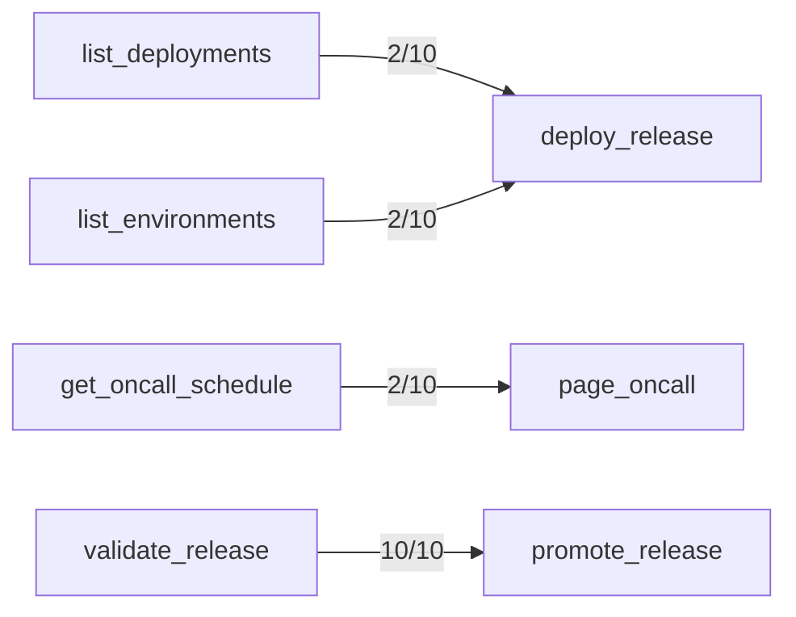

## Failure Attribution

45/490 trials failed.
- Description confusion: 2 (4%)
- Author-clarifiable arguments: 43 (96%)
- Model output mechanics: 0 (0%)
- Correct deprecated-tool avoidance: 15 (excluded above — the model routed away from a tool the catalog itself says not to use)

## Mechanics Floor

0/490 trial(s) failed for reasons no description edit can change: 0 malformed/duplicated argument JSON, 0 called a tool name that isn't in the catalog.

## Confusion Matrix

| Intended \ Called | acknowledge_alert | add_ticket_note | archive_doc | close_ticket | comment_on_ticket | create_doc | create_flag | create_incident_legacy | create_ticket | deactivate_user | delete_flag | deploy_release | get_config | get_deployment | get_doc | get_flags | get_oncall_schedule | get_secret_v1 | get_ticket | get_user | invite_user | list_alerts | list_deployments | list_environments | list_flags | list_shifts | list_teams | list_tickets | list_users | lookup_user | mute_alert | open_incident | override_oncall | page_oncall | promote_release | read_secret | redeploy_service | resolve_incident | restart_service | rollback_deployment | rotate_secret | search_docs | search_tickets | set_config | set_flag | snooze_alert | update_doc | update_ticket | validate_release | (no call) |
|---|---|---|---|---|---|---|---|---|---|---|---|---|---|---|---|---|---|---|---|---|---|---|---|---|---|---|---|---|---|---|---|---|---|---|---|---|---|---|---|---|---|---|---|---|---|---|---|---|---|---|
| acknowledge_alert | 10 | 0 | 0 | 0 | 0 | 0 | 0 | 0 | 0 | 0 | 0 | 0 | 0 | 0 | 0 | 0 | 0 | 0 | 0 | 0 | 0 | 0 | 0 | 0 | 0 | 0 | 0 | 0 | 0 | 0 | 0 | 0 | 0 | 0 | 0 | 0 | 0 | 0 | 0 | 0 | 0 | 0 | 0 | 0 | 0 | 0 | 0 | 0 | 0 | 0 |
| add_ticket_note | 0 | 10 | 0 | 0 | 0 | 0 | 0 | 0 | 0 | 0 | 0 | 0 | 0 | 0 | 0 | 0 | 0 | 0 | 0 | 0 | 0 | 0 | 0 | 0 | 0 | 0 | 0 | 0 | 0 | 0 | 0 | 0 | 0 | 0 | 0 | 0 | 0 | 0 | 0 | 0 | 0 | 0 | 0 | 0 | 0 | 0 | 0 | 0 | 0 | 0 |
| archive_doc | 0 | 0 | 10 | 0 | 0 | 0 | 0 | 0 | 0 | 0 | 0 | 0 | 0 | 0 | 0 | 0 | 0 | 0 | 0 | 0 | 0 | 0 | 0 | 0 | 0 | 0 | 0 | 0 | 0 | 0 | 0 | 0 | 0 | 0 | 0 | 0 | 0 | 0 | 0 | 0 | 0 | 0 | 0 | 0 | 0 | 0 | 0 | 0 | 0 | 0 |
| close_ticket | 0 | 0 | 0 | 10 | 0 | 0 | 0 | 0 | 0 | 0 | 0 | 0 | 0 | 0 | 0 | 0 | 0 | 0 | 0 | 0 | 0 | 0 | 0 | 0 | 0 | 0 | 0 | 0 | 0 | 0 | 0 | 0 | 0 | 0 | 0 | 0 | 0 | 0 | 0 | 0 | 0 | 0 | 0 | 0 | 0 | 0 | 0 | 0 | 0 | 0 |
| comment_on_ticket | 0 | 0 | 0 | 0 | 10 | 0 | 0 | 0 | 0 | 0 | 0 | 0 | 0 | 0 | 0 | 0 | 0 | 0 | 0 | 0 | 0 | 0 | 0 | 0 | 0 | 0 | 0 | 0 | 0 | 0 | 0 | 0 | 0 | 0 | 0 | 0 | 0 | 0 | 0 | 0 | 0 | 0 | 0 | 0 | 0 | 0 | 0 | 0 | 0 | 0 |
| create_doc | 0 | 0 | 0 | 0 | 0 | 10 | 0 | 0 | 0 | 0 | 0 | 0 | 0 | 0 | 0 | 0 | 0 | 0 | 0 | 0 | 0 | 0 | 0 | 0 | 0 | 0 | 0 | 0 | 0 | 0 | 0 | 0 | 0 | 0 | 0 | 0 | 0 | 0 | 0 | 0 | 0 | 0 | 0 | 0 | 0 | 0 | 0 | 0 | 0 | 0 |
| create_flag | 0 | 0 | 0 | 0 | 0 | 0 | 10 | 0 | 0 | 0 | 0 | 0 | 0 | 0 | 0 | 0 | 0 | 0 | 0 | 0 | 0 | 0 | 0 | 0 | 0 | 0 | 0 | 0 | 0 | 0 | 0 | 0 | 0 | 0 | 0 | 0 | 0 | 0 | 0 | 0 | 0 | 0 | 0 | 0 | 0 | 0 | 0 | 0 | 0 | 0 |
| create_incident_legacy | 0 | 0 | 0 | 0 | 0 | 0 | 0 | 5 | 0 | 0 | 0 | 0 | 0 | 0 | 0 | 0 | 0 | 0 | 0 | 0 | 0 | 0 | 0 | 0 | 0 | 0 | 0 | 0 | 0 | 0 | 0 | 5 | 0 | 0 | 0 | 0 | 0 | 0 | 0 | 0 | 0 | 0 | 0 | 0 | 0 | 0 | 0 | 0 | 0 | 0 |
| create_ticket | 0 | 0 | 0 | 0 | 0 | 0 | 0 | 0 | 10 | 0 | 0 | 0 | 0 | 0 | 0 | 0 | 0 | 0 | 0 | 0 | 0 | 0 | 0 | 0 | 0 | 0 | 0 | 0 | 0 | 0 | 0 | 0 | 0 | 0 | 0 | 0 | 0 | 0 | 0 | 0 | 0 | 0 | 0 | 0 | 0 | 0 | 0 | 0 | 0 | 0 |
| deactivate_user | 0 | 0 | 0 | 0 | 0 | 0 | 0 | 0 | 0 | 10 | 0 | 0 | 0 | 0 | 0 | 0 | 0 | 0 | 0 | 0 | 0 | 0 | 0 | 0 | 0 | 0 | 0 | 0 | 0 | 0 | 0 | 0 | 0 | 0 | 0 | 0 | 0 | 0 | 0 | 0 | 0 | 0 | 0 | 0 | 0 | 0 | 0 | 0 | 0 | 0 |
| delete_flag | 0 | 0 | 0 | 0 | 0 | 0 | 0 | 0 | 0 | 0 | 10 | 0 | 0 | 0 | 0 | 0 | 0 | 0 | 0 | 0 | 0 | 0 | 0 | 0 | 0 | 0 | 0 | 0 | 0 | 0 | 0 | 0 | 0 | 0 | 0 | 0 | 0 | 0 | 0 | 0 | 0 | 0 | 0 | 0 | 0 | 0 | 0 | 0 | 0 | 0 |
| deploy_release | 0 | 0 | 0 | 0 | 0 | 0 | 0 | 0 | 0 | 0 | 0 | 8 | 0 | 0 | 0 | 0 | 0 | 0 | 0 | 0 | 0 | 0 | 0 | 2 | 0 | 0 | 0 | 0 | 0 | 0 | 0 | 0 | 0 | 0 | 0 | 0 | 0 | 0 | 0 | 0 | 0 | 0 | 0 | 0 | 0 | 0 | 0 | 0 | 0 | 0 |
| get_config | 0 | 0 | 0 | 0 | 0 | 0 | 0 | 0 | 0 | 0 | 0 | 0 | 10 | 0 | 0 | 0 | 0 | 0 | 0 | 0 | 0 | 0 | 0 | 0 | 0 | 0 | 0 | 0 | 0 | 0 | 0 | 0 | 0 | 0 | 0 | 0 | 0 | 0 | 0 | 0 | 0 | 0 | 0 | 0 | 0 | 0 | 0 | 0 | 0 | 0 |
| get_deployment | 0 | 0 | 0 | 0 | 0 | 0 | 0 | 0 | 0 | 0 | 0 | 0 | 0 | 10 | 0 | 0 | 0 | 0 | 0 | 0 | 0 | 0 | 0 | 0 | 0 | 0 | 0 | 0 | 0 | 0 | 0 | 0 | 0 | 0 | 0 | 0 | 0 | 0 | 0 | 0 | 0 | 0 | 0 | 0 | 0 | 0 | 0 | 0 | 0 | 0 |
| get_doc | 0 | 0 | 0 | 0 | 0 | 0 | 0 | 0 | 0 | 0 | 0 | 0 | 0 | 0 | 10 | 0 | 0 | 0 | 0 | 0 | 0 | 0 | 0 | 0 | 0 | 0 | 0 | 0 | 0 | 0 | 0 | 0 | 0 | 0 | 0 | 0 | 0 | 0 | 0 | 0 | 0 | 0 | 0 | 0 | 0 | 0 | 0 | 0 | 0 | 0 |
| get_flags | 0 | 0 | 0 | 0 | 0 | 0 | 0 | 0 | 0 | 0 | 0 | 0 | 0 | 0 | 0 | 10 | 0 | 0 | 0 | 0 | 0 | 0 | 0 | 0 | 0 | 0 | 0 | 0 | 0 | 0 | 0 | 0 | 0 | 0 | 0 | 0 | 0 | 0 | 0 | 0 | 0 | 0 | 0 | 0 | 0 | 0 | 0 | 0 | 0 | 0 |
| get_oncall_schedule | 0 | 0 | 0 | 0 | 0 | 0 | 0 | 0 | 0 | 0 | 0 | 0 | 0 | 0 | 0 | 0 | 10 | 0 | 0 | 0 | 0 | 0 | 0 | 0 | 0 | 0 | 0 | 0 | 0 | 0 | 0 | 0 | 0 | 0 | 0 | 0 | 0 | 0 | 0 | 0 | 0 | 0 | 0 | 0 | 0 | 0 | 0 | 0 | 0 | 0 |
| get_secret_v1 | 0 | 0 | 0 | 0 | 0 | 0 | 0 | 0 | 0 | 0 | 0 | 0 | 0 | 0 | 0 | 0 | 0 | 0 | 0 | 0 | 0 | 0 | 0 | 0 | 0 | 0 | 0 | 0 | 0 | 0 | 0 | 0 | 0 | 0 | 0 | 4 | 0 | 0 | 0 | 0 | 0 | 0 | 0 | 0 | 0 | 0 | 0 | 0 | 0 | 6 |
| get_ticket | 0 | 0 | 0 | 0 | 0 | 0 | 0 | 0 | 0 | 0 | 0 | 0 | 0 | 0 | 0 | 0 | 0 | 0 | 10 | 0 | 0 | 0 | 0 | 0 | 0 | 0 | 0 | 0 | 0 | 0 | 0 | 0 | 0 | 0 | 0 | 0 | 0 | 0 | 0 | 0 | 0 | 0 | 0 | 0 | 0 | 0 | 0 | 0 | 0 | 0 |
| get_user | 0 | 0 | 0 | 0 | 0 | 0 | 0 | 0 | 0 | 0 | 0 | 0 | 0 | 0 | 0 | 0 | 0 | 0 | 0 | 10 | 0 | 0 | 0 | 0 | 0 | 0 | 0 | 0 | 0 | 0 | 0 | 0 | 0 | 0 | 0 | 0 | 0 | 0 | 0 | 0 | 0 | 0 | 0 | 0 | 0 | 0 | 0 | 0 | 0 | 0 |
| invite_user | 0 | 0 | 0 | 0 | 0 | 0 | 0 | 0 | 0 | 0 | 0 | 0 | 0 | 0 | 0 | 0 | 0 | 0 | 0 | 0 | 10 | 0 | 0 | 0 | 0 | 0 | 0 | 0 | 0 | 0 | 0 | 0 | 0 | 0 | 0 | 0 | 0 | 0 | 0 | 0 | 0 | 0 | 0 | 0 | 0 | 0 | 0 | 0 | 0 | 0 |
| list_alerts | 0 | 0 | 0 | 0 | 0 | 0 | 0 | 0 | 0 | 0 | 0 | 0 | 0 | 0 | 0 | 0 | 0 | 0 | 0 | 0 | 0 | 10 | 0 | 0 | 0 | 0 | 0 | 0 | 0 | 0 | 0 | 0 | 0 | 0 | 0 | 0 | 0 | 0 | 0 | 0 | 0 | 0 | 0 | 0 | 0 | 0 | 0 | 0 | 0 | 0 |
| list_deployments | 0 | 0 | 0 | 0 | 0 | 0 | 0 | 0 | 0 | 0 | 0 | 0 | 0 | 0 | 0 | 0 | 0 | 0 | 0 | 0 | 0 | 0 | 10 | 0 | 0 | 0 | 0 | 0 | 0 | 0 | 0 | 0 | 0 | 0 | 0 | 0 | 0 | 0 | 0 | 0 | 0 | 0 | 0 | 0 | 0 | 0 | 0 | 0 | 0 | 0 |
| list_environments | 0 | 0 | 0 | 0 | 0 | 0 | 0 | 0 | 0 | 0 | 0 | 0 | 0 | 0 | 0 | 0 | 0 | 0 | 0 | 0 | 0 | 0 | 0 | 10 | 0 | 0 | 0 | 0 | 0 | 0 | 0 | 0 | 0 | 0 | 0 | 0 | 0 | 0 | 0 | 0 | 0 | 0 | 0 | 0 | 0 | 0 | 0 | 0 | 0 | 0 |
| list_flags | 0 | 0 | 0 | 0 | 0 | 0 | 0 | 0 | 0 | 0 | 0 | 0 | 0 | 0 | 0 | 0 | 0 | 0 | 0 | 0 | 0 | 0 | 0 | 0 | 10 | 0 | 0 | 0 | 0 | 0 | 0 | 0 | 0 | 0 | 0 | 0 | 0 | 0 | 0 | 0 | 0 | 0 | 0 | 0 | 0 | 0 | 0 | 0 | 0 | 0 |
| list_shifts | 0 | 0 | 0 | 0 | 0 | 0 | 0 | 0 | 0 | 0 | 0 | 0 | 0 | 0 | 0 | 0 | 0 | 0 | 0 | 0 | 0 | 0 | 0 | 0 | 0 | 10 | 0 | 0 | 0 | 0 | 0 | 0 | 0 | 0 | 0 | 0 | 0 | 0 | 0 | 0 | 0 | 0 | 0 | 0 | 0 | 0 | 0 | 0 | 0 | 0 |
| list_teams | 0 | 0 | 0 | 0 | 0 | 0 | 0 | 0 | 0 | 0 | 0 | 0 | 0 | 0 | 0 | 0 | 0 | 0 | 0 | 0 | 0 | 0 | 0 | 0 | 0 | 0 | 10 | 0 | 0 | 0 | 0 | 0 | 0 | 0 | 0 | 0 | 0 | 0 | 0 | 0 | 0 | 0 | 0 | 0 | 0 | 0 | 0 | 0 | 0 | 0 |
| list_tickets | 0 | 0 | 0 | 0 | 0 | 0 | 0 | 0 | 0 | 0 | 0 | 0 | 0 | 0 | 0 | 0 | 0 | 0 | 0 | 0 | 0 | 0 | 0 | 0 | 0 | 0 | 0 | 10 | 0 | 0 | 0 | 0 | 0 | 0 | 0 | 0 | 0 | 0 | 0 | 0 | 0 | 0 | 0 | 0 | 0 | 0 | 0 | 0 | 0 | 0 |
| list_users | 0 | 0 | 0 | 0 | 0 | 0 | 0 | 0 | 0 | 0 | 0 | 0 | 0 | 0 | 0 | 0 | 0 | 0 | 0 | 0 | 0 | 0 | 0 | 0 | 0 | 0 | 0 | 0 | 10 | 0 | 0 | 0 | 0 | 0 | 0 | 0 | 0 | 0 | 0 | 0 | 0 | 0 | 0 | 0 | 0 | 0 | 0 | 0 | 0 | 0 |
| lookup_user | 0 | 0 | 0 | 0 | 0 | 0 | 0 | 0 | 0 | 0 | 0 | 0 | 0 | 0 | 0 | 0 | 0 | 0 | 0 | 0 | 0 | 0 | 0 | 0 | 0 | 0 | 0 | 0 | 0 | 10 | 0 | 0 | 0 | 0 | 0 | 0 | 0 | 0 | 0 | 0 | 0 | 0 | 0 | 0 | 0 | 0 | 0 | 0 | 0 | 0 |
| mute_alert | 0 | 0 | 0 | 0 | 0 | 0 | 0 | 0 | 0 | 0 | 0 | 0 | 0 | 0 | 0 | 0 | 0 | 0 | 0 | 0 | 0 | 0 | 0 | 0 | 0 | 0 | 0 | 0 | 0 | 0 | 10 | 0 | 0 | 0 | 0 | 0 | 0 | 0 | 0 | 0 | 0 | 0 | 0 | 0 | 0 | 0 | 0 | 0 | 0 | 0 |
| open_incident | 0 | 0 | 0 | 0 | 0 | 0 | 0 | 2 | 0 | 0 | 0 | 0 | 0 | 0 | 0 | 0 | 0 | 0 | 0 | 0 | 0 | 0 | 0 | 0 | 0 | 0 | 0 | 0 | 0 | 0 | 0 | 8 | 0 | 0 | 0 | 0 | 0 | 0 | 0 | 0 | 0 | 0 | 0 | 0 | 0 | 0 | 0 | 0 | 0 | 0 |
| override_oncall | 0 | 0 | 0 | 0 | 0 | 0 | 0 | 0 | 0 | 0 | 0 | 0 | 0 | 0 | 0 | 0 | 0 | 0 | 0 | 0 | 0 | 0 | 0 | 0 | 0 | 0 | 0 | 0 | 0 | 0 | 0 | 0 | 10 | 0 | 0 | 0 | 0 | 0 | 0 | 0 | 0 | 0 | 0 | 0 | 0 | 0 | 0 | 0 | 0 | 0 |
| page_oncall | 0 | 0 | 0 | 0 | 0 | 0 | 0 | 0 | 0 | 0 | 0 | 0 | 0 | 0 | 0 | 0 | 9 | 0 | 0 | 0 | 0 | 0 | 0 | 0 | 0 | 0 | 0 | 0 | 0 | 0 | 0 | 0 | 0 | 1 | 0 | 0 | 0 | 0 | 0 | 0 | 0 | 0 | 0 | 0 | 0 | 0 | 0 | 0 | 0 | 0 |
| promote_release | 0 | 0 | 0 | 0 | 0 | 0 | 0 | 0 | 0 | 0 | 0 | 0 | 0 | 0 | 0 | 0 | 0 | 0 | 0 | 0 | 0 | 0 | 0 | 0 | 0 | 0 | 0 | 0 | 0 | 0 | 0 | 0 | 0 | 0 | 0 | 0 | 0 | 0 | 0 | 0 | 0 | 0 | 0 | 0 | 0 | 0 | 0 | 0 | 10 | 0 |
| read_secret | 0 | 0 | 0 | 0 | 0 | 0 | 0 | 0 | 0 | 0 | 0 | 0 | 0 | 0 | 0 | 0 | 0 | 0 | 0 | 0 | 0 | 0 | 0 | 0 | 0 | 0 | 0 | 0 | 0 | 0 | 0 | 0 | 0 | 0 | 0 | 10 | 0 | 0 | 0 | 0 | 0 | 0 | 0 | 0 | 0 | 0 | 0 | 0 | 0 | 0 |
| redeploy_service | 0 | 0 | 0 | 0 | 0 | 0 | 0 | 0 | 0 | 0 | 0 | 0 | 0 | 0 | 0 | 0 | 0 | 0 | 0 | 0 | 0 | 0 | 0 | 0 | 0 | 0 | 0 | 0 | 0 | 0 | 0 | 0 | 0 | 0 | 0 | 0 | 10 | 0 | 0 | 0 | 0 | 0 | 0 | 0 | 0 | 0 | 0 | 0 | 0 | 0 |
| resolve_incident | 0 | 0 | 0 | 0 | 0 | 0 | 0 | 0 | 0 | 0 | 0 | 0 | 0 | 0 | 0 | 0 | 0 | 0 | 0 | 0 | 0 | 0 | 0 | 0 | 0 | 0 | 0 | 0 | 0 | 0 | 0 | 0 | 0 | 0 | 0 | 0 | 0 | 10 | 0 | 0 | 0 | 0 | 0 | 0 | 0 | 0 | 0 | 0 | 0 | 0 |
| restart_service | 0 | 0 | 0 | 0 | 0 | 0 | 0 | 0 | 0 | 0 | 0 | 0 | 0 | 0 | 0 | 0 | 0 | 0 | 0 | 0 | 0 | 0 | 0 | 0 | 0 | 0 | 0 | 0 | 0 | 0 | 0 | 0 | 0 | 0 | 0 | 0 | 0 | 0 | 10 | 0 | 0 | 0 | 0 | 0 | 0 | 0 | 0 | 0 | 0 | 0 |
| rollback_deployment | 0 | 0 | 0 | 0 | 0 | 0 | 0 | 0 | 0 | 0 | 0 | 0 | 0 | 0 | 0 | 0 | 0 | 0 | 0 | 0 | 0 | 0 | 0 | 0 | 0 | 0 | 0 | 0 | 0 | 0 | 0 | 0 | 0 | 0 | 0 | 0 | 0 | 0 | 0 | 10 | 0 | 0 | 0 | 0 | 0 | 0 | 0 | 0 | 0 | 0 |
| rotate_secret | 0 | 0 | 0 | 0 | 0 | 0 | 0 | 0 | 0 | 0 | 0 | 0 | 0 | 0 | 0 | 0 | 0 | 0 | 0 | 0 | 0 | 0 | 0 | 0 | 0 | 0 | 0 | 0 | 0 | 0 | 0 | 0 | 0 | 0 | 0 | 0 | 0 | 0 | 0 | 0 | 10 | 0 | 0 | 0 | 0 | 0 | 0 | 0 | 0 | 0 |
| search_docs | 0 | 0 | 0 | 0 | 0 | 0 | 0 | 0 | 0 | 0 | 0 | 0 | 0 | 0 | 0 | 0 | 0 | 0 | 0 | 0 | 0 | 0 | 0 | 0 | 0 | 0 | 0 | 0 | 0 | 0 | 0 | 0 | 0 | 0 | 0 | 0 | 0 | 0 | 0 | 0 | 0 | 10 | 0 | 0 | 0 | 0 | 0 | 0 | 0 | 0 |
| search_tickets | 0 | 0 | 0 | 0 | 0 | 0 | 0 | 0 | 0 | 0 | 0 | 0 | 0 | 0 | 0 | 0 | 0 | 0 | 0 | 0 | 0 | 0 | 0 | 0 | 0 | 0 | 0 | 0 | 0 | 0 | 0 | 0 | 0 | 0 | 0 | 0 | 0 | 0 | 0 | 0 | 0 | 0 | 10 | 0 | 0 | 0 | 0 | 0 | 0 | 0 |
| set_config | 0 | 0 | 0 | 0 | 0 | 0 | 0 | 0 | 0 | 0 | 0 | 0 | 0 | 0 | 0 | 0 | 0 | 0 | 0 | 0 | 0 | 0 | 0 | 0 | 0 | 0 | 0 | 0 | 0 | 0 | 0 | 0 | 0 | 0 | 0 | 0 | 0 | 0 | 0 | 0 | 0 | 0 | 0 | 10 | 0 | 0 | 0 | 0 | 0 | 0 |
| set_flag | 0 | 0 | 0 | 0 | 0 | 0 | 0 | 0 | 0 | 0 | 0 | 0 | 0 | 0 | 0 | 0 | 0 | 0 | 0 | 0 | 0 | 0 | 0 | 0 | 0 | 0 | 0 | 0 | 0 | 0 | 0 | 0 | 0 | 0 | 0 | 0 | 0 | 0 | 0 | 0 | 0 | 0 | 0 | 0 | 10 | 0 | 0 | 0 | 0 | 0 |
| snooze_alert | 0 | 0 | 0 | 0 | 0 | 0 | 0 | 0 | 0 | 0 | 0 | 0 | 0 | 0 | 0 | 0 | 0 | 0 | 0 | 0 | 0 | 0 | 0 | 0 | 0 | 0 | 0 | 0 | 0 | 0 | 0 | 0 | 0 | 0 | 0 | 0 | 0 | 0 | 0 | 0 | 0 | 0 | 0 | 0 | 0 | 10 | 0 | 0 | 0 | 0 |
| update_doc | 0 | 0 | 0 | 0 | 0 | 0 | 0 | 0 | 0 | 0 | 0 | 0 | 0 | 0 | 0 | 0 | 0 | 0 | 0 | 0 | 0 | 0 | 0 | 0 | 0 | 0 | 0 | 0 | 0 | 0 | 0 | 0 | 0 | 0 | 0 | 0 | 0 | 0 | 0 | 0 | 0 | 0 | 0 | 0 | 0 | 0 | 10 | 0 | 0 | 0 |
| update_ticket | 0 | 0 | 0 | 0 | 0 | 0 | 0 | 0 | 0 | 0 | 0 | 0 | 0 | 0 | 0 | 0 | 0 | 0 | 0 | 0 | 0 | 0 | 0 | 0 | 0 | 0 | 0 | 0 | 0 | 0 | 0 | 0 | 0 | 0 | 0 | 0 | 0 | 0 | 0 | 0 | 0 | 0 | 0 | 0 | 0 | 0 | 0 | 10 | 0 | 0 |
| validate_release | 0 | 0 | 0 | 0 | 0 | 0 | 0 | 0 | 0 | 0 | 0 | 0 | 0 | 0 | 0 | 0 | 0 | 0 | 0 | 0 | 0 | 0 | 0 | 0 | 0 | 0 | 0 | 0 | 0 | 0 | 0 | 0 | 0 | 0 | 0 | 0 | 0 | 0 | 0 | 0 | 0 | 0 | 0 | 0 | 0 | 0 | 0 | 0 | 10 | 0 |

## Trial Diversity
- acknowledge_alert: 10/10 distinct
- add_ticket_note: 10/10 distinct
- archive_doc: 10/10 distinct
- close_ticket: 10/10 distinct
- comment_on_ticket: 10/10 distinct
- create_doc: 10/10 distinct
- create_flag: 10/10 distinct
- create_incident_legacy: 8/10 distinct (some seeds sampled identical arguments)
- create_ticket: 10/10 distinct
- deactivate_user: 10/10 distinct
- delete_flag: 10/10 distinct
- deploy_release: 10/10 distinct
- get_config: 10/10 distinct
- get_deployment: 10/10 distinct
- get_doc: 10/10 distinct
- get_flags: 10/10 distinct
- get_oncall_schedule: 10/10 distinct
- get_secret_v1: 10/10 distinct
- get_ticket: 10/10 distinct
- get_user: 10/10 distinct
- invite_user: 10/10 distinct
- list_alerts: 10/10 distinct
- list_deployments: 10/10 distinct
- list_environments: 10/10 distinct
- list_flags: 10/10 distinct
- list_shifts: 10/10 distinct
- list_teams: 3/10 distinct (some seeds sampled identical arguments)
- list_tickets: 10/10 distinct
- list_users: 10/10 distinct
- lookup_user: 10/10 distinct
- mute_alert: 10/10 distinct
- open_incident: 10/10 distinct
- override_oncall: 10/10 distinct
- page_oncall: 10/10 distinct
- promote_release: 10/10 distinct
- read_secret: 10/10 distinct
- redeploy_service: 10/10 distinct
- resolve_incident: 10/10 distinct
- restart_service: 10/10 distinct
- rollback_deployment: 10/10 distinct
- rotate_secret: 10/10 distinct
- search_docs: 10/10 distinct
- search_tickets: 10/10 distinct
- set_config: 10/10 distinct
- set_flag: 10/10 distinct
- snooze_alert: 10/10 distinct
- update_doc: 10/10 distinct
- update_ticket: 10/10 distinct
- validate_release: 10/10 distinct

## Pass Rates
- acknowledge_alert: 10/10 (100%), 95% CI [72%, 100%]
- add_ticket_note: 10/10 (100%), 95% CI [72%, 100%]
- archive_doc: 10/10 (100%), 95% CI [72%, 100%]
- close_ticket: 9/10 (90%), 95% CI [60%, 98%]
- comment_on_ticket: 10/10 (100%), 95% CI [72%, 100%]
- create_doc: 10/10 (100%), 95% CI [72%, 100%]
- create_flag: 7/10 (70%), 95% CI [40%, 89%]
- create_incident_legacy: 5/10 (50%), 95% CI [24%, 76%]
- create_ticket: 9/10 (90%), 95% CI [60%, 98%]
- deactivate_user: 10/10 (100%), 95% CI [72%, 100%]
- delete_flag: 10/10 (100%), 95% CI [72%, 100%]
- deploy_release: 10/10 (100%), 95% CI [72%, 100%]
- get_config: 10/10 (100%), 95% CI [72%, 100%]
- get_deployment: 10/10 (100%), 95% CI [72%, 100%]
- get_doc: 10/10 (100%), 95% CI [72%, 100%]
- get_flags: 10/10 (100%), 95% CI [72%, 100%]
- get_oncall_schedule: 10/10 (100%), 95% CI [72%, 100%]
- get_secret_v1: 0/10 (0%), 95% CI [0%, 28%]
- get_ticket: 10/10 (100%), 95% CI [72%, 100%]
- get_user: 10/10 (100%), 95% CI [72%, 100%]
- invite_user: 8/10 (80%), 95% CI [49%, 94%]
- list_alerts: 7/10 (70%), 95% CI [40%, 89%]
- list_deployments: 10/10 (100%), 95% CI [72%, 100%]
- list_environments: 10/10 (100%), 95% CI [72%, 100%]
- list_flags: 10/10 (100%), 95% CI [72%, 100%]
- list_shifts: 10/10 (100%), 95% CI [72%, 100%]
- list_teams: 6/10 (60%), 95% CI [31%, 83%]
- list_tickets: 8/10 (80%), 95% CI [49%, 94%]
- list_users: 7/10 (70%), 95% CI [40%, 89%]
- lookup_user: 10/10 (100%), 95% CI [72%, 100%]
- mute_alert: 10/10 (100%), 95% CI [72%, 100%]
- open_incident: 7/10 (70%), 95% CI [40%, 89%]
- override_oncall: 7/10 (70%), 95% CI [40%, 89%]
- page_oncall: 3/10 (30%), 95% CI [11%, 60%]
- promote_release: 10/10 (100%), 95% CI [72%, 100%]
- read_secret: 10/10 (100%), 95% CI [72%, 100%]
- redeploy_service: 10/10 (100%), 95% CI [72%, 100%]
- resolve_incident: 9/10 (90%), 95% CI [60%, 98%]
- restart_service: 10/10 (100%), 95% CI [72%, 100%]
- rollback_deployment: 10/10 (100%), 95% CI [72%, 100%]
- rotate_secret: 7/10 (70%), 95% CI [40%, 89%]
- search_docs: 8/10 (80%), 95% CI [49%, 94%]
- search_tickets: 10/10 (100%), 95% CI [72%, 100%]
- set_config: 10/10 (100%), 95% CI [72%, 100%]
- set_flag: 10/10 (100%), 95% CI [72%, 100%]
- snooze_alert: 5/10 (50%), 95% CI [24%, 76%]
- update_doc: 10/10 (100%), 95% CI [72%, 100%]
- update_ticket: 8/10 (80%), 95% CI [49%, 94%]
- validate_release: 10/10 (100%), 95% CI [72%, 100%]

## Preconditions (observed)

Tools the model called *before* correctly calling the intended one, per trial:

- list_environments → deploy_release: 2/10 trials
- list_deployments → deploy_release: 2/10 trials
- get_oncall_schedule → page_oncall: 2/10 trials
- validate_release → promote_release: 10/10 trials

## Argument Failures

Trials that reached the right tool with the wrong arguments, per parameter: `missing` = expected but not sent, `extra` = sent but not expected, `wrong` = value differs, `* malformed/duplicated argument JSON` = the argument text could not be parsed.

- close_ticket: resolution wrong 1/10
- create_flag: default_on extra 3/10
- create_ticket: priority extra 1/10
- invite_user: role extra 2/10
- list_alerts: page wrong 2/10; page extra 1/10
- list_teams: include_members extra 4/10
- list_tickets: status extra 2/10; page extra 1/10
- list_users: page wrong 2/10; page extra 1/10
- open_incident: title wrong 1/10
- override_oncall: window wrong 3/10
- page_oncall: schedule_id wrong 6/10; urgency extra 2/10
- resolve_incident: postmortem_required extra 1/10
- rotate_secret: notify_owner extra 3/10
- search_docs: page extra 1/10; page wrong 1/10
- snooze_alert: minutes extra 5/10
- update_ticket: title extra 2/10

## No-Call Replies

- get_secret_v1 (seed 1, other): To retrieve the value of the secret, I need a justification for accessing it. Please provide a justification for why you want to access this secret.
- get_secret_v1 (seed 2, other): To retrieve the secret value, I need a justification for accessing it. Please provide a reason for accessing the secret "sample-name-884" from the service "sample-service_id-979."
- get_secret_v1 (seed 3, other): To retrieve the value of the secret "sample-name-607" for the service "sample-service_id-244", I need a justification for accessing the secret. Please provide a justification for this request.
- get_secret_v1 (seed 4, asked): To access the value of the secret, I need a justification for the request. Could you please provide the reason for this access?
- get_secret_v1 (seed 5, asked): To access the secret value, I need a justification for why you're requesting it. Could you please provide that?
- get_secret_v1 (seed 10, other): To fetch the value of the secret, I need to provide a justification for accessing it. Please provide a justification for why you need to access the secret value.

## Solvability Warnings
- get_user (seed 1, passed anyway, after 2 regeneration(s)): 
- get_user (seed 2, passed anyway, after 2 regeneration(s)): 
- get_user (seed 3, passed anyway, after 2 regeneration(s)): 
- get_user (seed 4, passed anyway, after 2 regeneration(s)): 
- get_user (seed 5, passed anyway, after 2 regeneration(s)): unparseable response, treated as ambiguous: This request is solvable via the tool list: both `get_user` and `lookup_user` are available to return the record for user ID sample-user_id-638, though which of the two duplicate tools should be called is ambiguous.
- get_user (seed 6, passed anyway, after 2 regeneration(s)): unparseable response, treated as ambiguous: **AMBIGUOUS** — both `get_user` and `lookup_user` are described identically as returning a user record, so it's unclear which tool should be used to fetch the details for `sample-user_id-813`.
- get_user (seed 7, passed anyway, after 2 regeneration(s)): 
- get_user (seed 8, passed anyway, after 2 regeneration(s)): unparseable response, treated as ambiguous: **AMBIGUOUS** — the tool list contains two functionally identical options for this request (`get_user` and `lookup_user`, both described only as "Return user record"), with no distinguishing criteria to determine which one should be used to fetch the record for `sample-user_id-233`.
- get_user (seed 10, passed anyway, after 2 regeneration(s)): 
- lookup_user (seed 1, passed anyway, after 2 regeneration(s)): 
- lookup_user (seed 5, passed anyway, after 2 regeneration(s)): unparseable response, treated as ambiguous: **AMBIGUOUS** — there are two functionally identical tools, `get_user` and `lookup_user`, both described as returning a user record, so it's unclear which one should be called to fulfill the request.
- lookup_user (seed 6, passed anyway, after 2 regeneration(s)): 
- lookup_user (seed 7, passed anyway, after 2 regeneration(s)): 
- lookup_user (seed 10, passed anyway, after 2 regeneration(s)): 
- get_ticket (seed 1, passed anyway, after 2 regeneration(s)): 
- list_tickets (seed 4, passed anyway, after 2 regeneration(s)): unparseable response, treated as ambiguous: **SOLVABLE** — the request maps directly to `list_tickets` filtered by `status=open`, and since it's described as paginated, repeated calls can be made to accumulate the first 206 results.
- list_tickets (seed 10, passed anyway, after 2 regeneration(s)): 
- close_ticket (seed 4, passed anyway, after 2 regeneration(s)): The close_ticket tool requires an original ticket id when resolution is "duplicate," but the user explicitly has no reference ticket to provide.
- close_ticket (seed 5, passed anyway, after 2 regeneration(s)): The user wants to close the ticket as a duplicate, but `close_ticket` requires specifying the original ticket ID it duplicates, and the user did not provide that ID.
- close_ticket (seed 7, passed anyway, after 2 regeneration(s)): The request conflicts by specifying two mutually exclusive resolutions at once—"won't fix" and "duplicate" (which requires citing an original ticket)—so it's unclear which single resolution to actually apply when closing the ticket.
- close_ticket (seed 8, passed anyway, after 2 regeneration(s)): 
- list_environments (seed 4, passed anyway, after 2 regeneration(s)): unparseable response, treated as ambiguous: **SOLVABLE**: The request directly matches the `list_environments` tool, which lists deployable environments (e.g., staging, production) for a given project id — here, "sample-project_id-242".
- get_deployment (seed 2, passed anyway, after 2 regeneration(s)): unparseable response, treated as ambiguous: **SOLVABLE** — the `get_deployment` tool directly fetches status, commit, and timing information for a given deployment ID, which is exactly what this request needs.
- get_deployment (seed 3, passed anyway, after 2 regeneration(s)): 
- get_deployment (seed 4, passed anyway, after 2 regeneration(s)): 
- get_deployment (seed 5, passed anyway, after 2 regeneration(s)): 
- get_deployment (seed 8, passed anyway, after 2 regeneration(s)): 
- get_deployment (seed 9, passed anyway, after 2 regeneration(s)): unparseable response, treated as ambiguous: **SOLVABLE** – the request maps directly onto the `get_deployment` tool, which can be called with the given deployment id ("sample-deployment_id-475") to return its status and commit timing without needing any additional clarification.
- get_deployment (seed 10, passed anyway, after 2 regeneration(s)): unparseable response, treated as ambiguous: **AMBIGUOUS** — the request omits the required `environment_id` (needed for `get_deployment`), which cannot be inferred from the deployment ID alone.
- rollback_deployment (seed 3, passed anyway, after 2 regeneration(s)): 
- promote_release (seed 4, passed anyway, after 2 regeneration(s)): 
- list_alerts (seed 5, passed anyway, after 2 regeneration(s)): unparseable response, treated as ambiguous: UNSOLVABLE — there is no tool in the provided list for listing or querying currently firing alerts (only alert-related actions like snoozing/silencing exist, but nothing to retrieve/list active alerts and their IDs).
- list_alerts (seed 6, passed anyway, after 2 regeneration(s)): 
- list_alerts (seed 9, passed anyway, after 2 regeneration(s)): 
- list_alerts (seed 10, passed anyway, after 2 regeneration(s)): 
- acknowledge_alert (seed 3, passed anyway, after 2 regeneration(s)): 
- acknowledge_alert (seed 5, passed anyway, after 2 regeneration(s)): unparseable response, treated as ambiguous: **AMBIGUOUS**: There is no "acknowledge" tool—only `mute_alert` (needs an until-time) or `snooze_alert` (needs a delay in minutes)—so it's unclear which action and duration the user wants to stop the paging without resolving the alert.
- acknowledge_alert (seed 10, passed anyway, after 2 regeneration(s)): 
- snooze_alert (seed 7, failed, after 2 regeneration(s)): 
- open_incident (seed 7, failed, after 2 regeneration(s)): 
- open_incident (seed 8, passed anyway, after 2 regeneration(s)): 
- open_incident (seed 9, passed anyway, after 2 regeneration(s)): 
- create_incident_legacy (seed 1, failed, after 2 regeneration(s)): 
- create_incident_legacy (seed 4, failed, after 2 regeneration(s)): 
- create_incident_legacy (seed 5, failed, after 2 regeneration(s)): 
- create_incident_legacy (seed 8, passed anyway, after 2 regeneration(s)): 
- search_docs (seed 8, passed anyway, after 2 regeneration(s)): 
- set_flag (seed 4, passed anyway, after 2 regeneration(s)): unparseable response, treated as ambiguous: I want to flag
- delete_flag (seed 2, passed anyway, after 2 regeneration(s)): The request asks to delete a flag "environment key" (implying a single environment scope), but the only deletion tool, delete_flag, removes the flag from every environment, so there's no tool that matches deleting just one environment key without broader side effects.
- delete_flag (seed 4, passed anyway, after 2 regeneration(s)): unparseable response, treated as ambiguous: I can't safely fulfill this exactly as described, and here's why:

**Tool mismatch:** The only deletion capability available is `delete_flag`, which **permanently deletes a feature flag across every environment** in a project — it does not support deleting the flag from a single environment only. There is no tool to remove a flag's configuration from just one environment (e.g., "sample-key-311") while leaving it intact elsewhere.

Since your request specifically asks to delete the flag for one environment key, but the only available action would wipe the flag entirely (all environments, all configs, irreversibly), I want to confirm before doing anything:

1. **Do you actually want the flag entirely removed from the project** (all environments, not just one)? If so, I can proceed with `delete_flag` for project `sample-project_id-242`.
2. **Or do you only want it turned off / removed from one specific environment**, in which case the appropriate action would be `set_flag` (to turn it off in that environment) rather than a permanent delete?

Could you clarify which outcome you actually need? Given delete_flag is irreversible and broader in scope than what you described, I don't want to execute it without confirming this distinction.
- delete_flag (seed 8, passed anyway, after 2 regeneration(s)): unparseable response, treated as ambiguous: Looking at this request, there is no tool available to delete a specific **environment key** within a feature flag — the only deletion tool available is `delete_flag`, which permanently deletes an entire feature flag **across every environment** in a project, not a single environment key.

This is a critical mismatch:

1. **Scope mismatch**: The request asks to delete one environment key ("sample-key-380") within a flag, but `delete_flag` would delete the whole flag globally, affecting all environments (dev, staging, production, etc.), not just the one specified.
2. **Irreversible action**: Both the user's request and the tool description confirm this cannot be undone. Given the scope mismatch, using `delete_flag` here risks destroying far more than intended.
3. **No environment-scoped delete exists**: I don't have a tool that deletes a flag from just one environment while preserving it elsewhere.

**I will not proceed with `delete_flag`** as-is, because it would likely cause unintended, irreversible damage beyond what was requested.

Before taking any action, I need clarification:

- Do you actually want the **entire feature flag** deleted from **all environments** in project "sample-project_id-233"? If so, please confirm the **flag's key/name** (not just the environment key), since `delete_flag` operates per-flag, not per-environment.
- Or, if you only want the flag **disabled/removed from a single environment** (e.g., "sample-key-380" environment), the correct action would be `set_flag` (turning it off in that environment), which is reversible — not permanent deletion.

Could you clarify:
1. Is "sample-key-380" the **flag key** or the **environment name**?
2. Do you want it removed from **all** environments, or **just one**?

Once confirmed, I can proceed safely — or if you'd like, I can open a support ticket to have this handled with proper review given the destructive nature of the action.
- delete_flag (seed 9, passed anyway, after 2 regeneration(s)): unparseable response, treated as ambiguous: 

## Metadata
- Model under test: openai/gpt-4o-mini
- Generator model: claude-sonnet-5
- Seeds per tool: 10
- Max steps per task: 3
