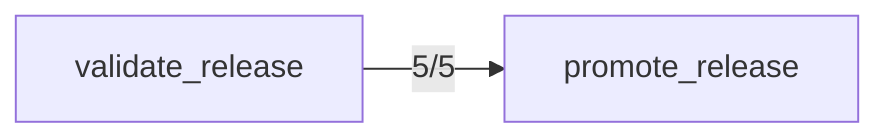

## Confusion Matrix

| Intended \ Called | acknowledge_alert | add_ticket_note | archive_doc | close_ticket | comment_on_ticket | create_doc | create_flag | create_incident_legacy | create_ticket | deactivate_user | delete_flag | deploy_release | get_config | get_deployment | get_doc | get_flags | get_oncall_schedule | get_secret_v1 | get_ticket | get_user | invite_user | list_alerts | list_deployments | list_environments | list_flags | list_shifts | list_teams | list_tickets | list_users | lookup_user | mute_alert | open_incident | override_oncall | page_oncall | promote_release | read_secret | redeploy_service | resolve_incident | restart_service | rollback_deployment | rotate_secret | search_docs | search_tickets | set_config | set_flag | snooze_alert | update_doc | update_ticket | validate_release | (no call) |
|---|---|---|---|---|---|---|---|---|---|---|---|---|---|---|---|---|---|---|---|---|---|---|---|---|---|---|---|---|---|---|---|---|---|---|---|---|---|---|---|---|---|---|---|---|---|---|---|---|---|---|
| acknowledge_alert | 5 | 0 | 0 | 0 | 0 | 0 | 0 | 0 | 0 | 0 | 0 | 0 | 0 | 0 | 0 | 0 | 0 | 0 | 0 | 0 | 0 | 0 | 0 | 0 | 0 | 0 | 0 | 0 | 0 | 0 | 0 | 0 | 0 | 0 | 0 | 0 | 0 | 0 | 0 | 0 | 0 | 0 | 0 | 0 | 0 | 0 | 0 | 0 | 0 | 0 |
| add_ticket_note | 0 | 5 | 0 | 0 | 0 | 0 | 0 | 0 | 0 | 0 | 0 | 0 | 0 | 0 | 0 | 0 | 0 | 0 | 0 | 0 | 0 | 0 | 0 | 0 | 0 | 0 | 0 | 0 | 0 | 0 | 0 | 0 | 0 | 0 | 0 | 0 | 0 | 0 | 0 | 0 | 0 | 0 | 0 | 0 | 0 | 0 | 0 | 0 | 0 | 0 |
| archive_doc | 0 | 0 | 5 | 0 | 0 | 0 | 0 | 0 | 0 | 0 | 0 | 0 | 0 | 0 | 0 | 0 | 0 | 0 | 0 | 0 | 0 | 0 | 0 | 0 | 0 | 0 | 0 | 0 | 0 | 0 | 0 | 0 | 0 | 0 | 0 | 0 | 0 | 0 | 0 | 0 | 0 | 0 | 0 | 0 | 0 | 0 | 0 | 0 | 0 | 0 |
| close_ticket | 0 | 0 | 0 | 3 | 0 | 0 | 0 | 0 | 0 | 0 | 0 | 0 | 0 | 0 | 0 | 0 | 0 | 0 | 1 | 0 | 0 | 0 | 0 | 0 | 0 | 0 | 0 | 0 | 0 | 0 | 0 | 0 | 0 | 0 | 0 | 0 | 0 | 0 | 0 | 0 | 0 | 0 | 0 | 0 | 0 | 0 | 0 | 0 | 0 | 1 |
| comment_on_ticket | 0 | 0 | 0 | 0 | 5 | 0 | 0 | 0 | 0 | 0 | 0 | 0 | 0 | 0 | 0 | 0 | 0 | 0 | 0 | 0 | 0 | 0 | 0 | 0 | 0 | 0 | 0 | 0 | 0 | 0 | 0 | 0 | 0 | 0 | 0 | 0 | 0 | 0 | 0 | 0 | 0 | 0 | 0 | 0 | 0 | 0 | 0 | 0 | 0 | 0 |
| create_doc | 0 | 0 | 0 | 0 | 0 | 5 | 0 | 0 | 0 | 0 | 0 | 0 | 0 | 0 | 0 | 0 | 0 | 0 | 0 | 0 | 0 | 0 | 0 | 0 | 0 | 0 | 0 | 0 | 0 | 0 | 0 | 0 | 0 | 0 | 0 | 0 | 0 | 0 | 0 | 0 | 0 | 0 | 0 | 0 | 0 | 0 | 0 | 0 | 0 | 0 |
| create_flag | 0 | 0 | 0 | 0 | 0 | 0 | 5 | 0 | 0 | 0 | 0 | 0 | 0 | 0 | 0 | 0 | 0 | 0 | 0 | 0 | 0 | 0 | 0 | 0 | 0 | 0 | 0 | 0 | 0 | 0 | 0 | 0 | 0 | 0 | 0 | 0 | 0 | 0 | 0 | 0 | 0 | 0 | 0 | 0 | 0 | 0 | 0 | 0 | 0 | 0 |
| create_incident_legacy | 0 | 0 | 0 | 0 | 0 | 0 | 0 | 0 | 0 | 0 | 0 | 0 | 0 | 0 | 0 | 0 | 0 | 0 | 0 | 0 | 0 | 0 | 0 | 0 | 0 | 0 | 0 | 0 | 0 | 0 | 0 | 3 | 0 | 0 | 0 | 0 | 0 | 0 | 0 | 0 | 0 | 0 | 0 | 0 | 0 | 0 | 0 | 0 | 0 | 2 |
| create_ticket | 0 | 0 | 0 | 0 | 0 | 0 | 0 | 0 | 5 | 0 | 0 | 0 | 0 | 0 | 0 | 0 | 0 | 0 | 0 | 0 | 0 | 0 | 0 | 0 | 0 | 0 | 0 | 0 | 0 | 0 | 0 | 0 | 0 | 0 | 0 | 0 | 0 | 0 | 0 | 0 | 0 | 0 | 0 | 0 | 0 | 0 | 0 | 0 | 0 | 0 |
| deactivate_user | 0 | 0 | 0 | 0 | 0 | 0 | 0 | 0 | 0 | 5 | 0 | 0 | 0 | 0 | 0 | 0 | 0 | 0 | 0 | 0 | 0 | 0 | 0 | 0 | 0 | 0 | 0 | 0 | 0 | 0 | 0 | 0 | 0 | 0 | 0 | 0 | 0 | 0 | 0 | 0 | 0 | 0 | 0 | 0 | 0 | 0 | 0 | 0 | 0 | 0 |
| delete_flag | 0 | 0 | 0 | 0 | 0 | 0 | 0 | 0 | 0 | 0 | 4 | 0 | 0 | 0 | 0 | 0 | 0 | 0 | 0 | 0 | 0 | 0 | 0 | 0 | 0 | 0 | 0 | 0 | 0 | 0 | 0 | 0 | 0 | 0 | 0 | 0 | 0 | 0 | 0 | 0 | 0 | 0 | 0 | 0 | 0 | 0 | 0 | 0 | 0 | 1 |
| deploy_release | 0 | 0 | 0 | 0 | 0 | 0 | 0 | 0 | 0 | 0 | 0 | 5 | 0 | 0 | 0 | 0 | 0 | 0 | 0 | 0 | 0 | 0 | 0 | 0 | 0 | 0 | 0 | 0 | 0 | 0 | 0 | 0 | 0 | 0 | 0 | 0 | 0 | 0 | 0 | 0 | 0 | 0 | 0 | 0 | 0 | 0 | 0 | 0 | 0 | 0 |
| get_config | 0 | 0 | 0 | 0 | 0 | 0 | 0 | 0 | 0 | 0 | 0 | 0 | 5 | 0 | 0 | 0 | 0 | 0 | 0 | 0 | 0 | 0 | 0 | 0 | 0 | 0 | 0 | 0 | 0 | 0 | 0 | 0 | 0 | 0 | 0 | 0 | 0 | 0 | 0 | 0 | 0 | 0 | 0 | 0 | 0 | 0 | 0 | 0 | 0 | 0 |
| get_deployment | 0 | 0 | 0 | 0 | 0 | 0 | 0 | 0 | 0 | 0 | 0 | 0 | 0 | 5 | 0 | 0 | 0 | 0 | 0 | 0 | 0 | 0 | 0 | 0 | 0 | 0 | 0 | 0 | 0 | 0 | 0 | 0 | 0 | 0 | 0 | 0 | 0 | 0 | 0 | 0 | 0 | 0 | 0 | 0 | 0 | 0 | 0 | 0 | 0 | 0 |
| get_doc | 0 | 0 | 0 | 0 | 0 | 0 | 0 | 0 | 0 | 0 | 0 | 0 | 0 | 0 | 5 | 0 | 0 | 0 | 0 | 0 | 0 | 0 | 0 | 0 | 0 | 0 | 0 | 0 | 0 | 0 | 0 | 0 | 0 | 0 | 0 | 0 | 0 | 0 | 0 | 0 | 0 | 0 | 0 | 0 | 0 | 0 | 0 | 0 | 0 | 0 |
| get_flags | 0 | 0 | 0 | 0 | 0 | 0 | 0 | 0 | 0 | 0 | 0 | 0 | 0 | 0 | 0 | 5 | 0 | 0 | 0 | 0 | 0 | 0 | 0 | 0 | 0 | 0 | 0 | 0 | 0 | 0 | 0 | 0 | 0 | 0 | 0 | 0 | 0 | 0 | 0 | 0 | 0 | 0 | 0 | 0 | 0 | 0 | 0 | 0 | 0 | 0 |
| get_oncall_schedule | 0 | 0 | 0 | 0 | 0 | 0 | 0 | 0 | 0 | 0 | 0 | 0 | 0 | 0 | 0 | 0 | 5 | 0 | 0 | 0 | 0 | 0 | 0 | 0 | 0 | 0 | 0 | 0 | 0 | 0 | 0 | 0 | 0 | 0 | 0 | 0 | 0 | 0 | 0 | 0 | 0 | 0 | 0 | 0 | 0 | 0 | 0 | 0 | 0 | 0 |
| get_secret_v1 | 0 | 0 | 0 | 0 | 0 | 0 | 0 | 0 | 0 | 0 | 0 | 0 | 0 | 0 | 0 | 0 | 0 | 0 | 0 | 0 | 0 | 0 | 0 | 0 | 0 | 0 | 0 | 0 | 0 | 0 | 0 | 0 | 0 | 0 | 0 | 0 | 0 | 0 | 0 | 0 | 0 | 0 | 0 | 0 | 0 | 0 | 0 | 0 | 0 | 5 |
| get_ticket | 0 | 0 | 0 | 0 | 0 | 0 | 0 | 0 | 0 | 0 | 0 | 0 | 0 | 0 | 0 | 0 | 0 | 0 | 5 | 0 | 0 | 0 | 0 | 0 | 0 | 0 | 0 | 0 | 0 | 0 | 0 | 0 | 0 | 0 | 0 | 0 | 0 | 0 | 0 | 0 | 0 | 0 | 0 | 0 | 0 | 0 | 0 | 0 | 0 | 0 |
| get_user | 0 | 0 | 0 | 0 | 0 | 0 | 0 | 0 | 0 | 0 | 0 | 0 | 0 | 0 | 0 | 0 | 0 | 0 | 0 | 5 | 0 | 0 | 0 | 0 | 0 | 0 | 0 | 0 | 0 | 0 | 0 | 0 | 0 | 0 | 0 | 0 | 0 | 0 | 0 | 0 | 0 | 0 | 0 | 0 | 0 | 0 | 0 | 0 | 0 | 0 |
| invite_user | 0 | 0 | 0 | 0 | 0 | 0 | 0 | 0 | 0 | 0 | 0 | 0 | 0 | 0 | 0 | 0 | 0 | 0 | 0 | 0 | 4 | 0 | 0 | 0 | 0 | 0 | 0 | 0 | 0 | 0 | 0 | 0 | 0 | 0 | 0 | 0 | 0 | 0 | 0 | 0 | 0 | 0 | 0 | 0 | 0 | 0 | 0 | 0 | 0 | 1 |
| list_alerts | 0 | 0 | 0 | 0 | 0 | 0 | 0 | 0 | 0 | 0 | 0 | 0 | 0 | 0 | 0 | 0 | 0 | 0 | 0 | 0 | 0 | 5 | 0 | 0 | 0 | 0 | 0 | 0 | 0 | 0 | 0 | 0 | 0 | 0 | 0 | 0 | 0 | 0 | 0 | 0 | 0 | 0 | 0 | 0 | 0 | 0 | 0 | 0 | 0 | 0 |
| list_deployments | 0 | 0 | 0 | 0 | 0 | 0 | 0 | 0 | 0 | 0 | 0 | 0 | 0 | 0 | 0 | 0 | 0 | 0 | 0 | 0 | 0 | 0 | 5 | 0 | 0 | 0 | 0 | 0 | 0 | 0 | 0 | 0 | 0 | 0 | 0 | 0 | 0 | 0 | 0 | 0 | 0 | 0 | 0 | 0 | 0 | 0 | 0 | 0 | 0 | 0 |
| list_environments | 0 | 0 | 0 | 0 | 0 | 0 | 0 | 0 | 0 | 0 | 0 | 0 | 0 | 0 | 0 | 0 | 0 | 0 | 0 | 0 | 0 | 0 | 0 | 5 | 0 | 0 | 0 | 0 | 0 | 0 | 0 | 0 | 0 | 0 | 0 | 0 | 0 | 0 | 0 | 0 | 0 | 0 | 0 | 0 | 0 | 0 | 0 | 0 | 0 | 0 |
| list_flags | 0 | 0 | 0 | 0 | 0 | 0 | 0 | 0 | 0 | 0 | 0 | 0 | 0 | 0 | 0 | 0 | 0 | 0 | 0 | 0 | 0 | 0 | 0 | 0 | 5 | 0 | 0 | 0 | 0 | 0 | 0 | 0 | 0 | 0 | 0 | 0 | 0 | 0 | 0 | 0 | 0 | 0 | 0 | 0 | 0 | 0 | 0 | 0 | 0 | 0 |
| list_shifts | 0 | 0 | 0 | 0 | 0 | 0 | 0 | 0 | 0 | 0 | 0 | 0 | 0 | 0 | 0 | 0 | 0 | 0 | 0 | 0 | 0 | 0 | 0 | 0 | 0 | 5 | 0 | 0 | 0 | 0 | 0 | 0 | 0 | 0 | 0 | 0 | 0 | 0 | 0 | 0 | 0 | 0 | 0 | 0 | 0 | 0 | 0 | 0 | 0 | 0 |
| list_teams | 0 | 0 | 0 | 0 | 0 | 0 | 0 | 0 | 0 | 0 | 0 | 0 | 0 | 0 | 0 | 0 | 0 | 0 | 0 | 0 | 0 | 0 | 0 | 0 | 0 | 0 | 5 | 0 | 0 | 0 | 0 | 0 | 0 | 0 | 0 | 0 | 0 | 0 | 0 | 0 | 0 | 0 | 0 | 0 | 0 | 0 | 0 | 0 | 0 | 0 |
| list_tickets | 0 | 0 | 0 | 0 | 0 | 0 | 0 | 0 | 0 | 0 | 0 | 0 | 0 | 0 | 0 | 0 | 0 | 0 | 0 | 0 | 0 | 0 | 0 | 0 | 0 | 0 | 0 | 2 | 0 | 0 | 0 | 0 | 0 | 0 | 0 | 0 | 0 | 0 | 0 | 0 | 0 | 0 | 0 | 0 | 0 | 0 | 0 | 0 | 0 | 3 |
| list_users | 0 | 0 | 0 | 0 | 0 | 0 | 0 | 0 | 0 | 0 | 0 | 0 | 0 | 0 | 0 | 0 | 0 | 0 | 0 | 0 | 0 | 0 | 0 | 0 | 0 | 0 | 0 | 0 | 5 | 0 | 0 | 0 | 0 | 0 | 0 | 0 | 0 | 0 | 0 | 0 | 0 | 0 | 0 | 0 | 0 | 0 | 0 | 0 | 0 | 0 |
| lookup_user | 0 | 0 | 0 | 0 | 0 | 0 | 0 | 0 | 0 | 0 | 0 | 0 | 0 | 0 | 0 | 0 | 0 | 0 | 0 | 0 | 0 | 0 | 0 | 0 | 0 | 0 | 0 | 0 | 1 | 4 | 0 | 0 | 0 | 0 | 0 | 0 | 0 | 0 | 0 | 0 | 0 | 0 | 0 | 0 | 0 | 0 | 0 | 0 | 0 | 0 |
| mute_alert | 0 | 0 | 0 | 0 | 0 | 0 | 0 | 0 | 0 | 0 | 0 | 0 | 0 | 0 | 0 | 0 | 0 | 0 | 0 | 0 | 0 | 0 | 0 | 0 | 0 | 0 | 0 | 0 | 0 | 0 | 5 | 0 | 0 | 0 | 0 | 0 | 0 | 0 | 0 | 0 | 0 | 0 | 0 | 0 | 0 | 0 | 0 | 0 | 0 | 0 |
| open_incident | 0 | 0 | 0 | 0 | 0 | 0 | 0 | 0 | 0 | 0 | 0 | 0 | 0 | 0 | 0 | 0 | 0 | 0 | 0 | 0 | 0 | 0 | 0 | 0 | 0 | 0 | 0 | 0 | 0 | 0 | 0 | 3 | 0 | 0 | 0 | 0 | 0 | 0 | 0 | 0 | 0 | 0 | 0 | 0 | 0 | 0 | 0 | 0 | 0 | 2 |
| override_oncall | 0 | 0 | 0 | 0 | 0 | 0 | 0 | 0 | 0 | 0 | 0 | 0 | 0 | 0 | 0 | 0 | 0 | 0 | 0 | 0 | 0 | 0 | 0 | 0 | 0 | 0 | 0 | 0 | 0 | 0 | 0 | 0 | 5 | 0 | 0 | 0 | 0 | 0 | 0 | 0 | 0 | 0 | 0 | 0 | 0 | 0 | 0 | 0 | 0 | 0 |
| page_oncall | 0 | 0 | 0 | 0 | 0 | 0 | 0 | 0 | 0 | 0 | 0 | 0 | 0 | 0 | 0 | 0 | 0 | 0 | 0 | 0 | 0 | 0 | 0 | 0 | 0 | 0 | 0 | 0 | 0 | 0 | 0 | 0 | 0 | 5 | 0 | 0 | 0 | 0 | 0 | 0 | 0 | 0 | 0 | 0 | 0 | 0 | 0 | 0 | 0 | 0 |
| promote_release | 0 | 0 | 0 | 0 | 0 | 0 | 0 | 0 | 0 | 0 | 0 | 0 | 0 | 0 | 0 | 0 | 0 | 0 | 0 | 0 | 0 | 0 | 0 | 0 | 0 | 0 | 0 | 0 | 0 | 0 | 0 | 0 | 0 | 0 | 0 | 0 | 0 | 0 | 0 | 0 | 0 | 0 | 0 | 0 | 0 | 0 | 0 | 0 | 5 | 0 |
| read_secret | 0 | 0 | 0 | 0 | 0 | 0 | 0 | 0 | 0 | 0 | 0 | 0 | 0 | 0 | 0 | 0 | 0 | 0 | 0 | 0 | 0 | 0 | 0 | 0 | 0 | 0 | 0 | 0 | 0 | 0 | 0 | 0 | 0 | 0 | 0 | 5 | 0 | 0 | 0 | 0 | 0 | 0 | 0 | 0 | 0 | 0 | 0 | 0 | 0 | 0 |
| redeploy_service | 0 | 0 | 0 | 0 | 0 | 0 | 0 | 0 | 0 | 0 | 0 | 0 | 0 | 0 | 0 | 0 | 0 | 0 | 0 | 0 | 0 | 0 | 0 | 0 | 0 | 0 | 0 | 0 | 0 | 0 | 0 | 0 | 0 | 0 | 0 | 0 | 5 | 0 | 0 | 0 | 0 | 0 | 0 | 0 | 0 | 0 | 0 | 0 | 0 | 0 |
| resolve_incident | 0 | 0 | 0 | 0 | 0 | 0 | 0 | 0 | 0 | 0 | 0 | 0 | 0 | 0 | 0 | 0 | 0 | 0 | 0 | 0 | 0 | 0 | 0 | 0 | 0 | 0 | 0 | 0 | 0 | 0 | 0 | 0 | 0 | 0 | 0 | 0 | 0 | 5 | 0 | 0 | 0 | 0 | 0 | 0 | 0 | 0 | 0 | 0 | 0 | 0 |
| restart_service | 0 | 0 | 0 | 0 | 0 | 0 | 0 | 0 | 0 | 0 | 0 | 0 | 0 | 0 | 0 | 0 | 0 | 0 | 0 | 0 | 0 | 0 | 0 | 0 | 0 | 0 | 0 | 0 | 0 | 0 | 0 | 0 | 0 | 0 | 0 | 0 | 0 | 0 | 5 | 0 | 0 | 0 | 0 | 0 | 0 | 0 | 0 | 0 | 0 | 0 |
| rollback_deployment | 0 | 0 | 0 | 0 | 0 | 0 | 0 | 0 | 0 | 0 | 0 | 0 | 0 | 0 | 0 | 0 | 0 | 0 | 0 | 0 | 0 | 0 | 0 | 0 | 0 | 0 | 0 | 0 | 0 | 0 | 0 | 0 | 0 | 0 | 0 | 0 | 0 | 0 | 0 | 5 | 0 | 0 | 0 | 0 | 0 | 0 | 0 | 0 | 0 | 0 |
| rotate_secret | 0 | 0 | 0 | 0 | 0 | 0 | 0 | 0 | 0 | 0 | 0 | 0 | 0 | 0 | 0 | 0 | 0 | 0 | 0 | 0 | 0 | 0 | 0 | 0 | 0 | 0 | 0 | 0 | 0 | 0 | 0 | 0 | 0 | 0 | 0 | 0 | 0 | 0 | 0 | 0 | 5 | 0 | 0 | 0 | 0 | 0 | 0 | 0 | 0 | 0 |
| search_docs | 0 | 0 | 0 | 0 | 0 | 0 | 0 | 0 | 0 | 0 | 0 | 0 | 0 | 0 | 0 | 0 | 0 | 0 | 0 | 0 | 0 | 0 | 0 | 0 | 0 | 0 | 0 | 0 | 0 | 0 | 0 | 0 | 0 | 0 | 0 | 0 | 0 | 0 | 0 | 0 | 0 | 5 | 0 | 0 | 0 | 0 | 0 | 0 | 0 | 0 |
| search_tickets | 0 | 0 | 0 | 0 | 0 | 0 | 0 | 0 | 0 | 0 | 0 | 0 | 0 | 0 | 0 | 0 | 0 | 0 | 0 | 0 | 0 | 0 | 0 | 0 | 0 | 0 | 0 | 0 | 0 | 0 | 0 | 0 | 0 | 0 | 0 | 0 | 0 | 0 | 0 | 0 | 0 | 0 | 4 | 0 | 0 | 0 | 0 | 0 | 0 | 1 |
| set_config | 0 | 0 | 0 | 0 | 0 | 0 | 0 | 0 | 0 | 0 | 0 | 0 | 0 | 0 | 0 | 0 | 0 | 0 | 0 | 0 | 0 | 0 | 0 | 0 | 0 | 0 | 0 | 0 | 0 | 0 | 0 | 0 | 0 | 0 | 0 | 0 | 0 | 0 | 0 | 0 | 0 | 0 | 0 | 4 | 0 | 0 | 0 | 0 | 0 | 1 |
| set_flag | 0 | 0 | 0 | 0 | 0 | 0 | 0 | 0 | 0 | 0 | 0 | 0 | 0 | 0 | 0 | 0 | 0 | 0 | 0 | 0 | 0 | 0 | 0 | 0 | 0 | 0 | 0 | 0 | 0 | 0 | 0 | 0 | 0 | 0 | 0 | 0 | 0 | 0 | 0 | 0 | 0 | 0 | 0 | 0 | 5 | 0 | 0 | 0 | 0 | 0 |
| snooze_alert | 0 | 0 | 0 | 0 | 0 | 0 | 0 | 0 | 0 | 0 | 0 | 0 | 0 | 0 | 0 | 0 | 0 | 0 | 0 | 0 | 0 | 0 | 0 | 0 | 0 | 0 | 0 | 0 | 0 | 0 | 0 | 0 | 0 | 0 | 0 | 0 | 0 | 0 | 0 | 0 | 0 | 0 | 0 | 0 | 0 | 1 | 0 | 0 | 0 | 4 |
| update_doc | 0 | 0 | 0 | 0 | 0 | 0 | 0 | 0 | 0 | 0 | 0 | 0 | 0 | 0 | 0 | 0 | 0 | 0 | 0 | 0 | 0 | 0 | 0 | 0 | 0 | 0 | 0 | 0 | 0 | 0 | 0 | 0 | 0 | 0 | 0 | 0 | 0 | 0 | 0 | 0 | 0 | 0 | 0 | 0 | 0 | 0 | 5 | 0 | 0 | 0 |
| update_ticket | 0 | 0 | 0 | 0 | 0 | 0 | 0 | 0 | 0 | 0 | 0 | 0 | 0 | 0 | 0 | 0 | 0 | 0 | 1 | 0 | 0 | 0 | 0 | 0 | 0 | 0 | 0 | 0 | 0 | 0 | 0 | 0 | 0 | 0 | 0 | 0 | 0 | 0 | 0 | 0 | 0 | 0 | 0 | 0 | 0 | 0 | 0 | 3 | 0 | 1 |
| validate_release | 0 | 0 | 0 | 0 | 0 | 0 | 0 | 0 | 0 | 0 | 0 | 0 | 0 | 0 | 0 | 0 | 0 | 0 | 0 | 0 | 0 | 0 | 0 | 0 | 0 | 0 | 0 | 0 | 0 | 0 | 0 | 0 | 0 | 0 | 0 | 0 | 0 | 0 | 0 | 0 | 0 | 0 | 0 | 0 | 0 | 0 | 0 | 0 | 5 | 0 |

## Trial Diversity
- acknowledge_alert: 5/5 distinct
- add_ticket_note: 5/5 distinct
- archive_doc: 5/5 distinct
- close_ticket: 5/5 distinct
- comment_on_ticket: 5/5 distinct
- create_doc: 5/5 distinct
- create_flag: 5/5 distinct
- create_incident_legacy: 4/5 distinct (some seeds sampled identical arguments)
- create_ticket: 5/5 distinct
- deactivate_user: 5/5 distinct
- delete_flag: 5/5 distinct
- deploy_release: 5/5 distinct
- get_config: 5/5 distinct
- get_deployment: 5/5 distinct
- get_doc: 5/5 distinct
- get_flags: 5/5 distinct
- get_oncall_schedule: 5/5 distinct
- get_secret_v1: 5/5 distinct
- get_ticket: 5/5 distinct
- get_user: 5/5 distinct
- invite_user: 5/5 distinct
- list_alerts: 5/5 distinct
- list_deployments: 5/5 distinct
- list_environments: 5/5 distinct
- list_flags: 5/5 distinct
- list_shifts: 5/5 distinct
- list_teams: 2/5 distinct (some seeds sampled identical arguments)
- list_tickets: 5/5 distinct
- list_users: 5/5 distinct
- lookup_user: 5/5 distinct
- mute_alert: 5/5 distinct
- open_incident: 5/5 distinct
- override_oncall: 5/5 distinct
- page_oncall: 5/5 distinct
- promote_release: 5/5 distinct
- read_secret: 5/5 distinct
- redeploy_service: 5/5 distinct
- resolve_incident: 5/5 distinct
- restart_service: 5/5 distinct
- rollback_deployment: 5/5 distinct
- rotate_secret: 5/5 distinct
- search_docs: 5/5 distinct
- search_tickets: 5/5 distinct
- set_config: 5/5 distinct
- set_flag: 5/5 distinct
- snooze_alert: 5/5 distinct
- update_doc: 5/5 distinct
- update_ticket: 5/5 distinct
- validate_release: 5/5 distinct

## Pass Rates
- acknowledge_alert: 5/5 (100%), 95% CI [57%, 100%]
- add_ticket_note: 5/5 (100%), 95% CI [57%, 100%]
- archive_doc: 5/5 (100%), 95% CI [57%, 100%]
- close_ticket: 3/5 (60%), 95% CI [23%, 88%]
- comment_on_ticket: 5/5 (100%), 95% CI [57%, 100%]
- create_doc: 5/5 (100%), 95% CI [57%, 100%]
- create_flag: 2/5 (40%), 95% CI [12%, 77%]
- create_incident_legacy: 0/5 (0%), 95% CI [0%, 43%]
- create_ticket: 5/5 (100%), 95% CI [57%, 100%]
- deactivate_user: 5/5 (100%), 95% CI [57%, 100%]
- delete_flag: 4/5 (80%), 95% CI [38%, 96%]
- deploy_release: 5/5 (100%), 95% CI [57%, 100%]
- get_config: 5/5 (100%), 95% CI [57%, 100%]
- get_deployment: 5/5 (100%), 95% CI [57%, 100%]
- get_doc: 5/5 (100%), 95% CI [57%, 100%]
- get_flags: 5/5 (100%), 95% CI [57%, 100%]
- get_oncall_schedule: 5/5 (100%), 95% CI [57%, 100%]
- get_secret_v1: 0/5 (0%), 95% CI [0%, 43%]
- get_ticket: 5/5 (100%), 95% CI [57%, 100%]
- get_user: 5/5 (100%), 95% CI [57%, 100%]
- invite_user: 4/5 (80%), 95% CI [38%, 96%]
- list_alerts: 4/5 (80%), 95% CI [38%, 96%]
- list_deployments: 5/5 (100%), 95% CI [57%, 100%]
- list_environments: 5/5 (100%), 95% CI [57%, 100%]
- list_flags: 5/5 (100%), 95% CI [57%, 100%]
- list_shifts: 5/5 (100%), 95% CI [57%, 100%]
- list_teams: 3/5 (60%), 95% CI [23%, 88%]
- list_tickets: 2/5 (40%), 95% CI [12%, 77%]
- list_users: 3/5 (60%), 95% CI [23%, 88%]
- lookup_user: 4/5 (80%), 95% CI [38%, 96%]
- mute_alert: 5/5 (100%), 95% CI [57%, 100%]
- open_incident: 3/5 (60%), 95% CI [23%, 88%]
- override_oncall: 5/5 (100%), 95% CI [57%, 100%]
- page_oncall: 5/5 (100%), 95% CI [57%, 100%]
- promote_release: 5/5 (100%), 95% CI [57%, 100%]
- read_secret: 5/5 (100%), 95% CI [57%, 100%]
- redeploy_service: 5/5 (100%), 95% CI [57%, 100%]
- resolve_incident: 3/5 (60%), 95% CI [23%, 88%]
- restart_service: 5/5 (100%), 95% CI [57%, 100%]
- rollback_deployment: 5/5 (100%), 95% CI [57%, 100%]
- rotate_secret: 5/5 (100%), 95% CI [57%, 100%]
- search_docs: 5/5 (100%), 95% CI [57%, 100%]
- search_tickets: 4/5 (80%), 95% CI [38%, 96%]
- set_config: 4/5 (80%), 95% CI [38%, 96%]
- set_flag: 5/5 (100%), 95% CI [57%, 100%]
- snooze_alert: 1/5 (20%), 95% CI [4%, 62%]
- update_doc: 5/5 (100%), 95% CI [57%, 100%]
- update_ticket: 3/5 (60%), 95% CI [23%, 88%]
- validate_release: 5/5 (100%), 95% CI [57%, 100%]

## Preconditions (observed)

Tools the model called *before* correctly calling the intended one, per trial:

- validate_release → promote_release: 5/5 trials

## Solvability Warnings
- get_user (seed 1, passed anyway): unparseable response, treated as ambiguous: **AMBIGUOUS** — both `get_user` and `lookup_user` are described identically ("Return user record"), so it's unclear which tool should be used to fetch the user's details.
- get_user (seed 2, passed anyway): 
- get_user (seed 3, passed anyway): unparseable response, treated as ambiguous: This request is **SOLVABLE** — it directly maps to fetching a single user record by ID.
- get_user (seed 4, passed anyway): 
- get_user (seed 5, passed anyway): 
- lookup_user (seed 2, passed anyway): unparseable response, treated as ambiguous: This request is **AMBIGUOUS** — two tools (`get_user` and `lookup_user`) both claim to "return user record," so it's unclear which one should be used to pull up user979@example.com.
- lookup_user (seed 3, failed): 
- lookup_user (seed 4, passed anyway): 
- lookup_user (seed 5, passed anyway): unparseable response, treated as ambiguous: **AMBIGUOUS** — both `get_user` and `lookup_user` are described identically as returning a user record, so it's unclear which tool should be used to pull up the account.
- list_users (seed 3, failed): unparseable response, treated as ambiguous: **AMBIGUOUS** — the request asks for the "next page" of `list_users` results but provides no pagination cursor/token from a prior call, so it's impossible to determine which page to retrieve.
- invite_user (seed 2, failed): unparseable response, treated as ambiguous: **SOLVABLE** — The `invite_user` tool directly supports sending an invitation email to a new user (e.g., user979@example.com) with pre-assigned role/team, which matches this request exactly.
- invite_user (seed 5, passed anyway): unparseable response, treated as ambiguous: **SOLVABLE** — use `invite_user` with email "user638@example.com" and role "engineer" (teams optional/unspecified).
- list_teams (seed 2, failed): 
- list_teams (seed 5, failed): 
- update_ticket (seed 5, failed): unparseable response, treated as ambiguous: This request is **SOLVABLE**.

It requires updating a ticket's title to an empty value, which directly maps to the `update_ticket` tool — call `update_ticket` with ticket_id "sample-ticket_id-638" and title set to an empty string.
- get_ticket (seed 1, passed anyway): unparseable response, treated as ambiguous: **SOLVABLE** — The `get_ticket` tool directly supports this request, as it explicitly returns "one ticket by id, including comments status history," matching the request to pull up comment and status history for ticket `sample-ticket_id-138`.
- get_ticket (seed 2, passed anyway): unparseable response, treated as ambiguous: **SOLVABLE** — The `get_ticket` tool directly supports this request, as it "fetches one ticket by id, including comments [and] status history," which is exactly what's being asked for ticket `sample-ticket_id-979`.
- get_ticket (seed 3, passed anyway): unparseable response, treated as ambiguous: **SOLVABLE** — the `get_ticket` tool fetches a ticket by ID and explicitly includes its comments and status history, which directly satisfies this request for ticket `sample-ticket_id-244`.
- list_tickets (seed 4, passed anyway): unparseable response, treated as ambiguous: **AMBIGUOUS** — the request doesn't specify which pagination parameters to use (e.g., page size vs. total count of 206), and `list_tickets` is paginated, so it's unclear how to retrieve exactly "first 206" across likely smaller page-size limits without knowing the tool's max page size or whether multiple calls should be chained.
- search_tickets (seed 2, passed anyway): unparseable response, treated as ambiguous: This request is **SOLVABLE**: the `search_tickets` tool directly supports finding tickets matching a query string like "sample-query-979".
- comment_on_ticket (seed 3, passed anyway): unparseable response, treated as ambiguous: **SOLVABLE**: The request clearly maps to the `comment_on_ticket` tool, which posts a comment visible to everyone on the specified ticket ("sample-ticket_id-244") with the given text ("sample-body-607"), satisfying the "everyone access to see it" requirement.
- comment_on_ticket (seed 4, passed anyway): The `comment_on_ticket` tool only lets us post a public comment visible to everyone, but it has no parameter to suppress notifications to the assignee, so the "don't notify assignee" requirement can't be reliably fulfilled.
- close_ticket (seed 1, passed anyway): unparseable response, treated as ambiguous: **SOLVABLE** — the `close_ticket` tool directly supports closing a ticket by ID with a specified resolution (e.g., "fixed").
- close_ticket (seed 4, failed): The close_ticket tool requires an original ticket id when the resolution is "duplicate," but the request doesn't specify which original ticket sample-ticket_id-242 is a duplicate of.
- close_ticket (seed 5, failed): unparseable response, treated as ambiguous: **AMBIGUOUS** — the request says to close ticket 638 as a duplicate but never specifies the original ticket ID that `close_ticket` requires to record.
- list_deployments (seed 2, passed anyway): unparseable response, treated as ambiguous: **SOLVABLE**: The request directly maps to the `list_deployments` tool, which lists deployment IDs for a given environment ID in newest-to-oldest order by default.
- get_deployment (seed 1, passed anyway): unparseable response, treated as ambiguous: **SOLVABLE** — the request directly maps to calling `get_deployment` with the deployment ID "sample-deployment_id-138" to retrieve its status and commit timing information.
- get_deployment (seed 2, passed anyway): 
- get_deployment (seed 3, passed anyway): 
- get_deployment (seed 4, passed anyway): unparseable response, treated as ambiguous: This request is **SOLVABLE**.

The `get_deployment` tool directly matches this need — it "Fetch status, commit timing one deployment," and the user has provided a specific deployment ID (`sample-deployment_id-242`) to check.
- get_deployment (seed 5, passed anyway): 
- deploy_release (seed 2, passed anyway): unparseable response, treated as ambiguous: **SOLVABLE** — the request directly maps to the `deploy_release` tool, which deploys a specified release to a specified environment given exactly the two identifiers provided (release ID and environment ID).
- deploy_release (seed 3, passed anyway): There is no tool available to determine whether a maintenance window applies to the target environment, so it cannot be verified before calling deploy_release.
- deploy_release (seed 5, passed anyway): unparseable response, treated as ambiguous: **SOLVABLE** — the request directly maps to the `deploy_release` tool with explicit, unambiguous parameters (release ID and environment ID both provided).
- rollback_deployment (seed 1, passed anyway): 
- rollback_deployment (seed 3, passed anyway): 
- rollback_deployment (seed 4, passed anyway): unparseable response, treated as ambiguous: **AMBIGUOUS** — the request doesn't specify which environment (e.g., staging, production) the deployment ID belongs to, which is required to call `rollback_deployment`.
- promote_release (seed 4, passed anyway): unparseable response, treated as ambiguous: **SOLVABLE** — the request maps directly to two available tools: `validate_release` (to validate `sample-release_id-242`) followed by `promote_release` (to promote it to the `production` environment).
- list_alerts (seed 1, passed anyway): unparseable response, treated as ambiguous: UNSOLVABLE: There is no tool available to list or query alerts (only mute_alert/snooze_alert act on an already-known alert), so there's no way to retrieve IDs of currently firing warning-severity alerts across services.
- list_alerts (seed 2, passed anyway): There is no tool available to list, query, or filter currently firing alerts (only alert-related actions like mute/snooze exist), so the request cannot be fulfilled or clarified toward a solvable path with the given toolset.
- list_alerts (seed 3, failed): 
- list_alerts (seed 4, passed anyway): unparseable response, treated as ambiguous: **AMBIGUOUS** — there is no tool available to query/list alerts (e.g., by service or severity); only alert-management actions (silence, snooze, page) exist, none of which retrieve alert listings or IDs.
- list_alerts (seed 5, passed anyway): 
- acknowledge_alert (seed 1, passed anyway): 
- acknowledge_alert (seed 3, passed anyway): unparseable response, treated as ambiguous: **AMBIGUOUS** — there is no `acknowledge_alert` (or similar) tool in the list; the closest match, `snooze_alert`, only delays the next notification rather than actually acknowledging the alert, so the request's specific intent can't be mapped to an available action with confidence.
- acknowledge_alert (seed 5, passed anyway): there is no dedicated "acknowledge" action—only mute_alert (needs an until-time) or snooze_alert (needs a minute count)—and the user didn't specify how long the alert should stop paging, so it's unclear which tool/duration to use.
- snooze_alert (seed 2, failed): The request to "push its next alert back by few minutes" doesn't specify an exact number of minutes required by the snooze_alert tool's parameters.
- snooze_alert (seed 4, failed): unparseable response, treated as ambiguous: **SOLVABLE** — the request directly maps to the `snooze_alert` tool, which delays an alert's next notification by a specified number of minutes, using the provided `alert_id` ("sample-alert_id-242") and duration (812 minutes) as parameters.
- open_incident (seed 1, passed anyway): unparseable response, treated as ambiguous: **SOLVABLE** — the request directly maps to the `open_incident` tool, providing both the required title ("Write Q3 report") and severity (sev3), with no missing or conflicting information needed to invoke it.
- open_incident (seed 2, failed): 
- open_incident (seed 3, passed anyway): 
- open_incident (seed 5, failed): unparseable response, treated as ambiguous: **SOLVABLE** — the request can be fulfilled directly via the `open_incident` tool by declaring an incident titled "Book dentist appointment" with severity sev2.
- create_incident_legacy (seed 1, failed): unparseable response, treated as ambiguous: **SOLVABLE** — the request supplies both required parameters (title "Write Q3 report" and severity sev3) needed to call `open_incident`, with commander/alert links being optional.
- create_incident_legacy (seed 3, failed): unparseable response, treated as ambiguous: **SOLVABLE** — the request supplies both required parameters (title "Write Q3 report" and severity sev3) needed to call `open_incident`, with commander/alert links being optional.
- create_incident_legacy (seed 4, failed): unparseable response, treated as ambiguous: **AMBIGUOUS** — "Write Q3 report" is not an actionable incident-worthy issue (no affected service/system indicated), and `open_incident` also requires unclear optional details like commander/alert links that would need clarification to fit incident semantics properly.
- create_incident_legacy (seed 5, failed): unparseable response, treated as ambiguous: **SOLVABLE** — `open_incident` (or the deprecated `create_incident_legacy`) directly supports creating an incident with a specified title and severity, with no other required parameters needed for this request.
- resolve_incident (seed 3, failed): unparseable response, treated as ambiguous: **SOLVABLE** — the request directly maps to the `resolve_incident` tool, providing the incident ID (`sample-incident_id-244`) and summary (`sample-summary-607`) needed to mark it resolved.
- get_oncall_schedule (seed 1, passed anyway): unparseable response, treated as ambiguous: **SOLVABLE**: The request clearly specifies a team ID and asks for the on-call schedule with current and next responder—this maps directly to the `get_oncall_schedule` tool's stated functionality.
- override_oncall (seed 3, passed anyway): The requested override window ends (2026-03-08T12:00:00) before it begins (2026-10-06T12:00:00), so the intended start/end times are unclear.
- override_oncall (seed 4, passed anyway): unparseable response, treated as ambiguous: **SOLVABLE**: The request provides all parameters needed (schedule ID, user ID, start/end times, timezone) to directly call the `override_oncall` tool.
- list_shifts (seed 2, passed anyway): unparseable response, treated as ambiguous: **SOLVABLE** — Use `list_shifts` with schedule ID `sample-schedule_id-979` to return the upcoming on-call shifts for that schedule.
- list_shifts (seed 3, passed anyway): unparseable response, treated as ambiguous: **SOLVABLE** — This request maps directly to the `list_shifts` tool, which lists upcoming on-call shifts for a given schedule ID (here, `sample-schedule_id-244`).
- update_doc (seed 3, passed anyway): unparseable response, treated as ambiguous: **SOLVABLE** — The request maps directly to the `update_doc` tool, which replaces a wiki page's content given its ID (and the new content is provided), so no missing information prevents execution.
- list_flags (seed 1, passed anyway): unparseable response, treated as ambiguous: **SOLVABLE** — The request maps directly to the `list_flags` (or `get_flags`) tool, which lists all feature flags for a specified project ID.
- list_flags (seed 2, passed anyway): 
- get_flags (seed 3, passed anyway): 
- set_flag (seed 4, passed anyway): The request contradictorily asks to both turn the flag off and set an 11% user rollout, which are mutually exclusive states for a feature flag.
- delete_flag (seed 2, failed): No tool exists to delete an environment secret/key (only delete_flag for feature flags is available), so this request cannot be mapped to any of the listed capabilities.
- delete_flag (seed 4, passed anyway): The request specifically asks to delete the flag for a single environment key, but the only available tool, `delete_flag`, permanently removes the feature flag across *all* environments in the project — there's no environment-scoped deletion option, so I can't confirm this action matches what's actually available without clarifying with the user first.
- get_secret_v1 (seed 2, failed): unparseable response, treated as ambiguous: **SOLVABLE** — `read_secret` can retrieve the value for the specified secret name ("sample-name-884") and service ("sample-service_id-979"), logging the required justification in the audit trail.
- get_secret_v1 (seed 4, failed): unparseable response, treated as ambiguous: This request is **SOLVABLE**, one sentence reason: the `read_secret` tool directly supports retrieving a secret's value for a given service, which matches the request to get the value of secret "sample-name-311" for service "sample-service_id-242".
- rotate_secret (seed 1, passed anyway): unparseable response, treated as ambiguous: 
- rotate_secret (seed 5, passed anyway): The toolset has no way to determine which services depend on "sample-name-760" for redeployment or to identify the secret's "owner" for notification, so the redeploy and notify steps can't be reliably executed.

## Metadata
- Model under test: claude-sonnet-5
- Generator model: claude-sonnet-5
- Seeds per tool: 5
- Max steps per task: 3
