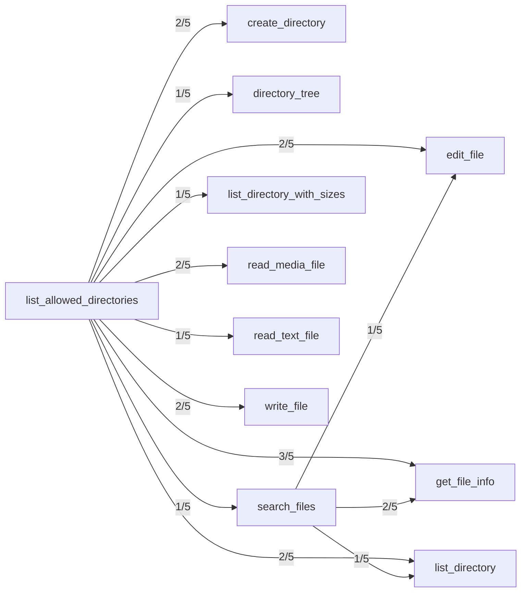

## Confusion Matrix

| Intended \ Called | create_directory | directory_tree | edit_file | get_file_info | list_allowed_directories | list_directory | list_directory_with_sizes | move_file | read_file | read_media_file | read_multiple_files | read_text_file | search_files | write_file |
|---|---|---|---|---|---|---|---|---|---|---|---|---|---|---|
| create_directory | 3 | 0 | 0 | 0 | 2 | 0 | 0 | 0 | 0 | 0 | 0 | 0 | 0 | 0 |
| directory_tree | 0 | 4 | 0 | 0 | 1 | 0 | 0 | 0 | 0 | 0 | 0 | 0 | 0 | 0 |
| edit_file | 0 | 0 | 3 | 0 | 2 | 0 | 0 | 0 | 0 | 0 | 0 | 0 | 0 | 0 |
| get_file_info | 0 | 0 | 0 | 2 | 3 | 0 | 0 | 0 | 0 | 0 | 0 | 0 | 0 | 0 |
| list_allowed_directories | 0 | 0 | 0 | 0 | 5 | 0 | 0 | 0 | 0 | 0 | 0 | 0 | 0 | 0 |
| list_directory | 0 | 0 | 0 | 0 | 3 | 1 | 1 | 0 | 0 | 0 | 0 | 0 | 0 | 0 |
| list_directory_with_sizes | 0 | 0 | 0 | 0 | 1 | 0 | 4 | 0 | 0 | 0 | 0 | 0 | 0 | 0 |
| move_file | 0 | 0 | 0 | 0 | 0 | 0 | 0 | 5 | 0 | 0 | 0 | 0 | 0 | 0 |
| read_file | 0 | 0 | 0 | 0 | 1 | 0 | 0 | 0 | 0 | 0 | 0 | 3 | 1 | 0 |
| read_media_file | 0 | 0 | 0 | 0 | 2 | 0 | 0 | 0 | 0 | 3 | 0 | 0 | 0 | 0 |
| read_multiple_files | 0 | 0 | 0 | 0 | 3 | 0 | 0 | 0 | 0 | 0 | 0 | 2 | 0 | 0 |
| read_text_file | 0 | 0 | 0 | 0 | 1 | 0 | 0 | 0 | 1 | 0 | 0 | 3 | 0 | 0 |
| search_files | 0 | 0 | 0 | 0 | 1 | 0 | 0 | 0 | 0 | 0 | 0 | 0 | 4 | 0 |
| write_file | 0 | 0 | 0 | 0 | 2 | 0 | 0 | 0 | 0 | 0 | 0 | 0 | 0 | 3 |

## Trial Diversity
- create_directory: 5/5 distinct
- directory_tree: 5/5 distinct
- edit_file: 5/5 distinct
- get_file_info: 5/5 distinct
- list_allowed_directories: 1/5 distinct (some seeds sampled identical arguments)
- list_directory: 5/5 distinct
- list_directory_with_sizes: 5/5 distinct
- move_file: 5/5 distinct
- read_file: 5/5 distinct
- read_media_file: 5/5 distinct
- read_multiple_files: 5/5 distinct
- read_text_file: 5/5 distinct
- search_files: 5/5 distinct
- write_file: 5/5 distinct

## Pass Rates
- create_directory: 5/5 (100%), 95% CI [57%, 100%]
- directory_tree: 5/5 (100%), 95% CI [57%, 100%]
- edit_file: 5/5 (100%), 95% CI [57%, 100%]
- get_file_info: 5/5 (100%), 95% CI [57%, 100%]
- list_allowed_directories: 5/5 (100%), 95% CI [57%, 100%]
- list_directory: 3/5 (60%), 95% CI [23%, 88%]
- list_directory_with_sizes: 5/5 (100%), 95% CI [57%, 100%]
- move_file: 5/5 (100%), 95% CI [57%, 100%]
- read_file: 0/5 (0%), 95% CI [0%, 43%]
- read_media_file: 5/5 (100%), 95% CI [57%, 100%]
- read_multiple_files: 0/5 (0%), 95% CI [0%, 43%]
- read_text_file: 3/5 (60%), 95% CI [23%, 88%]
- search_files: 4/5 (80%), 95% CI [38%, 96%]
- write_file: 5/5 (100%), 95% CI [57%, 100%]

## Preconditions (observed)

Tools the model called *before* correctly calling the intended one, per trial:

- list_allowed_directories → create_directory: 2/5 trials
- list_allowed_directories → directory_tree: 1/5 trials
- list_allowed_directories → edit_file: 2/5 trials
- search_files → edit_file: 1/5 trials
- list_allowed_directories → get_file_info: 3/5 trials
- search_files → get_file_info: 2/5 trials
- list_allowed_directories → list_directory: 2/5 trials
- search_files → list_directory: 1/5 trials
- list_allowed_directories → list_directory_with_sizes: 1/5 trials
- list_allowed_directories → read_media_file: 2/5 trials
- list_allowed_directories → read_text_file: 1/5 trials
- list_allowed_directories → search_files: 1/5 trials
- list_allowed_directories → write_file: 2/5 trials

## Undeclared Preconditions

The model follows these dependencies, but the catalog is silent about them. Either state
the precondition in the description or make the tool self-sufficient, then re-run:

- create_directory: models call list_allowed_directories first in 2/5 trials, but create_directory's description never mentions list_allowed_directories
- edit_file: models call list_allowed_directories first in 2/5 trials, but edit_file's description never mentions list_allowed_directories
- get_file_info: models call list_allowed_directories first in 3/5 trials, but get_file_info's description never mentions list_allowed_directories
- get_file_info: models call search_files first in 2/5 trials, but get_file_info's description never mentions search_files
- list_directory: models call list_allowed_directories first in 2/5 trials, but list_directory's description never mentions list_allowed_directories
- read_media_file: models call list_allowed_directories first in 2/5 trials, but read_media_file's description never mentions list_allowed_directories
- write_file: models call list_allowed_directories first in 2/5 trials, but write_file's description never mentions list_allowed_directories

## Solvability Warnings
- read_file (seed 4): The request asks for both first 20 lines and last 93 lines simultaneously, but read_text_file's head and tail parameters cannot be used together, making it unclear which single call satisfies the request.
- read_text_file (seed 1): Both read_file and read_text_file can return full file contents, and without knowing the file type read_media_file could also apply, so no single tool is uniquely determined.
- read_text_file (seed 2): There are two viable tools for reading full file contents (read_file and read_text_file), so it's not clear which single one should be called.
- read_text_file (seed 4): The request needs both head and tail line ranges from a single file, but read_text_file's head and tail parameters cannot be combined in one call, requiring two separate calls rather than one clear tool invocation.
- read_media_file (seed 1): The request asks for base64-encoded contents, but it's unclear whether the file is a media/binary file (use read_media_file) or a text file needing manual base64 encoding, which no listed tool explicitly performs for text files.
- read_multiple_files (seed 2): The request gives only a filename without a path or extension, so it's unclear whether to use search_files to locate it first or read_text_file/read_file directly, and read_file vs read_text_file both apply since one is just a deprecated alias.
- read_multiple_files (seed 3): The request could be satisfied by multiple overlapping tools (e.g., read_file, read_text_file, or even search_files to locate the file first), and it's unclear whether "sample-paths-607" is a full path or requires searching, so no single tool is uniquely indicated.
- list_directory (seed 1): Both "list_directory" and "list_directory_with_sizes" match the phrase "detailed listing all files folders inside" equally well, making the single correct tool unclear.
- list_directory (seed 2): Both list_directory and list_directory_with_sizes (and possibly directory_tree) match "detailed list of files/folders," so it's unclear which single tool is intended.
- list_directory (seed 4): Multiple tools (list_directory, list_directory_with_sizes, directory_tree) could satisfy a "detailed list of all files/folders," so the single correct tool isn't unambiguous.

## Metadata
- Model under test: claude-sonnet-5
- Generator model: claude-sonnet-5
- Seeds per tool: 5
- Max steps per task: 3
